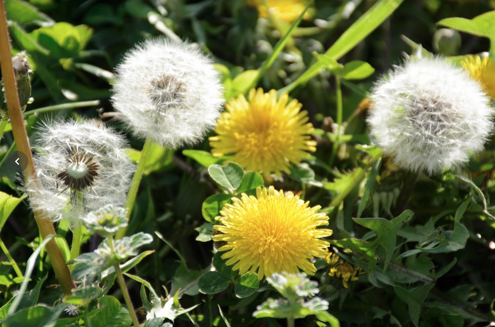
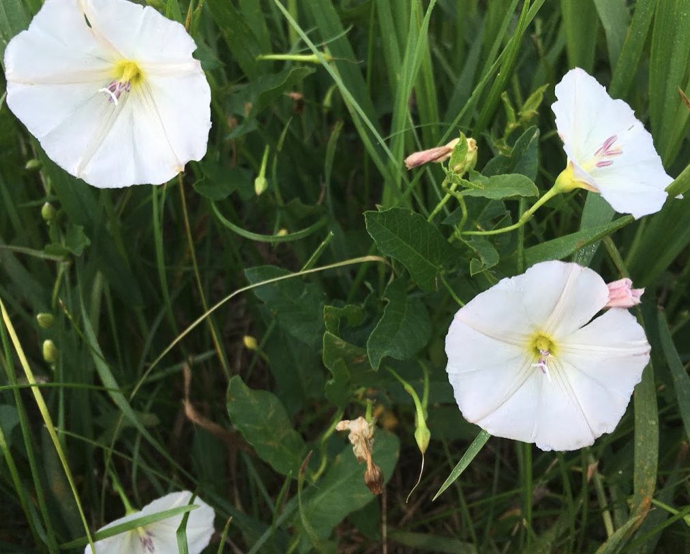

```{r setup, include=FALSE}
options(htmltools.dir.version = FALSE)

knitr::opts_chunk$set(
  echo = FALSE,
  fig.align = "center",
  message = FALSE,
  warning = FALSE,
  cache = TRUE
)
```

```{r}
library(pagedown)
```

# Objetivos 

## Você vai aprender

- O que é ecologia e por quê é importante?


- Conceitos fundamentais relevantes para ecologia de plantas daninhas e espécies invasoras.


```{r echo=FALSE, out.width=500, fig.align='center'}
knitr::include_graphics("https://media.giphy.com/media/5Yl9jArDeVlttTd2x6/giphy.gif")
```


---

# Introdução Ecologia de Plantas Daninhas

## Princípios ecológicos

- **Ecologia** é o estudo de organismos e sua interação com o meio ambiente
--


- Um objetivo da ecologia de plantas é entender os processos que determinam quais plantas ocorrem em um local específico e por quê
--


- A biologia intrínseca das espécies e a natureza extrínseca da área ocupada (ambiente) são igualmente importantes para determinar o sucesso e a expansão das populações de plantas


---

# Princípios ecológicos


.pull-left[
- **Ambiente** somatório de todos os fatores vivos (bióticos) e não-vivos (abióticos) que podem afetar o desenvolvimento, crescimento ou distribuição das plantas


- Fatores ambientais abióticos que afetam o crescimento das plantas são agrupados em recursos e condições
]

.pull-right[
```{r echo=FALSE, out.width=500, fig.align='center'}

```
]

---

# Recursos

Os recursos são consumíveis e incluem: radiação, água, nutrientes, CO<sub>2</sub>, O<sub>2</sub>, etc


```{r echo=FALSE, out.width=700, fig.align='center', fig.pos= "middle"}
knitr::include_graphics("images/recursos.png")
```


---

# Condições

As condições não são consumidas, mas afetam o crescimento das plantas. Eles incluem: temperatura, pH do solo, densidade do solo, etc


```{r echo=FALSE, out.width=600, fig.align='center', fig.pos= "middle"}

```

---

# Dúvidas?


```{r echo=FALSE, out.width=400, fig.align='center', fig.pos= "middle"}
knitr::include_graphics("https://media.giphy.com/media/kdisXBktli0j8Gfhu6/giphy.gif")
```


---

# Processos Ecológicos


Os padrões e processos ecológicos ocorrem em muitas escalas diferentes, ou dimensões espaciais e temporais.

```{r echo=FALSE, out.width=700, fig.align='center', fig.pos= "middle"}

```


---

# Escala em Sistemas Ecológicos


.pull-left[

1. Bioma

1. Ecossistema

1. Comunidade

1. Espécies

1. População

1. Organismo
]


.pull-right[
```{r echo=FALSE, out.width=300, fig.align='center', fig.pos= "middle"}
knitr::include_graphics("images/ecologia.jpg")
```

```{r echo=FALSE, out.width=300, fig.align='center', fig.pos= "middle"}
knitr::include_graphics("https://static.biologianet.com/conteudo/images/os-seres-vivos-sao-organizados-em-diferentes-niveis-54f6414e2a12e.jpg")
```

]

---

# Organismo

Ser vivo que tem uma estrutura organizada, pode reagir a estímulos, reproduzir, crescer, adaptar etc


.pull-left[
```{r echo=FALSE, out.width=600, fig.align='center', fig.pos= "middle"}

```
]


.pull-right[
```{r echo=FALSE, out.width=600, fig.align='center', fig.pos= "middle"}

```
]

---

# Espécie

Geralmente cruzam apenas entre si, surgem da seleção natural e manipulação genética


```{r echo=FALSE, out.width=600, fig.align='center', fig.pos= "middle"}

```


---


# População


.pull-left[
```{r echo=FALSE, out.width=600, fig.align='center', fig.pos= "middle"}

```
]


.pull-right[

Grupo de indivíduos da mesma espécie que interagem entre si

- Número

- Local

- Dispersão

- Futuro

]


---

# Ecologia populacional

O estudo sobre quais fatores afetam a população e como e por que uma população muda ao longo do tempo


.pull-left[
```{r echo=FALSE, out.width=600, fig.align='center', fig.pos= "middle"}

```
]


.pull-right[
```{r echo=FALSE, out.width=600, fig.align='center', fig.pos= "middle"}

```
]


---


# Comunidade

Todas as populações interagindo em um local


```{r echo=FALSE, out.width=600, fig.align='center', fig.pos= "middle"}

```


---

# Ecossistema


```{r echo=FALSE, out.width=500, fig.align='center', fig.pos= "middle"}

```


---


# Ecossistema


```{r echo=FALSE, out.width=400, fig.align='center', fig.pos= "middle"}

```


---

# Agroecossistemas versus Ecossistemas Naturais


.pull-left[
```{r echo=FALSE, out.width=400, fig.align='center', fig.pos= "middle"}

```

```{r echo=FALSE, out.width=400, fig.align='center', fig.pos= "middle"}
knitr::include_graphics("images/agroeco.jpg")
```
]


.pull-right[

- Dependem de energia e do trabalho humano


- A diversidade de plantas e animais é reduzida para maximizar a produtividade agrícola


- As culturas estão sob seleção artificial e não natural


- O ambiente é modificado por nossas ações e objetivos


- Tendem a ser altamente perturbados

]


---


# Bioma

Um bioma é uma comunidade de plantas e animais que possuem características comuns ao ambiente em que existem


```{r echo=FALSE, out.width=400, fig.align='center', fig.pos= "middle"}

```


---


# Planta daninha


Quais fatores contribuíram para a distribuição desigual desta planta daninha?


```{r echo=FALSE, out.width=500, fig.align='center', fig.pos= "middle"}

```


---


# Planta daninha

kochia (*Bassia scoparia*)


.pull-left[
```{r echo=FALSE, out.width=400, fig.align='center', fig.pos= "middle"}

```
]
--

.pull-right[
```{r echo=FALSE, out.width=500, fig.align='center', fig.pos= "middle"}

```
]


---


# Sucessão Ecológica

.pull-left[
```{r echo=FALSE, out.width=500, fig.align='center', fig.pos= "middle"}

```

```{r echo=FALSE, out.width=500, fig.align='center', fig.pos= "middle"}
knitr::include_graphics("https://static.todamateria.com.br/upload/su/ce/sucessa_o_ecola_gica1_c.jpg")
```
]


.pull-right[

- As mudanças na composição das espécies que ocorrem ao longo do tempo

- Quando se inicia? 

- O que a produção agrícola faz com a sucessão?

]

---


# Nicho


- **Nicho** - o espaço multidimensional a partir do qual uma planta reúne os recursos necessários para sua sobrevivência e reprodução


- **Diferenciação de nicho** - as espécies diferem em seus requisitos ou especializações


O cultivo de **monocultura** raramente usa toda a água, nutrientes ou 
luz disponível, criando nichos abertos que as plantas daninhas preenchem


```{r echo=FALSE, out.width=500, fig.align='center', fig.pos= "middle"}

```

---


# Dúvidas?


```{r echo=FALSE, out.width=400, fig.align='center', fig.pos= "middle"}
knitr::include_graphics("https://media.giphy.com/media/3o7GUB9ExWUxjiSrKw/giphy.gif")
```


---


# Estrutura da comunidade 

## Por que as plantas daninhas existem?

As espécies coexistem dentro de uma comunidade vegetal por causa de:

- Uso diferente de nichos
--


- Requisitos de recursos diferentes
--


- Diferentes causas de mortalidade
--


- Sensibilidade diferente a toxinas
--


- Demanda de tempo diferente para fatores de crescimento
--


- Combinação de dois ou mais destes


---


# Estrutura da comunidade  

## Por que as plantas daninhas existem?

.pull-left[
A distribuição irregular de plantas daninhas pode resultar de:

- Padrão de dispersão

- Gradientes no microambiente

- Perturbação

- Interações entre espécies
]


.pull-right[
```{r echo=FALSE, out.width=500, fig.align='center', fig.pos= "middle"}

```
]

---


# Dúvidas?


```{r echo=FALSE, out.width=400, fig.align='center', fig.pos= "middle"}
knitr::include_graphics("https://media.giphy.com/media/13qctMBrrgbwJi/giphy.gif")
```

.center[
```
MAXWEL COURA OLIVEIRA - maxweloliveira@unoeste.br
```
]


```{r eval=FALSE}
#remotes::install_github('rstudio/pagedown')
pagedown::chrome_print("mipd.html")
```
