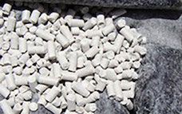

```{r setup, include=FALSE}
options(htmltools.dir.version = FALSE)

knitr::opts_chunk$set(
  echo = FALSE,
  fig.align = "center",
  message = FALSE,
  warning = FALSE,
  cache = TRUE
)
```

```{r}
library(pagedown)
```


# Objetivos 

## Você vai aprender

- Descrever o processo de desenvolvimento de um herbicida como um produto comercial
--


- Discutir a importância do rótulo do herbicida e as declarações de advertência nele contidas
--


- Definir a formulação de herbicida, explique por que é importante e quais formulações requerem mais mistura
--


- Explicar os requisitos para a ação do herbicida


---

# Herbicidas


- **Descoberta de herbicidas** - os pesquisadores preparam produtos químicos, esses produtos químicos são "avaliados" por sua atividade nas plantas
--
  
  
- Pesquisadores em uma empresa podem avaliar milhares de moléculas a cada ano


.center[]


---

# Desenvolvimento de Herbicidas

**Desenvolvimento de herbicidas** - um processo de modificação química sistemática e experimentos para melhorar a atividade biológica. Os fatores avaliados incluem:
--


- **Seletividade** da planta
--
  
  
- **Mobilidade** e **persistência** do solo
--
  
  
- Outros fatores físicos e químicos que influenciam o destino do produto químico no meio ambiente
--
  
  
- **Toxicidade** para animais e humanos

---

# Desenvolvimento de Herbicidas

- Os pesticidas não podem ser distribuídos ou vendidos no Brasil a menos que estejam registrados no MAPA.
--


- O custo para desenvolver e obter o registro de um novo herbicida pode exceder US $ 250 milhões e pode levar de 7 a 11 anos.
--


```{r echo=FALSE, out.width=500, fig.align='center'}

```


---


# Desenvolvimento de Herbicidas

Os pesticidas são classificados como uso geral ou restrito. Um produto químico é rotulado como uso restrito se apresenta os seguintes problemas:
  
- Perigo ou prejuízo para a saúde pública
- Perigo para os trabalhadores agrícolas
- Perigo para animais domésticos ou culturas
- Panos às culturas subsequentes por resíduos persistentes no solo

.center[
]


---


# Importante


> **NOTA:** O manuseio de herbicidas requer treinamentos. 

- Existem cursos e treinamentos e é provável que vai existir o requerimento de uma licença para aplicacação de herbicidas

.center[
]


---


# Bula do Herbicida

.pull-left[
  
]

.pull-right[
  A `bula` do herbicida é um documento legal que especifica como o material deve ser usado para garantir sua segurança e eficácia
]

---

# Bula do Herbicida

- As advertências ou precauções na bula tratam da toxicidade humana e dos riscos ambientais, físicos e químicos associados ao produto
--
  
  
- As categorias de toxicidade determinam a palavra de sinalização a ser usada, o que determina como esse composto é regulado
--
  
  
- Cuidado, Aviso, Perigo. Tudo com base na quantidade de um composto (dosagem) necessário para matar 50% da população de teste
--
  
  
- **DL50** - a dosagem necessária para matar 50% da população em teste (CL50 refere-se à concentração)

---

# DL50


  
---

# Bula do Herbicida


Bula do herbicida [Paraquat](https://www.syngenta.com.br/sites/g/files/zhg256/f/gramoxone_200_0.pdf?token=1551377720)


---

# Formulação do herbicida

- Os ingredientes ativos geralmente não são adequados para uso como produto comercial
--


- Uma **formulação** é o produto final, contendo ingredientes ativos e "inertes" (solventes, emulsificantes, diluentes, etc.)
--


- **Emulsificante** - substâncias que auxiliam na suspensão de um líquido em outro (como óleo na água). Eles possuem propriedades polares e não polares dentro da mesma molécula
--


- **Diluente** - um fluido usado para diluir outro


---

# Formulação do herbicida


.pull-left[

```{r echo=FALSE, out.width=500, fig.align='center'}

```
  ]

.pull-right[
  As formulações devem ser:
    
- Compatível com o transportador (geralmente água)


- Conveniente e seguro de manusear


- Capaz de ser aplicado com precisão e uniformidade
  ]


---


# Formulação do herbicida

- Alguns `herbicidas` são formulados como um número de produtos diferentes, todos com o mesmo ingrediente ativo. Estes são desenvolvidos para:
    - Melhorar a eficácia ou a seletividade das culturas
    - Reduzir a toxicidade animal
    - Fornecer uma vantagem econômica ao fabricante
    - Melhorar propriedades químicas ou físicas
--
  
  
- E ainda pode variar substancialmente em termos de eficácia, dose de aplicação, risco ou custo


---


# Formulação líquida

.pull-left[
- **Pós solúveis em água** - geralmente um sal solúvel em água do ingrediente ativo (ai). Requer pouca mistura
  
- **Líquidos solúveis em água** - semelhantes ao pó, mas já em solução
  
- **Concentrado emulsificável** - ia é geralmente não-polar, mas misturado com um emulsificante para transportá-lo em solução. Requer agitação
  ]

.pull-right[
  
]


---


# Formulação usada como líquida

- **Pós molháveis (WP)** - geralmente o ai é insolúvel em água, por isso é seco e suspenso em água com a ajuda de um agente dispersante. Agitação rigorosa é necessária

- **Líquidos dispersíveis em água ou fluidos** - como o pó molhável, mas já em suspensão. Requer agitação.

- **Grânulos dispersáveis em água (WDG)** - pode ser qualquer tipo de ai. A granulação é usada porque é fácil medir e vazar e produz menos poeira do que os pós.


.pull-left[
```{r echo=FALSE, out.width=300}

```
]


.pull-right[
```{r echo=FALSE, out.width=350}

```
]

---


# Formulações secas - para aplicação direta


- **Grânulos** - feitos de colóides de argila, polímeros de amido, tecidos de plantas peletizados, fertilizantes secos, etc

- **Pílulas (Pellets)** - maiores que grânulos. Geralmente usado para controlar plantas isoladas (árvores ou arbustos)


```{r echo=FALSE, out.width=350}

```

---


# Formulações


```{r echo=FALSE, out.width=600}

```


---

# Qual o tipo de formulação?


```{r echo=FALSE, out.width=300}

```

---


# Problemas


.pull-left[
```{r echo=FALSE, out.width=300}

```
]


.pull-right[
```{r echo=FALSE, out.width=350}

```
]


---


# Tecnologia de aplicação

## Questões de preocupação:
  
- Deriva
    - Partícula
        - Tamanho da gota (pressão, tipo de bico)
        - Altura do pulverizador
        - Velocidade do vento
        - Direção de pulverização

    - Volatilidade
        - Pressão de vapor da formulação
        - Temperatura do ar
        - Inversão térmica

---


# Na planta

## Requisitos para ação de herbicida:
  
- Contato
--


- Absorção
--


- Translocação para o mecanismo de ação
--


- Acumulação no mecanismo de ação
--


- Efetividade no local da ação


---


# Herbicidas aplicados no solo

## Fatores que afetam a absorção de herbicidas no solo:
  
- Área total ou aplicados em banda
--


- Pode exigir incorporação ou umidade para ativar
--


- O tempo pode ser menos crítico
--


- Pode ser seletivo por profundidade
--


- Contato com o solo

---

# Absorção de herbicidas do solo


- **PH do solo** - nenhum efeito direto conhecido na absorção, mas tem grandes efeitos na mobilidade dos herbicidas


- Captação pelas **raízes** (captação de herbicida pelas raízes)


- Entrada tipicamente passiva com água através dos pêlos das raízes (captação inicialmente simplástica)


- Mover para cima apoplasticamente


- Captação por brotos enterrados

---

# Posicionamento de herbicidas


- Posicionamento (absorção da raiz x parte da parte aérea)
--


- Tempo de aplicação (afeta a atividade residual e a persistência do solo)
--


- Volatilidade (pode causar movimento ou perda)
--


- Adsorção (afeta o movimento e a disponibilidade no solo, taxa de degradação)
--


- Lixiviação
--


- Interação com a umidade do solo


---


# Posicionamento de herbicidas

Teflan (trifluralin) aplicado abaixo vs acima da semente

```{r echo=FALSE, out.width=550, fig.cap="University of Nebraska-Lincoln"}

```

---

# Dúvidas?


.center[


```
MAXWEL COURA OLIVEIRA - maxweloliveira@unoeste.br
```
]


```{r eval=FALSE}
#remotes::install_github('rstudio/pagedown')
pagedown::chrome_print("Herbicide_2.html")
```
