```{r setup, include=FALSE}
options(htmltools.dir.version = FALSE)

knitr::opts_chunk$set(
  echo = FALSE,
  fig.align = "center",
  message = FALSE,
  warning = FALSE,
  cache = TRUE
)
```

```{r}
library(pagedown)
```


# Objetivos


- Entender como as plantas competem por recursos

- Explicar quais recursos são mais críticos e por que

- Descrever características que tornam as plantas mais competitivas para esses recursos críticos
--


---

# Definição

- **Interferência da planta** - o efeito que a presença de uma planta tem no crescimento e desenvolvimento de seus vizinhos

- **Competição entre plantas** - efeitos mutuamente adversos das plantas que utilizam um recurso (nutrientes, água e luz) em falta

- **Alelopatia** é um tipo de interferência em que a inibição de plantas vizinhas ocorre como resultado da excreção de uma toxina biológica

- **Parasitismo** - um organismo vive em, sobre ou com outro, às custas de quem obtém comida, abrigo ou apoio


---

# Relações de Densidade-Rendimento


- À medida que a densidade (população) aumenta, a biomassa (rendimento) de um indivíduo diminui

- O rendimento (biomassa) de uma área aumenta à medida que a densidade (população) aumenta, mas com retornos decrescentes.


---


# Interferência de plantas daninhas

A maioria das pesquisas agrícolas sobre competição entre implantes concentra-se em seus efeitos (interferência) e não no que causa esses efeitos.

```{r echo=FALSE, out.width=600, fig.align='center'}
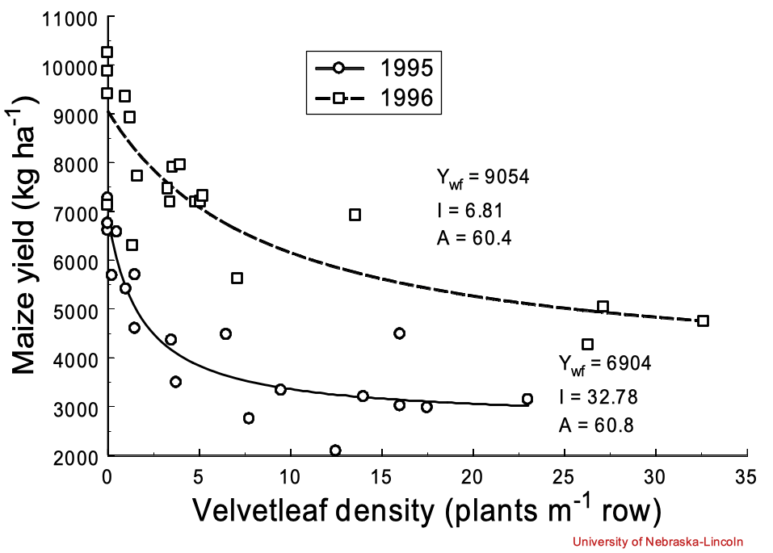
```

---


```{r echo=FALSE, out.width=600, fig.align='center'}
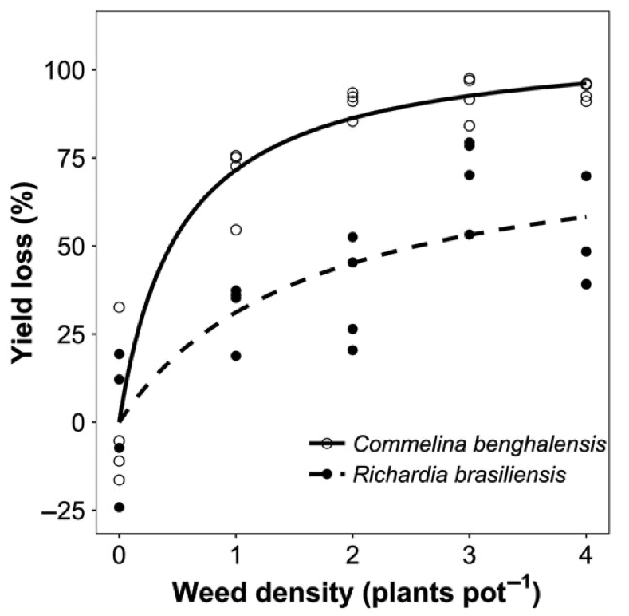
```

---

# Recursos e Condições

## A competição ocorre quando um recurso é limitado

- **Recursos** - são consumidos (por exemplo, luz, água, nutrientes, CO2, etc.)

- **Condições** - não são consumidas (por exemplo, temperatura, umidade)
    - As condições podem modificar a capacidade de uma planta de adquirir recursos


---

class: inverse, center, middle

# Recursos

```{r echo=FALSE, out.width=800, fig.align='center'}
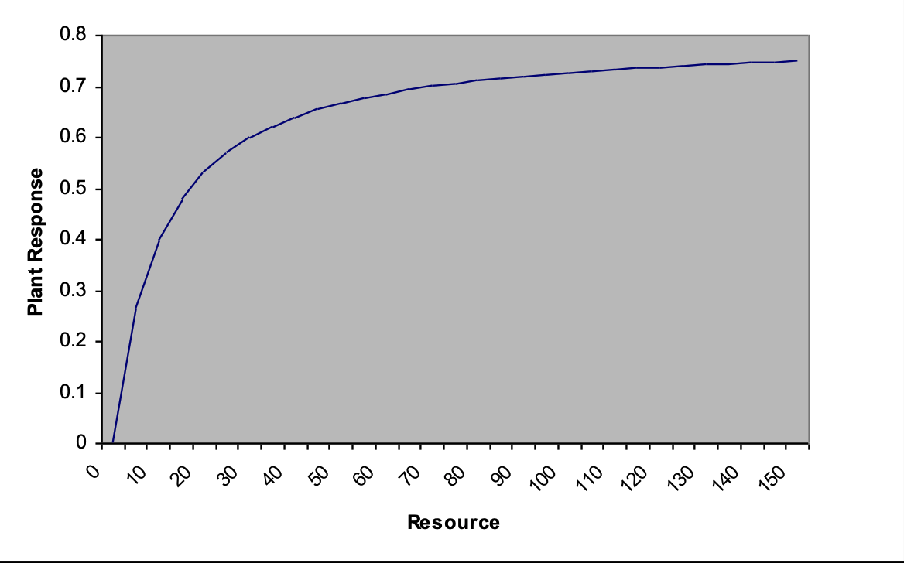
```


---

# Mecanismos da competição

- As plantas daninhas causam perda de rendimento em plantas cultivadas indiretamente por sua influência nos recursos necessários para o crescimento da cultura


- O resultado da competição é impulsionado pelos mecanismos fisiológicos que regulam o efeito de cada espécie em um recurso e sua resposta à disponibilidade desse recurso


```{r echo=FALSE, out.width=600, fig.align='center'}
knitr::include_graphics("https://media.giphy.com/media/pgX4wQxRRps9W/giphy.gif")
```

---

# Mecanismos da competição

## Efeitos e respostas


```{r echo=FALSE, out.width=800, fig.align='center'}
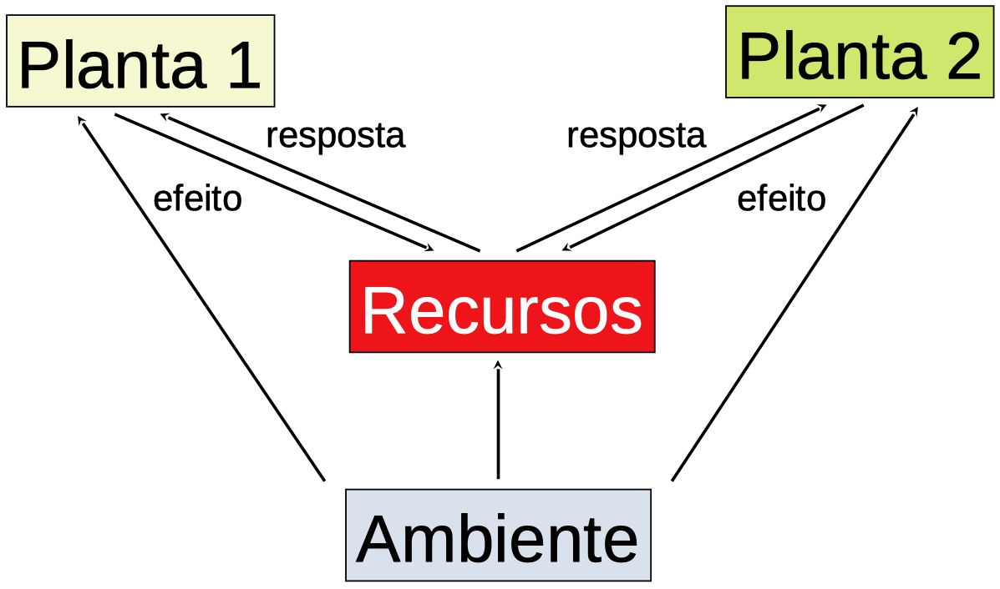
```


---

# Competição entre plantas

## Os mecanismos de competição devem ser demonstrados por:

- Esgotamento de recursos associado à presença do concorrente (efeito das plantas nos recursos)

- Mudanças no crescimento morfológico e fisiológico associadas a mudanças nos recursos (resposta ao recurso)

- Correlações entre presença de vizinhos, esgotamento de recursos e resposta ao crescimento


---

# Competição direta vs indireta

- A **competição direta** ocorre quando o recurso é imediatamente escasso

- A **competição indireta** ocorre quando as plantas estão utilizando um conjunto finito de recursos


---

# Competição por nutrientes

- Nitrogênio, fósforo, potássio (macronutrientes: C, H, O, P, K, N, S, Ca, Fe, Mg)

- O que acontece às plantas quando um nutriente se torna limitante?


---

class: inverse, center, middle

```{r echo=FALSE, out.width=800, fig.align='center'}

```
---


# Competição por nutrientes vs luz


```{r echo=FALSE, out.width=800, fig.align='center'}
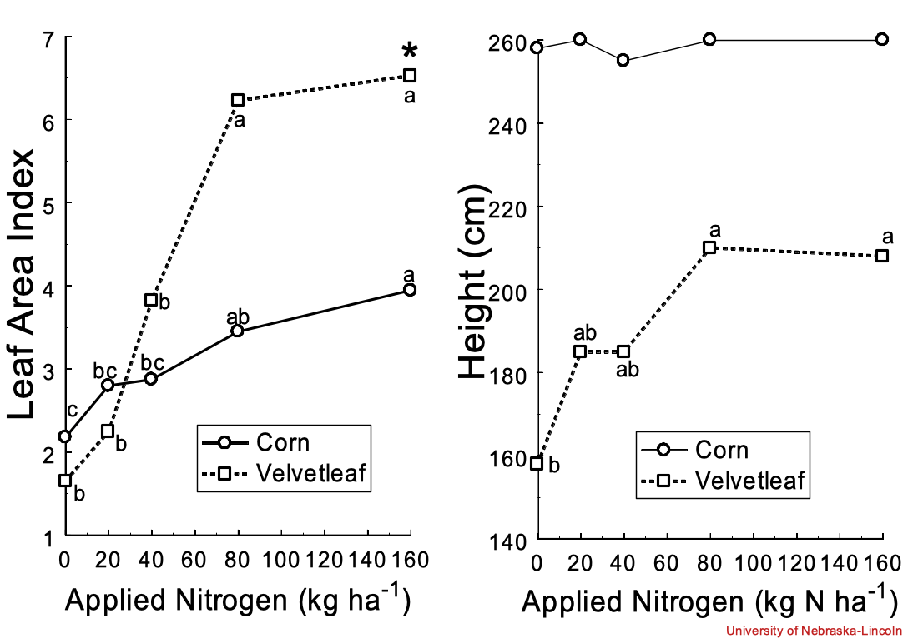
```


---

# 

.pull-left[

- *Abutilon theophrasti* (velvetleaf)

```{r echo=FALSE, out.width=400, fig.align='center'}
knitr::include_graphics("https://www.canr.msu.edu/ipm/uploads/images/VelvetleafPlant.jpg")
```
]


.pull-right[

- Corn (milho)

```{r echo=FALSE, out.width=400, fig.align='center'}
knitr::include_graphics("https://upload.wikimedia.org/wikipedia/commons/thumb/e/ed/Corn_Zea_mays_Plant_Row_2000px.jpg/800px-Corn_Zea_mays_Plant_Row_2000px.jpg")
```
]
 

---

# Competição por nutrientes

- Por que a resposta da planta diminui quando o nitrogênio é limitante?

- O que acontece com N quando é absorvido? Como é usado nas plantas?

```{r echo=FALSE, out.width=400, fig.align='center'}
knitr::include_graphics("https://media.giphy.com/media/Scjoq4LDEfCQLmxpDQ/giphy.gif")
```


---

# Competição por nutrientes

## Teores típicos de N e K em plantas daninhas


```{r echo=FALSE, out.width=800, fig.align='center'}
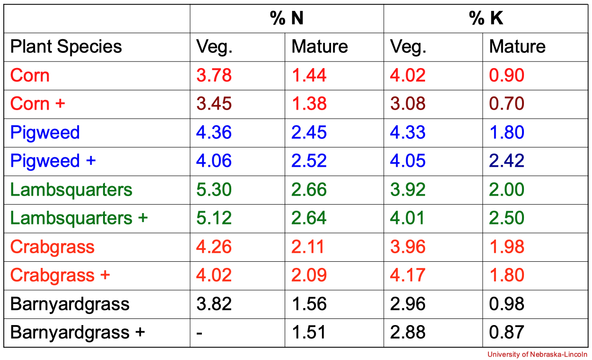
```


---


# Competição por nutrientes

Devemos adicionar mais fertilizante para reduzir os efeitos das plantas daninhas?


---

# Competição por água


- A água é a mais crítica de todas as exigências de crescimento das plantas, porque é a menos confiável

- Eficiência no uso da água (EUA: g de matéria seca da planta por unidade de água transpirada)


---

Necessidade de água (1 / EUA) de algumas espécies de monocotiledôneas

g de água necessária para produzir 1 g de matéria seca

```{r echo=FALSE, out.width=800, fig.align='center'}
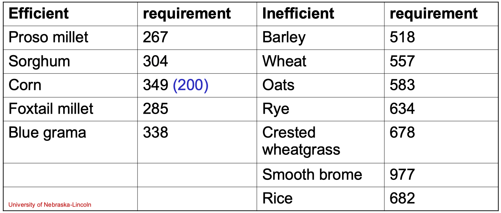
```


---


Necessidade de água (1 / EUA) de algumas espécies de dicotiledôneas

g de água necessária para produzir 1 g de matéria seca


```{r echo=FALSE, out.width=800, fig.align='center'}
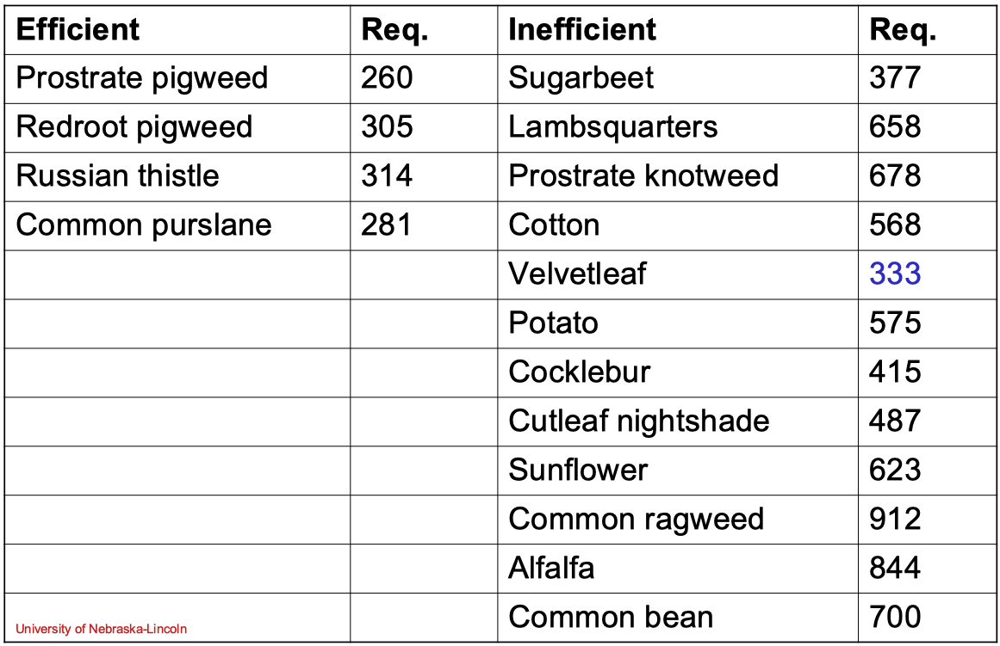
```


---


# Competição por luz


.pull-left[

- A luz varia em duração (duração do dia), quantidade, qualidade

```{r echo=FALSE, out.width=800, fig.align='center'}
knitr::include_graphics("https://geog0113.readthedocs.io/en/latest/_images/gto_si01_0206_1.png")
```

]

.pull-right[
```{r echo=FALSE, out.width=300, fig.align='center'}
knitr::include_graphics("https://qph.fs.quoracdn.net/main-qimg-fee15b632990ecb051a0fc54eb2df1a0-c")
```

```{r echo=FALSE, out.width=300, fig.align='center'}
knitr::include_graphics("https://blogdoenem.com.br/wp-content/uploads/2016/02/BIO16.gif")
```

]

---


# Competição por luz


```{r echo=FALSE, out.width=500, fig.align='center'}
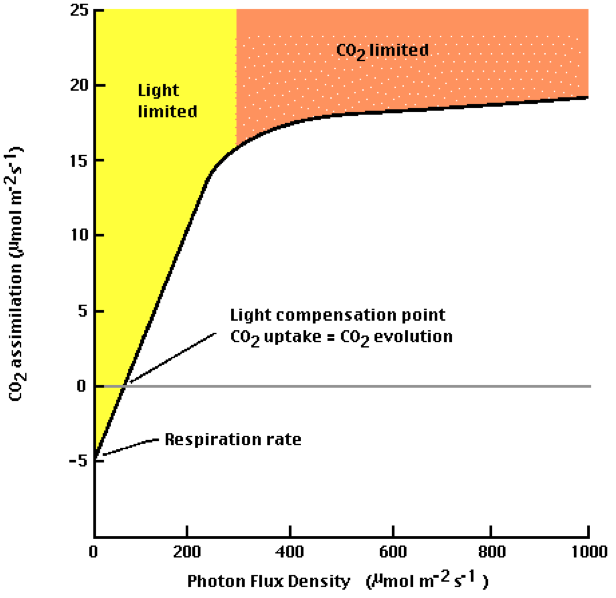
```


---

# Competição por luz

- Fotossíntese C<sub>3</sub> versus C<sub>4</sub> 

```{r echo=FALSE, out.width=500, fig.align='center'}
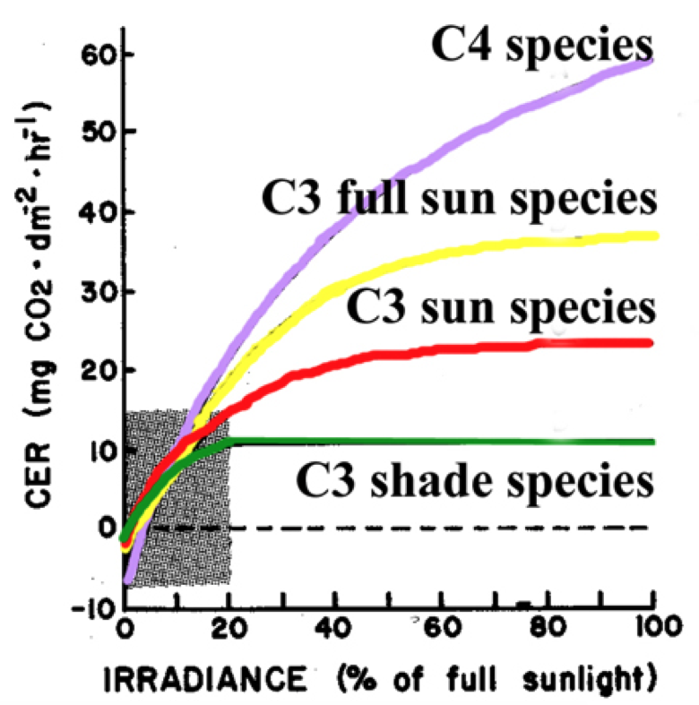
```

---

# Competição por luz


- A competição pela luz é instantânea, direta


```{r echo=FALSE, out.width=700, fig.align='center'}
knitr::include_graphics("https://pbs.twimg.com/media/Eb9gRElWsAAnjah?format=jpg&name=large")
``` 

---

# Competição por luz

- % radiação interceptada por plantas de soja


```{r echo=FALSE, out.width=500, fig.align='center'}
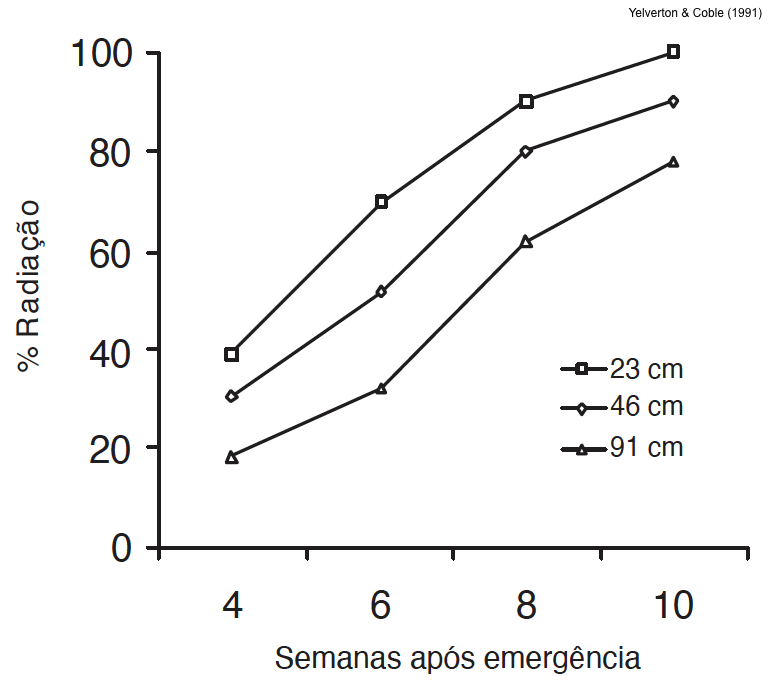
``` 


---

class: center, middle

.pull-left[
```{r echo=FALSE, out.width=800, fig.align='center'}
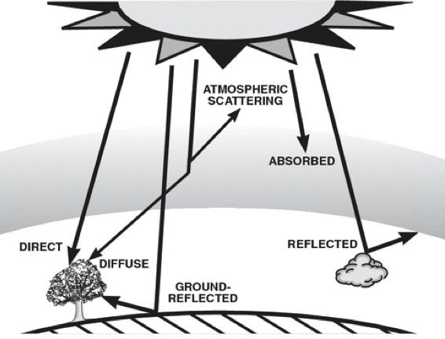
```

```{r echo=FALSE, out.width=800, fig.align='center'}
knitr::include_graphics("https://img.ledsmagazine.com/files/base/ebm/leds/image/2019/02/1902ledsf2_4.png?auto=format&fit=max&w=1440")
```


]

.pull-right[
```{r echo=FALSE, out.width=800, fig.align='center'}
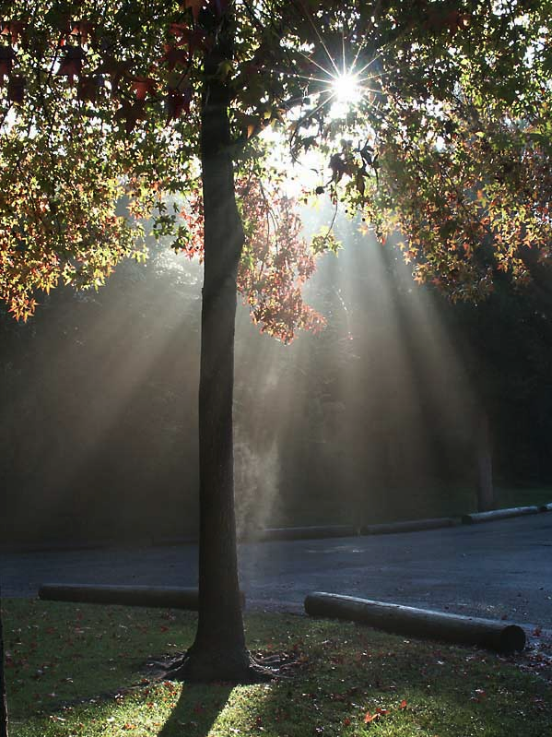
```
]


---

# Competição por luz

- Características do dossel que influenciam a interceptação de luz

- Mais área foliar = mais interceptação = mais concorrência
    - Ângulo da folha
    - Distribuição vertical da área foliar


```{r echo=FALSE, out.width=500, fig.align='center'}
knitr::include_graphics("https://media.giphy.com/media/9V5mtoySmtyuFt7mV7/giphy.gif")
```


---


# Competição por luz

```{r echo=FALSE, out.width=450, fig.align='center'}
knitr::include_graphics("https://www.researchgate.net/profile/Jianming_Yu/publication/329455956/figure/fig1/AS:709947570524163@1546276099878/Distinct-leaf-angle-architecture-for-inbred-lines-B73-Mo17-and-PHW30-An-illustration.png")
```


---

# Competição por luz


```{r echo=FALSE, out.width=600, fig.align='center'}
knitr::include_graphics("https://media.springernature.com/m685/springer-static/image/art%3A10.1038%2Fs41598-019-49858-8/MediaObjects/41598_2019_49858_Fig1_HTML.png")
```


---

# Competição por luz


```{r echo=FALSE, out.width=600, fig.align='center'}
knitr::include_graphics("https://www.danforthcenter.org/app/uploads/2020/06/Figure2.png")
```


---

# Dúvidas?


.center[


```
MAXWEL COURA OLIVEIRA - maxweloliveira@unoeste.br
```
]


```{r eval=FALSE}
#remotes::install_github('rstudio/pagedown')
pagedown::chrome_print("competition.html")
```


