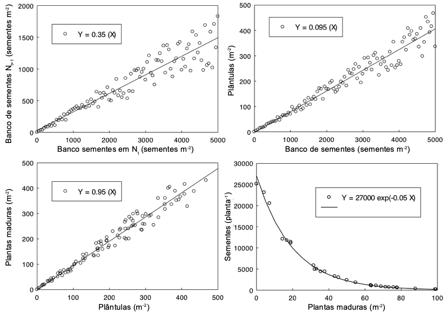

##  Banco de Sementes do Solo

<br>

1) A equação fundamental da biologia populacional de plantas daninhas é (complete a equação):


N<sub>t+1</sub> = N<sub>t</sub> + ____________________ - ____________________ + imigrantes - ____________________ (3 pts)

<br>

___________________________________________________________________________

2) Lembre-se da equação formalizada do banco de sementes:

**N<sub>t+1</sub>**  = N<sub>t</sub> + [(N<sub>t</sub> \* E<sub>m</sub> \* S<sub>pl</sub>) \* P \* (1-E<sub>f</sub>)] \* D - [(N<sub>t</sub> \* E<sub>m</sub>) + ((N<sub>t</sub>-N<sub>t</sub> \* E<sub>m</sub>) \* (1-S<sub>bs</sub>))] + I-E

<br>

N<sub>m</sub> = N<sub>t</sub> \* E<sub>m</sub> \* S<sub>pl</sub>

P = (P<sub>m</sub> * (exp(-a * N<sub>m</sub>)))

<br>

Um agrônomo fez uma amostragem em uma lavoura em setembro de 2019 e determinou que havia 900 sementes de picão preto m<sup>-2</sup> no banco de sementes. Usando as informações mostradas na página 3, obtenha valores para cada um dos componentes da equação, conforme mostrado a seguir. Observe que esses dados não presumem nenhum controle de plantas daninhas. Portanto, E<sub>f</sub> = 0. Certifique-se de **incluir unidades** e **mostrar seu trabalho** (4 pontos)

Suponha que D = 0,3 e ignore a imigração e a emigração.

**Dica:** exp(-0,05 * 81,2) = 0,0172


```{r include=FALSE}
exp(-0.05*81.2)
```


a) N<sub>t</sub> = ________ (1 pt)

```{r include=FALSE}
900
```


b) N<sub>pl</sub> =________ (2 pts)

```{r include=FALSE}
0.095*900
```


c) N<sub>m</sub> = ________ (2 pts)

```{r include=FALSE}
81.2*0.95
```


c) P = ________ (2 pts)

```{r include=FALSE}
27000 * 0.01724902
```

d) Emergências = ________ (2 pts)

```{r include=FALSE}
(0.095 * 900) * 0.95
```

e) Mortes (perdas) = ________ (3 pts)

```{r include=FALSE}
(900 * 0.095) + (900-900 * 0.095) * (1 - 0.65)
```


f) N<sub>t+1</sub> = ________ (3 pts)


```{r include=FALSE}
900 + ((900*0.095*0.95) * (27000 * 0.01724902) * 0.3) - (900*0.095) + (900-900*0.095) * (1-0.35)
```

<br>

O banco de sementes está aumentando ou diminuindo de tamanho? (1 pt)

<br>
<br>

___________________________________________________________________________

3) Suponha que você seja um agrônomo de trabalhando para a Cooperativa. Você está discutindo o problema com o produtor e quer ajudar a encontrar uma maneira de reduzir a população de picão preto mais rapidamente.

a) Que tática de manejo você recomendaria para fazer isso acontecer e que taxa(s) variável(is) na equação do banco de sementes essa prática de manejo influenciaria? (2 pts)

<br>
<br>
<br>

b) Qual seria uma mudança razoável no valor dessa variável de taxa e o que causaria essa mudança? (explicar) (2 pts)

<br>
<br>

c) Usando a mudança argumentada acima em a e b, recalcule N<sub>t+1</sub> (mostre seu trabalho) (4 pts)

<br>
<br>
<br>

d) O banco de sementes aumenta ou diminui (em relação ao tamanho inicial do banco de sementes) com essa mudança? Por quanto? (1 pt)

<br>
<br>

e) Você está satisfeito com este novo tamanho de banco de sementes (explique)? (1 pt)

<br>
<br>

f) Quais outras informações precisamos saber mais para tornar este modelo melhor (explique)? (2 pts)

<br>
<br>

___________________________________________________________________________


```{r echo=FALSE, out.width=600, fig.align='center'}

```


