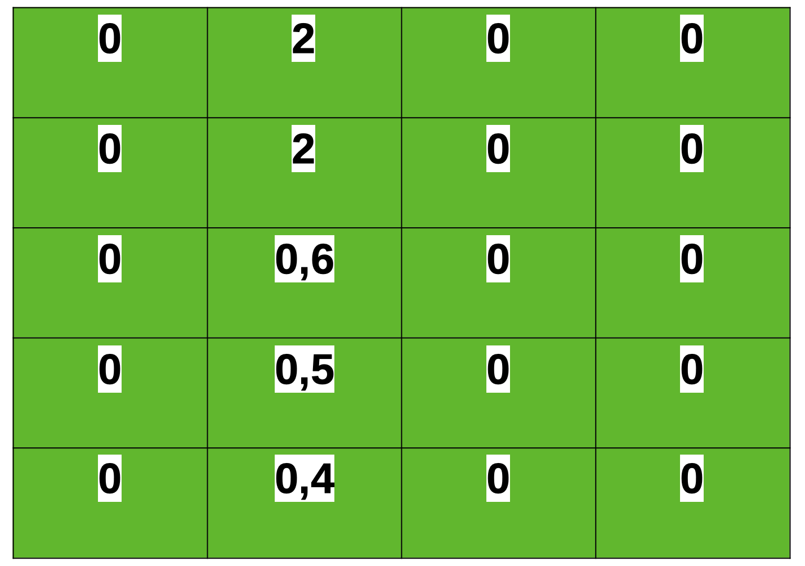

```{r include=FALSE}
library(kableExtra)
library(tidyverse)
```


```{r setup, include=FALSE}
options(htmltools.dir.version = FALSE)

knitr::opts_chunk$set(
  echo = FALSE,
  fig.align = "center",
  message = FALSE,
  warning = FALSE,
  cache = FALSE,
  include = FALSE
)
```


<br>

Mostre todo o seu trabalho e inclua unidades (4 pts)

<br>

Lembre-se de que: 

$${Y_L}=\frac{IN}{1 + \frac{IN}{A}}$$

e que:

$${D_e}=\frac{C}{Y_s P I E_f}$$

e:

$${RL}= (Y * P) - (C + M) $$

<br>

# Problema

Um agricultor em Londrina/PR está produzindo soja Roundup Ready e notou que agora ele tem buva resistente ao glifosato em seu lavoura. Suponha que cada célula na tabela a seguir representa a densidade média de buva (plantas m<sup>-2</sup>) para uma área de 10 ha dentro dessa lavoura:



```{r eval=FALSE, fig.align='center', include=FALSE, out.width=400}

```


# Defina

As seguintes informações foram encontradas na literatura (escreva o que o parâmetro representa) (1 cada):

C = _______________________________________________ = R$ 450 / ha

Y<sub>s</sub> = ______________________________________________ = 67 sacas / ha

P = _______________________________________________ = 100,0 R$ / saca

I = ________________________________________________ = 23%

E<sub>f</sub> = _______________________________________________ = 95%

A = <ins>Perda de produtividade máxima (conforme a densidade se aproxima do infinito)</ins> = 75%

<br>

**Lembre-se**: Produtividade = Produtividade livre de plantas daninhas (Ys) - Produtividade livre de plantas daninhas (Ys) * fração da perda de rendimento 

Suponha que a aplicação de herbicida restaure a produtividade ao nível livre de plantas daninhas.


<br>

# Calcule a densidade média de buva (plantas m<sup>-2</sup>) para a lavoura (2).

<br>

<br>

<br>

```{r }
(0.6+0.5+0.4+2+2) / 20
```


# Calcule 

## O nível de dano econômico de um único ano de densidade de buva (2):

<br>

<br>

<br>

```{r}
450 / (67*100*0.23*0.95)
```


## Se usassemos a densidade de buva da lavoura inteira e o nível de dano econômico da densidade de buva calculada acima para decidir se uma aplicação de herbicida é justificada, o que você faria (1)?

<br>

<br>

<br>

## Qual é o nível de dano econômico se o preço aumentar para R$ 180,00 por saca? Quais são as implicações desse resultado (2)?

<br>

<br>

<br>

```{r}
450 / (67*180*0.23*0.95)
```

## Qual seria o retorno econômico se pulverizássemos toda a lavoura, assumindo o preço de R$ 100,0 (2)?

<br>

<br>

<br>

```{r}
(200 * (67*100)) - (200 * (450 + 0))
```


## Qual seria o retorno econômico de toda lavoura se não fizessemos nada (4)?

<br>

<br>

<br>

```{r}
(0.23 * 0.275) / (1 + (0.23 * 0.275 / 0.75))
```


```{r}
200 * ((1-0.05833077) * 67 * 100)
```


## Qual seria o retorno econômico da lavoura inteira se pulverizássemos apenas aqueles blocos de 10 ha que excedem o limite de dano econômico de densidade de plantas daninhas? (4)

<br>

<br>

<br>

```{r}
200 * (67 * 100) - (50 * 450)
```


## Qual seria a vantagem de usar o manejo localizado na lavoura vez de não usar nenhum manejo de plantas daninhas? (2)

<br>

<br>

<br>

## Se essa fosse uma lavoura de sua consultoria, o que você faria e por quê (seja especifico e concentre sua resposta nos conceitos que discutimos em aula)? (2)

<br>

<br>

<br>


