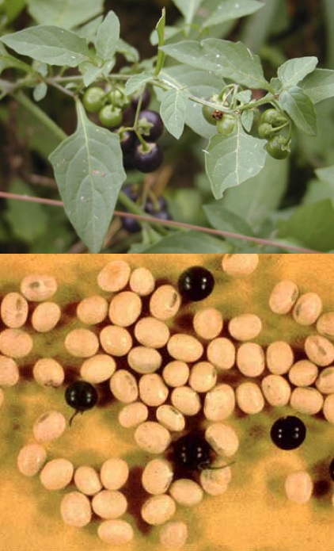

```{r setup, include=FALSE}
options(htmltools.dir.version = FALSE)

knitr::opts_chunk$set(
  echo = FALSE,
  fig.align = "center",
  message = FALSE,
  warning = FALSE,
  cache = TRUE
)
```

```{r}
library(pagedown)
```


class: inverse, middle, center

# Vai começar!

```{r echo=FALSE, out.width=600, fig.align='center'}
knitr::include_graphics("https://media.giphy.com/media/jrriGjKlTvBeM/giphy.gif")
```

---

class: middle, center

# As previsões foram erradas...

```{r echo=FALSE, out.width=400, fig.align='center'}
knitr::include_graphics("https://pbs.twimg.com/media/DzUlN2cX4AAJ8ca?format=jpg&name=small")
```


---

class: middle, center

# O ano é 2020

```{r echo=FALSE, out.width=400, fig.align='center'}
knitr::include_graphics("https://media.giphy.com/media/3MKKLNT2Zrfby/giphy.gif")
```


---

class: middle, center

# 2020

```{r echo=FALSE, out.width=350, fig.align='center'}
knitr::include_graphics("https://media.giphy.com/media/3oKIPwoeGErMmaI43S/giphy.gif")
```


---

class: middle, center


# Mas vai melhorar!

```{r echo=FALSE, out.width=400, fig.align='center'}
knitr::include_graphics("https://media.giphy.com/media/xT1R9Mu1CCG7HiIezK/giphy.gif")
```
---


```{r echo=FALSE, out.width=400, fig.align='center'}
knitr::include_graphics("https://media.giphy.com/media/eh7nOwlu16eq7mXd0b/giphy.gif")
```


.pull-left[
```{r echo=FALSE, out.width=400, fig.align='center'}
knitr::include_graphics("https://media.giphy.com/media/d7HWDCV6t72iRm9vPh/giphy.gif")
```
]


.pull-right[
```{r echo=FALSE, out.width=400, fig.align='center'}
knitr::include_graphics("https://media.giphy.com/media/h26R1JMxiqYpwp0rkF/giphy.gif")
```
]


---

# Professor

- Maxwel Coura Oliveira (maxweloliveira@unoeste.br)

- Whats app: (18) 996-901-070


.pull-left[

- Minha história acadêmica

    - **Graduação**: UFVJM 

    - **Mestrado**: UFVJM 

    - **Doutorado**: University of Nebraska-Lincoln

    - **Pós-doutorado**: University of Wisconsin-Madison
    
    - **Professor**: Universidade do Oeste Paulista
    
    - **Blog**: [https://maxweeds.rbind.io/pt/](https://maxweeds.rbind.io/pt/)
]

.pull-right[
```{r echo=FALSE, out.width=400, fig.align='center'}
knitr::include_graphics("images/maxwel_2.jpg")
```
]


---

# Apresentação

- Nome?

- De onde você é?

- Qual é o seu curso e ano?

- Experiência com manejo de plantas daninhas?

- Fato pessoal (programa de TV ou livro favorito, *hobby* etc.)
--


.pull-left[
```{r echo=FALSE, out.width=400, fig.align='center'}
knitr::include_graphics("https://media.giphy.com/media/aAccWtx0tMyTm/giphy.gif")
```
]

.pull-right[
```{r echo=FALSE, out.width=300, fig.align='center'}
knitr::include_graphics("https://media.giphy.com/media/Pk20jMIe44bHa/giphy.gif")
```

]

---

# Calendário

- **11 agosto**: Aula inaugural - Introdução as plantas daninhas e plantas invasoras

- **18 agosto**: Ecologia

- **25 agosto**: Invasão biológica 

- **1 setembro**: Biologia populacional - parte I

- **8 setembro**: Biologia populacional - parte II

- **15 setembro**: Biologia populacional - parte III

- **22 setembro**: Biologia populacional - parte IV

- **29 setembro**: Competição entre plantas 

- **6 outubro**: Nível de dano econômico


---

# Calendário

- **13 outubro**: Genética populacional

- **20 outubro**: Resistência de plantas daninhas

- **27 outubro**: Manejo Integrado de plantas daninhas

- **3 novembro**: Controle biológico

- **10 novembro**: Controle químico - parte I

- **17 novembro**: Controle químico - parte II

- **24 novembro**: Mecanismo de ação dos herbicidas

- **1 dezembro**: Herbicidas no solo

- **8 dezembro**: Metabolismo de herbicidas em plantas


---

# Referências

- Ross MA e Lembi CA (2008) Applied Weed Science

- Radosevich SR, Holt JS e Ghersa CM (2007) [Ecology of Weeds and Invasive Plants: Relationship to Agriculture and Natural Resource Management](https://onlinelibrary.wiley.com/doi/book/10.1002/9780470168943)

- Oliveira Jr, Constantin J, Inoue MH (2011) [Biologia e Manejo de Plantas Daninhas](http://omnipax.com.br/livros/2011/BMPD/BMPD-livro.pdf)

- Silva AA e Silva JF (2013) Tópicos em Manejo de Plantas Daninhas

- Zimdahl RL (2018) Fundamentals of Weed Science 
---

# Objetivos

- O que são plantas daninhas?

- O que são plantas invasoras?

- Por que devemos nos preocupar com plantas invasoras e daninhas?


```{r echo=FALSE, out.width=500, fig.align='center'}
knitr::include_graphics("https://media.giphy.com/media/7uPz3aoWgCJMs/giphy.gif")
```


---


# O que é uma planta daninha?
--


- Plantas que crescem em um local indesejável
--


- Uma planta fora do lugar
--


.pull-left[
```{r echo=FALSE, out.width=400, fig.align='center'}
knitr::include_graphics("https://cropwatch.unl.edu/documents/Volunteer-corn-F3-450.jpg")
```
]

.pull-right[
```{r echo=FALSE, out.width=400, fig.align='center'}
knitr::include_graphics("https://cropwatch.unl.edu/image/image_gallery/uuid%3D733c81c2-308e-45c8-a0bb-07ee75545b70%26groupId%3D1841%26t%3D1372797454178")
```
]

- Quais plantas são essas?

- São plantas daninhas?

---


# O que é uma planta daninha?
--

- Uma planta na qual a virtude ainda não foi descoberta


.pull-left[
```{r echo=FALSE, out.width=400, fig.align='center'}
knitr::include_graphics("https://www.gardeningknowhow.com/wp-content/uploads/2011/10/johnson-grass1-400x445.jpg")
```
]

.pull-right[

- *Sorghum halepense* (L.) Pers. (campim massambará)

- Introduzido como uma planta forrageira

- Campim massambará ainda será uma planta daninha mesmo que tenha o mesmo valor de milho, soja, arroz e outros

]


---


# O que é uma planta daninha?


- Uma planta é daninha por que possui certas características que as diferenciam de outras plantas


> Plantas que interferem no crescimento de plantas desejáveis e são incomumente persistentes. Eles danificam os sistemas de cultivo de alto valor, os sistemas naturais e as atividades humanas e por isso são indesejáveis

.pull-left[
```{r echo=FALSE, out.width=400, fig.align='center'}
knitr::include_graphics("https://pbs.twimg.com/media/EeQNnXWXsAA-DzM?format=jpg&name=large")
```
]

.pull-right[
```{r echo=FALSE, out.width=220, fig.align='center'}
knitr::include_graphics("https://cdn6.dissolve.com/p/D869_39_138/D869_39_138_1200.jpg")
```
]


---


# O que é uma planta daninha?

| Caracteristicas ideais de uma planta daninha                                                                    |
|-----------------------------------------------------------------------------------------------------------------|
| Requisitos de germinação cumpridos em muitos ambientes                                                          |
| Germinação descontínua (controlada internamente) e grande longevidade das sementes                              |
| Rápido crescimento da fase vegetativa à floração                                                                |
| Produção contínua de sementes enquanto as condições de cultivo permitirem                                       |
| Autocompatibilidade, mas não autogamia ou apomixia completas                                                    |
| Polinização cruzada, quando ocorre, por visitantes não especializados ou vento                                  |
| Produção de sementes muito alta em circunstâncias ambientais favoráveis                                         |
| Produção de algumas sementes em uma ampla gama de condições ambientais: tolerância e plasticidade               |
| Adaptações para dispersão a curta e longa distância                                                             |
| Se perene, uma reprodução vegetativa vigorosa ou regeneração de fragmentos                                      |
| Se perene, robusta de modo a não ser retirada do chão facilmente                                                |
| Capacidade de competir inter-especificamente por meios especiais (roseta, asfixia, crescimento e aleloquímicos) |


---


# Efeitos indesejáveis
--


- Impacto na produtividade de plantas de alto valor 
--


- Perda de qualidade
--


- Limita o manejo de culturas
--


- Hospedeiro de pestes
--


- Interferência na colheita
--


- Aumento no processamento em pós-colheita
--


- Aumento no processo de transporte de grãos


---


# Efeitos indesejáveis

## Impacto na produtividade de plantas de alto valor 


```{r echo=FALSE, out.width=600, fig.align='center'}
knitr::include_graphics("https://pbs.twimg.com/media/DjYfzYpX4AEwny5?format=jpg&name=large")
```


---

# Efeitos indesejáveis

## Impacto na produtividade de plantas de alto valor 


.pull-left[
```{r echo=FALSE, out.width=250, fig.align='center'}
knitr::include_graphics("https://pbs.twimg.com/media/DjYfyiaW4AAnHXf?format=jpg&name=large")
```
]

.pull-right[
```{r echo=FALSE, out.width=250, fig.align='center'}
knitr::include_graphics("https://pbs.twimg.com/media/DjYf0nVXgAAu8Yi?format=jpg&name=small")
```
]

---

# Efeitos indesejáveis

## Impacto na produtividade de plantas de alto valor 

- Estimativa de Soltani et. al. nos EUA

- Prejuíjo causado em culturas por plantas daninhas não manejadas

| Cultura   | Graos       | Valor (US$) |
|-----------|-------------|-------------|
| Beterraba | 22.4 mi ton |  1.25 bi    |
| Feijao    | 941 mi kg   |  622 mi     |
| Milho     | 148 mi ton  |  26.7 bi    |
| Sorgo     | 5,7 mi kg |  953 mi       |
| Soja      | 52.1%       |  16.2 bi    |


---


# Efeitos indesejáveis

## Perda de qualidade


```{r echo=FALSE, out.width=700, fig.align='center'}
knitr::include_graphics("https://cdn.noticiasagricolas.com.br/dbimagens/018ae420547ff215be520908a05028fc.jpg")
```


---

# Efeitos indesejáveis


## Limita o manejo de culturas

- Áreas infestadas com tiririca (*Cyperus* spp.) em olericultura.


```{r echo=FALSE, out.width=700, fig.align='center'}
knitr::include_graphics("https://pbs.twimg.com/profile_banners/1042524436497420288/1537392450/1500x500")
```


---


# Efeitos indesejáveis


## Hospedeiro de pestes


.pull-left[

- *Lamium amplexicaule* (lâmio-violeta)

- Hospedeira alternativa do nematoide do cisto da soja

]


.pull-right[
```{r echo=FALSE, out.width=400, fig.align='center'}
knitr::include_graphics("https://turf.purdue.edu/wp-content/uploads/2014/04/5c98eecaa0a13_Square.jpg")
```
]


---

# Efeitos indesejáveis

## Interferência na colheita

```{r echo=FALSE, out.width=700, fig.align='center'}

```

---

# Efeitos indesejáveis


## Aumento no processamento em pós-colheita

- Limpeza de sementes

- Maria-pretinha (*Solanum* spp.)

```{r echo=FALSE, out.width=250, fig.align='center'}

```

---


# Efeitos indesejáveis


## Aumento no processamento em pós-colheita

- Problemas com exportação de grãos

```{r echo=FALSE, out.width=500, fig.align='center'}
knitr::include_graphics("images/wssa.png")
```


---

# Efeitos indesejáveis

## Aumento no processo de transporte de grãos

- Misturas de sementes de plantas daninhas com grãos

- **1969**: 16 mi ton grãos forom recebidos com 487 k ton (~33 vagões) com aveia selvagem (*Avena fatua*) - prejuízo de US`$` 2 mi.

```{r echo=FALSE, out.width=500, fig.align='center'}
knitr::include_graphics("https://www.bakingbusiness.com/-/media/D48D6B2DCB49466EACDB4E1BB73938DD.ashx")
```


---

# Impacto direto no homem

- **Alergia**: Pólen de ambrósia americana (*Ambrosia* spp.)

```{r echo=FALSE, out.width=600, fig.align='center'}
knitr::include_graphics("https://www.ville.mont-royal.qc.ca/sites/default/files/styles/news_picture_simple/public/shutterstock_1044743326.jpg?itok=qljjaLIr")
```

---

# Impacto direto no homem

- **Alergia**: Pólen de ambrósia americana (*Ambrosia* spp.)

```{r echo=FALSE, out.width=600, fig.align='center'}
knitr::include_graphics("https://i2.wp.com/www.compoundchem.com/wp-content/uploads/2014/06/Hayfever-Antihistamines-2016.png?resize=1200%2C849&ssl=1")
```

---

# Impacto direto no homem

- **Alergia**: Pólen de ambrósia americana (*Ambrosia* spp.)

```{r echo=FALSE, out.width=600, fig.align='center'}
knitr::include_graphics("https://i2.wp.com/www.compoundchem.com/wp-content/uploads/2014/06/Hayfever-Antihistamines-2016.png?resize=1200%2C849&ssl=1")
```

---

# Impacto direto no homem

- **Espinho**: Capim carrapicho (*Cenchrus echinatus*)


```{r echo=FALSE, out.width=350, fig.align='center'}
knitr::include_graphics("https://pbs.twimg.com/media/Eeb3v-OWkAAi_mF?format=jpg&name=small")
```

---

# Impacto direto no homem

- Obstrução da visibilidade no transito

```{r echo=FALSE, out.width=600, fig.align='center'}
knitr::include_graphics("https://www.staradvertiser.com/wp-content/uploads/2020/04/web1_20200422-0528-CTY-OVERGROWN-WEEDS.jpg")
```

---

# Impacto direto no homem

- Obstrução de pavimentos

```{r echo=FALSE, out.width=400, fig.align='center'}
knitr::include_graphics("https://www.installitdirect.com/wp-content/uploads/2019/12/Remove-Weeds-Between-Pavers-Ideas.jpg")
```

---

# Impacto direto no homem

- Estética

- Kudzu (*Pueraria montana*)

```{r echo=FALSE, out.width=600, fig.align='center'}
knitr::include_graphics("https://bloximages.newyork1.vip.townnews.com/journalpatriot.com/content/tncms/assets/v3/editorial/6/b6/6b65671e-3f83-11e5-9f9c-734a5a691cb2/55c8dc39efb57.image.jpg?resize=750%2C502")
```

---

# Impacto direto no homem

- Obstrucção de canais e rios

- Plantas daninhas aquaticas 

```{r echo=FALSE, out.width=600, fig.align='center'}
knitr::include_graphics("http://www.odiariodemogi.net.br/wp-content/uploads/2018/09/rio-tiete.jpg")
```

- Rio Tietê em Mogi das Cruzes (Foto: Edson Martins)

---


# Impacto em animais

- **Veneno**: cefezinho (*Palicourea marcgravi*)

```{r echo=FALSE, out.width=600, fig.align='center'}
knitr::include_graphics("https://rehagro.com.br/blog/wp-content/uploads/2018/06/plantas-toxicas-de-importancia-pecuaria4.jpg")
```


---

# Impacto em animais

- **Pastejo**: Diminuição da oferta para os animais

```{r echo=FALSE, out.width=600, fig.align='center'}
knitr::include_graphics("https://pastoextraordinario.com.br/wp-content/uploads/2018/11/Pasto_Extraordinario_Como_contolar_plantas_daninhas_nas_pastagens_MG-1024x768.png")
```


---

# Plantas invasoras


> São espécies que são introduzidas (não nativas) ao ecossistema em questão e cuja introdução causa ou é suscetível de causar problemas econômicos, ambientais ou de saúde humana

- Exemplo clássico: pardal

```{r echo=FALSE, out.width=400, fig.align='center'}
knitr::include_graphics("https://media.giphy.com/media/RksrTsDMQJ29O/giphy.gif")
```

---

# Plantas invasoras

.pull-left[

- café (*Coffea arabica*) nas matas da Serra da Cantareira

```{r echo=FALSE, out.width=600, fig.align='center'}
knitr::include_graphics("https://arvoresdesaopaulo.files.wordpress.com/2011/11/planta-invasora-na-cidade-de-sc3a3o-paulo-foto-de-ricardo-cardim-todos-os-direitos-reservados-5.jpg")
```

- Origem: África
]

.pull-right[

- capim gordura (*Melinis minutiflora*)

```{r echo=FALSE, out.width=600, fig.align='center'}
knitr::include_graphics("https://arvoresdesaopaulo.files.wordpress.com/2011/11/planta-invasora-na-cidade-de-sc3a3o-paulo-foto-de-ricardo-cardim-todos-os-direitos-reservados-6.jpg")
```

- Origem: África

]

---

# Plantas invasoras

- Capim gordura (*Melinis minutiflora*) era usado como pasto até a década de 1960.

```{r echo=FALSE, out.width=600, fig.align='center'}

```

- [Invasão biológica do capim gordura](http://www.terrabrasilis.org.br/ecotecadigital/pdf/mg-biota-capim-gordura-invasao-biologica-conservacao-do-cerrado-e-regime-de-fogo-levantamento-dos-principais-aspectos-relacionados-a-recuperacao-de-areas-degradadas-no-bioma-cerrado-.pdf)

---

# Plantas invasoras

- kudzu (*Pueraria montana*)

```{r echo=FALSE, out.width=600, fig.align='center'}
knitr::include_graphics("https://images.squarespace-cdn.com/content/v1/53eb0127e4b07c1e9aef853b/1456282000245-5PGNOI5TYAZXITPUY40U/ke17ZwdGBToddI8pDm48kKmw982fUOZVIQXHUCR1F55Zw-zPPgdn4jUwVcJE1ZvWQUxwkmyExglNqGp0IvTJZUJFbgE-7XRK3dMEBRBhUpw5XnxLBmEFHJGf_0qFdDpmIncOw4kq9OpCHNTYqzGO-E1YJr-Thht9Tdog4YtCwrE/image-asset.jpeg")
```

---

# Plantas invasoras

- pinheirinha-da-água e híbridos (*Myriophyllum spicatum* x *M. sibiricum*)

```{r echo=FALSE, out.width=600, fig.align='center'}
knitr::include_graphics("https://mtri.org/assets/eurasian_watermilfoil/fig3_biology_tn.png")
```

- Híbrido causa mais problemas em áreas aquáticas

---

# Impacto de plantas invasoras

- Deslocamento de espécies nativas (plantas, pássaros, animais)

```{r echo=FALSE, out.width=600, fig.align='center'}
knitr::include_graphics("https://s3.amazonaws.com/gs-geo-images/8491adac-1eec-4b4d-9580-527f98a296e6_l.jpg")
```


---

# Dúvidas?


.center[


```
MAXWEL COURA OLIVEIRA - maxweloliveira@unoeste.br
```
]


```{r eval=FALSE}
#remotes::install_github('rstudio/pagedown')
pagedown::chrome_print("intro.html")
```


