```{r setup, include=FALSE}
options(htmltools.dir.version = FALSE)

knitr::opts_chunk$set(
  echo = FALSE,
  fig.align = "center",
  message = FALSE,
  warning = FALSE,
  cache = TRUE
)
```

```{r}
library(pagedown)
```


# Objetivos

## Invasão Biológica

- Qual é o processo de invasão?

- Qual é a diferença entre invasividade e invasibilidade?

- Quais fatores contribuem para cada um?


```{r echo=FALSE, out.width=250, fig.align='center'}
knitr::include_graphics("https://media.giphy.com/media/U3dIoNBOyfTkA/giphy.gif")
```

---

# Terminologia

- **Exótica (introduzidas)**: plantas cuja presença em uma área é resultado de transporte mediado por humanos

- **Naturalizadas**: plantas exóticas que formam populações que se substituem há pelo menos 10 anos

- **Invasoras**: plantas naturalizadas que produzem um grande número de progênies a distâncias consideráveis das plantas-mãe e têm potencial para se espalhar por uma grande área


---

# Invasão Biológica

O manejo de plantas daninhas em agroecossistemas pode ser diferente do manejo de plantas invasoras em ecossistemas mais diversos

- A diversidade inerente é maior em ecossistemas mais diversos
    
- Manejo para a estabilidade do habitat ou estética
    
- O foco em ecossistemas mais diversos é a detecção e erradicação de potenciais invasores


As plantas daninhas e plantas invasoras têm muitas características semelhantes


---


# O processo de invasão


```{r echo=FALSE, out.width=600, fig.align='center'}
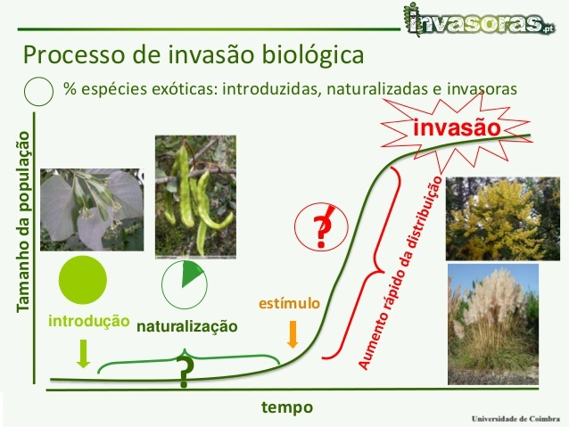
```


---

# Em geral

- 10% da população de satélites se naturaliza

- 10% das populações naturalizadas tornam-se invasoras

- Portanto, 1% das espécies introduzidas se tornará invasiva

- Regra muito geral - espécies invasoras são raras

- Mas existem 260000 espécies de plantas


---

# Tempo mínimo de residência


- A probabilidade de invasão aumenta com o tempo desde a introdução

- O tempo mínimo de residência dependerá das espécies

    - Por causa da fase de latência, invasões biológicas têm inércia incorporada


---

# O que é a ciência da invasão biológica?


## Aborda as perguntas
    

- Quais fatores contribuem para o potencial de invasão?

    - O que determina se uma população será estabelecida além da introdução (invasividade)?

- Como e por que os diferentes habitats e comunidades de plantas são suscetíveis à invasão (invasibilidade)?

- Qual o impacto das plantas invasoras na diversidade de espécies e nos processos ecossistêmicos?


---

# Quais fatores contribuem para o potencial de invasão?

**Hipótese de naturalização de Darwin** - a colonização é menos provável quando a espécie colonizadora está relacionada a membros da comunidade invadida porque a proximidade evolutiva intensifica a competição entre as espécies

```{r echo=FALSE, out.width=250, fig.align='center'}
knitr::include_graphics("https://media.giphy.com/media/3ohhwu9r3BRtEKm5Fe/giphy.gif")
```


> “Como as espécies do mesmo gênero geralmente têm, embora de forma alguma invariavelmente, muitas semelhanças em hábitos e constituição, e sempre em estrutura, a luta será geralmente mais severa entre elas, se entrarem em competição uma com a outra, do que entre as espécies de gêneros distintos”

---

# Quais fatores contribuem para o potencial de invasão?


**Hipótese de liberação do inimigo** - quando uma espécie é introduzida em um novo local, ela não é mais regulada por seus inimigos naturais
- A sobrevivência e o crescimento são maiores, portanto as plantas são mais competitivas

- Semelhante à hipótese "evolução da capacidade competitiva aumentada". Se a espécie não precisar mais de defesa contra herbívoros, poderá investir mais energia no condicionamento físico

```{r echo=FALSE, out.width=500, fig.align='center'}
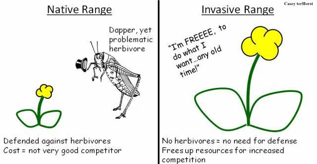
```

---

# Quais fatores contribuem para o potencial de invasão?

**Novos mecanismos de defesa** - as espécies são bem-sucedidas porque possuem novas armas bioquímicas que funcionam como agentes alelopáticos incomumente poderosos ou como mediadores de novas interações microbianas planta-solo


```{r echo=FALSE, out.width=500, fig.align='center'}
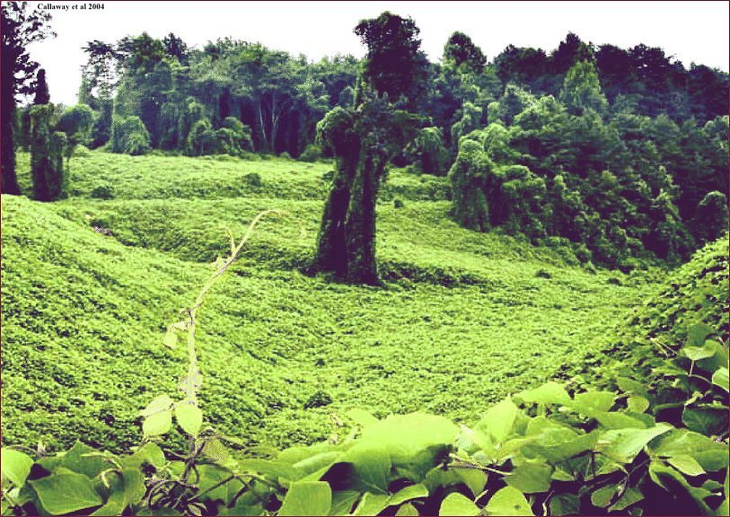
```


---


# Quais fatores contribuem para o potencial de invasão?

.pull-left[
**Plasticidade fenotípica e / ou evolução da invasividade** 

- A planta deve possuir níveis suficientemente altos de tolerância fisiológica e plasticidade, ou deve sofrer diferenciação genética para atingir os níveis exigidos de aptidão

- A evolução pode ocorrer por deriva genética, consanguinidade em populações fundadoras, hibridização intra ou interespecífica.
]


.pull-right[
```{r echo=FALSE, out.width=500, fig.align='center'}
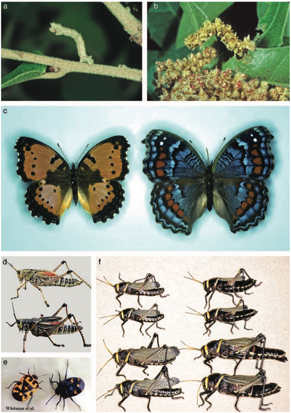
```
]


---

# Quais fatores contribuem para o potencial de invasão?

.pull-left[
```{r echo=FALSE, out.width=500, fig.align='center'}
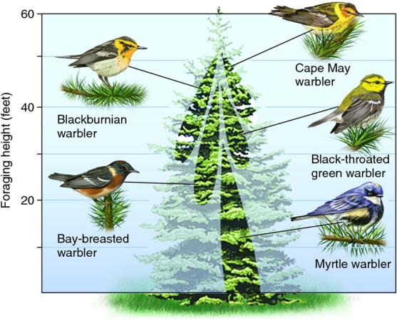
```
]


.pull-right[
**Nicho vazio** 

- Os invasores usam recursos que são deixados disponíveis por nativos ausentes. As características que permitem isso incluem características da história de vida (características de invasividade)
]


---

# Quais fatores contribuem para o potencial de invasão?

**Nicho vazio** - Características da história de vida (traços) 

- Plantas perenes com características de plantas daninhas

.pull-left[
```{r echo=FALSE, out.width=500, fig.align='center'}
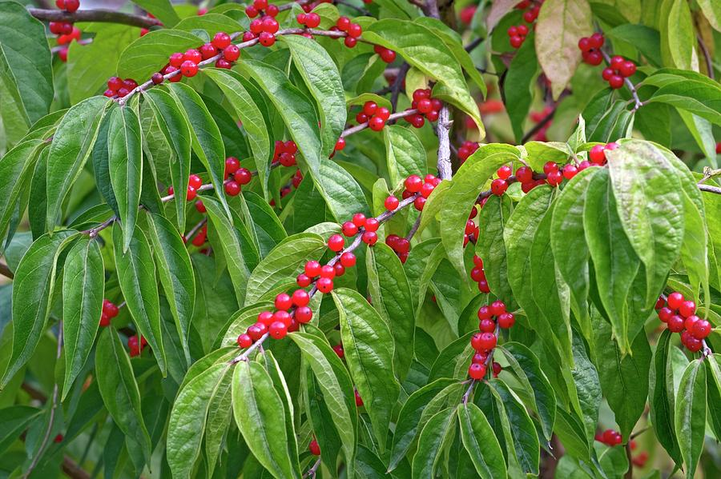
```
Amur madressilva (*Lonicera maackii*)
]


.pull-right[
```{r echo=FALSE, out.width=500, fig.align='center'}
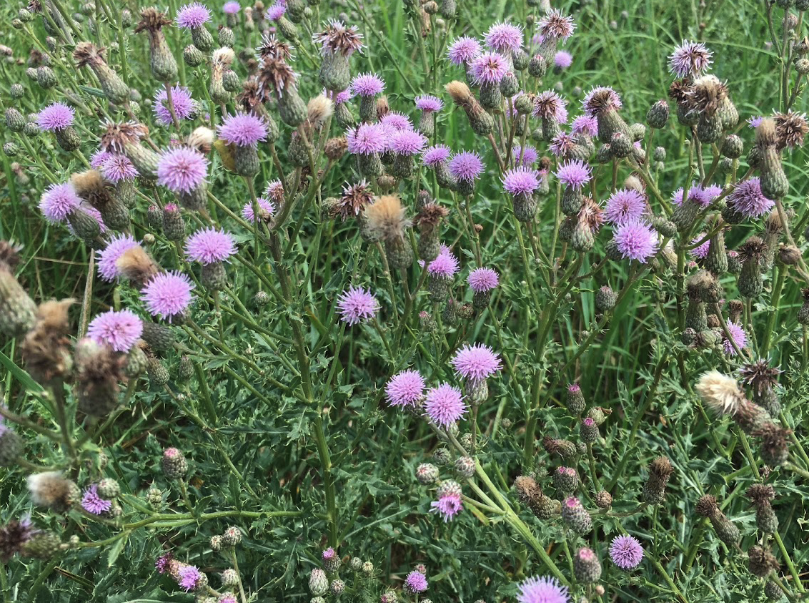
```
cardo-roxo (*Cirsium arvense*)
]


---

# Quais fatores contribuem para o potencial de invasão?

**Nicho vazio** - Características da história de vida (traços)

- Oportunistas anuais ou bianuais 

.pull-left[
```{r echo=FALSE, out.width=500, fig.align='center'}
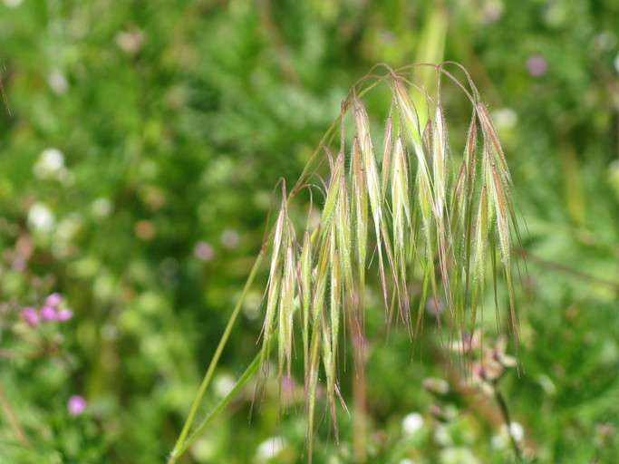
```
bromo-vassoura (*Bromus tectorum*)
]


.pull-right[
```{r echo=FALSE, out.width=500, fig.align='center'}
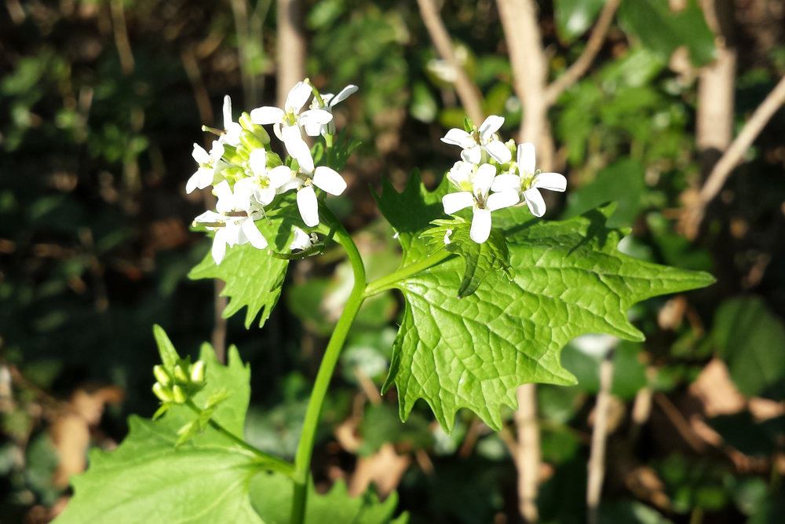
```
erva-alheira (*Alliaria petiolata*)
]

---

# Quais fatores contribuem para o potencial de invasão?


.pull-left[
**Dispersão**

- Cada vez mais, a dispersão pós-introdução por agência humana é provavelmente o fator mais significativo de muitas invasões de plantas

- Veja campanhas para limpar seu barco antes de sair de um lago ou calçados em parques estaduais/nacionais
]


.pull-right[
```{r echo=FALSE, out.width=500, fig.align='center'}
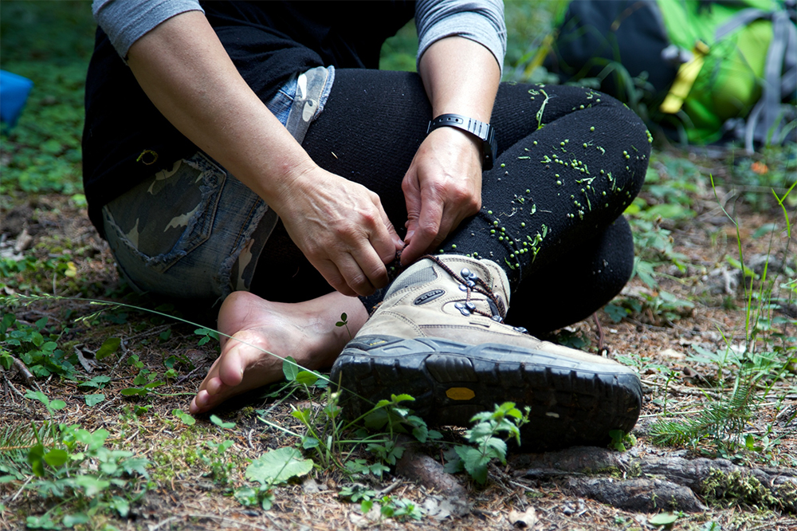
```

```{r echo=FALSE, out.width=250, fig.align='center'}
knitr::include_graphics("https://media.giphy.com/media/W3U6INALcO2Z5fdUJe/giphy.gif")
```

]

---


- O ambiente é constituído por todos os fatores bióticos e abióticos que afetam o desenvolvimento e a distribuição das plantas

- Para espécies novas ou migratórias, o ambiente é pensado como uma peneira pela qual algumas espécies passam e sobrevivem, mas a maioria falha


```{r echo=FALSE, out.width=500, fig.align='center'}
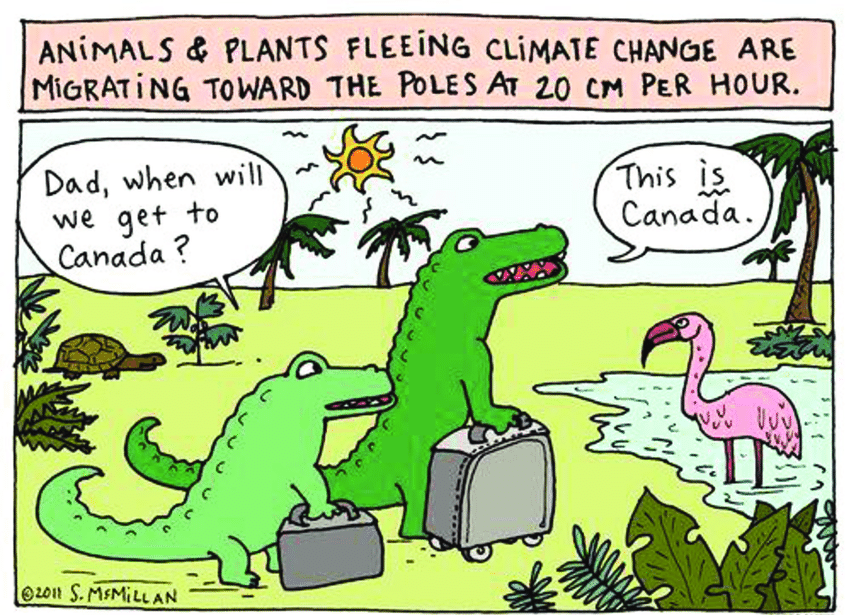
```


---


- Após a perturbação, algumas espécies encontram locais seguros ou um conjunto de condições ambientais adequadas


```{r echo=FALSE, out.width=600, fig.align='center'}
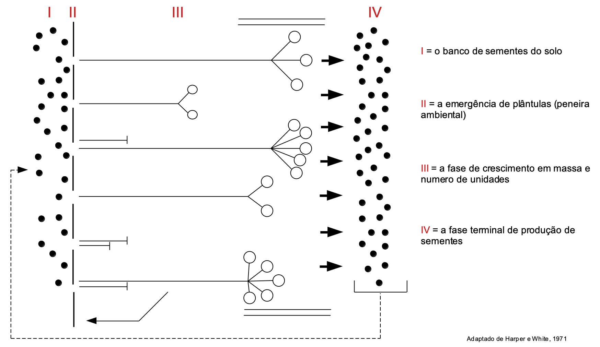
```


---

# Quais fatores contribuem para a vulnerabilidade do habitat?

.pull-left[
```{r echo=FALSE, out.width=600, fig.align='center'}
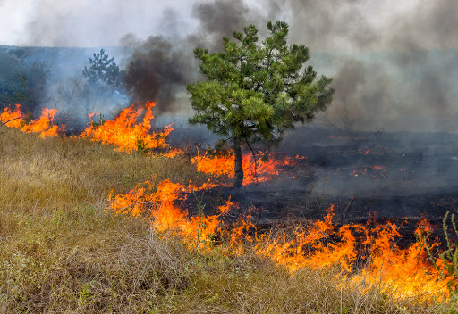
```

- Pressão de propágulo

- Distúrbios
    - Lacunas, incêndio, excesso de pastejo, doenças, etc.
]


.pull-right[

- Riqueza de espécies - o número de espécies presentes em uma comunidade
    - Diversas comunidades resistentes à invasão
    - Nichos completos -> Exclusão competitiva

- Disponibilidade de recursos (estresse e heterogeneidade espacial)
    - Se a oferta for > absorvida, haverá maior invasibilidade; flutuação
]

---

# Fatores que podem diminuir a invasibilidade

.pull-left[
- História evolutiva
    - Longa história de distúrbios humanos
    - Longa história de intensa competição

- Estrutura da comunidade
    - Alta diversidade de espécies
    - Ausência de mutualistas - micorrizas
    - Presença de herbívoros / inimigos naturais
    - Nichos completos -> Exclusão competitiva

- Perturbação - destruição total ou parcial da cobertura vegetativa
    - Manutenção do regime típico
]


.pull-right[
```{r echo=FALSE, out.width=600, fig.align='center'}
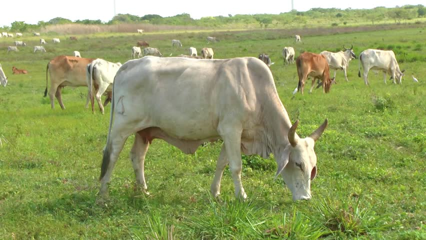
```

```{r echo=FALSE, out.width=300, fig.align='center'}
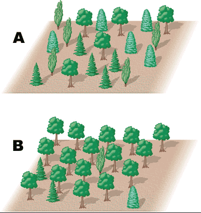
```


]

---

# Fatores que podem diminuir a invasibilidade


- **Pressão do propágulo** - probabilidade de que os propágulos se dispersem, estabeleçam e sobrevivam, de modo a manter as espécies
    - Fracos agentes de dispersão 
    - Ausência de fragmentação

- **Estresse** - o funcionamento fisiológico é reduzido abaixo do ideal 
    - Baixa disponibilidade de recursos
    - Condições extremas
    - Flutuação
    
```{r echo=FALSE, out.width=250, fig.align='center'}
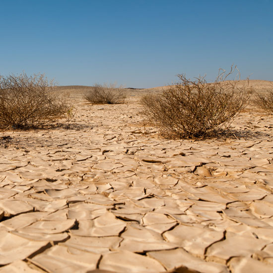
```


---

# Invasão em grandes áreas geográficas


## A dispersão geográfica ocorre por


- Patches que crescem como uma frente (não é comum em invasões)

- Indivíduos (satélites) que formam novos patches
    - Relação dispersão-sobrevivência

- Alguns sugerem que, como as populações de satélites crescerão mais rapidamente que o patch estabelecido, é melhor localizar e erradicar esses indivíduos do que tentar erradicar o patch de origem


---

# Do ponto de vista do manejo
    
## Duas perguntas são críticas


1. Sob quais condições os ecossistemas invadidos se formam?

2.  Quais mecanismos mantêm o domínio de plantas exóticas?
     - A maioria das ferramentas de controle de planta daninhas não trata dos mecanismos que causam o inicio do problema. Portanto, é provável que o local permaneça suscetível à invasão pela mesma ou novas espécies
     
---

# Dúvidas?


.center[


```
MAXWEL COURA OLIVEIRA - maxweloliveira@unoeste.br
```
]


```{r eval=FALSE}
#remotes::install_github('rstudio/pagedown')
pagedown::chrome_print("Herbicide_1.html")
```

