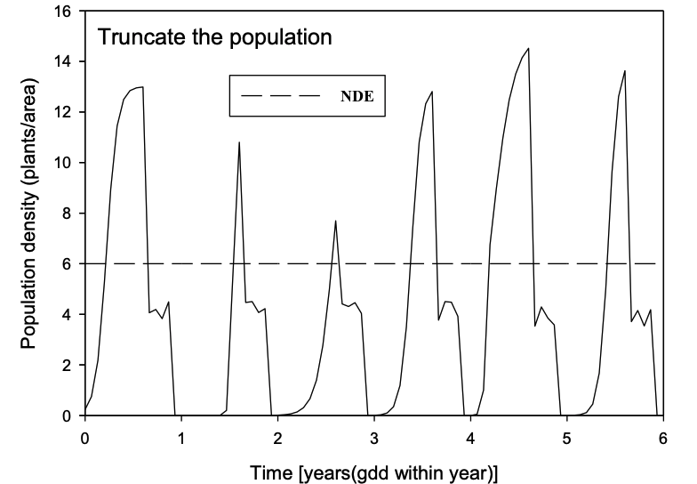
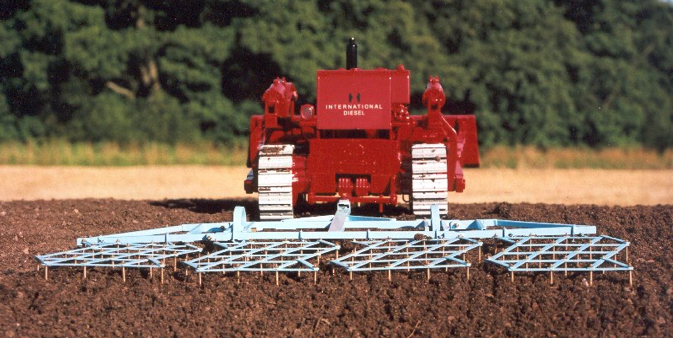
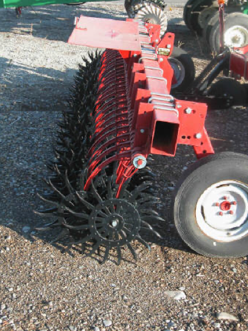

```{r setup, include=FALSE}
options(htmltools.dir.version = FALSE)

knitr::opts_chunk$set(
  echo = FALSE,
  fig.align = "center",
  message = FALSE,
  warning = FALSE,
  cache = TRUE
)
```

```{r}
library(pagedown)
```


# Objetivos 

## Você vai aprender

- Distinguir três objetivos do manejo de plantas daninhas


- Ilustrar três princípios da MIPD


- Identifique e descrever quatro componentes de um programa MIPD


.center[]

---


# Componentes do MIPD

.pull-left[

- Prevenção

- Erradicação

- Controle
  - Cultural
  - Mecânico
  - Biológico
  - Químico

]
--


.pull-right[
```{r echo=FALSE, out.width=500, fig.align='center'}

```
]

---

# Prevenção


> **Prevenção** é impedir que as plantas daninhas (sementes ou propagulos vegetativos) contaminem, se estabeleçam ou se espalhem dentro de uma área

.center[]


Quais são as cinco maneiras pelas quais podemos praticar a prevenção de plantas daninhas?


---

# Prevenção


**Quarentena**  são usadas para isolar e previnir a propagação de plantas nocivas
  

  
> **Fato:** "Cerca de 85% das plantas que chegam ao País para fins de pesquisa estão contaminadas com pragas" (EMBRAPA)

```{r echo=FALSE, out.width=500, fig.align='center'}

```

---

# Prevenção


**Lei de sementes**  são decretadas para garantir a pureza de sementes de culturas de alto valor econômico e prevenir a dispersão de sementes de plantas daninhas

```{r echo=FALSE, out.width=500, fig.align='center'}

``` 


Acesse aqui a [Lei de sementes no Brasil](http://www.planalto.gov.br/ccivil_03/LEIS/2003/L10.711.htm)


---

# Prevenção


**Lei de plantas daninhas** são decretadas para obrigar as autoridades locais e proprietários a executar medidas de saneamento de plantas daninhas em propriedades rurais, rodovias, ferrovias, áreas não agrícolas e outras

```{r echo=FALSE, out.width=500, fig.align='center'}

``` 

---

# Prevenção


**Educação** para prevenir a propagação de plantas daninhas requer que individuos sejam capazes de identificar espécies de plantas daninhas/invasoras.


```{r echo=FALSE, out.width=500, fig.align='center'}
knitr::include_graphics("images/education.png")
``` 

---

# Prevenção

## Precauções além de leis e regulações

- Não deixe plantas indesejáveis reproduzirem
--


- Não espalhe sementes em áreas não infestadas
--


- Não espalhe estruturas reprodutivas de plantas daninhas ou invasoras
--


- Não alimente animais com material contaminado com sementes ou propagulos de plantas daninhas/invasoras
--


- Limpeza de equipamentos, máquinas, colheitadoras, implementos etc
--


- Elimine plantas daninhas antes da fase reprodutiva


---

# Prevenção


```{r echo=FALSE, out.width=700, fig.align='center'}

``` 


---

# Erradicação

> **Erradicação** é a eliminação completa de todas as plantas daninhas e suas sementes/propágulos.
--


Com qual frequência a erradicação é eficaz?


---

# Erradicação


**Palmer amaranth** (*Amaranthus palmeri*) no Mato Grosso em 2015

Mais informações sobre [Palmer amaranth no Mato Grosso]( https://ainfo.cnptia.embrapa.br/digital/bitstream/item/159778/1/Doc-384-OL.pdf)

```{r echo=FALSE, out.width=400, fig.align='center'}
knitr::include_graphics("images/palmer.png")
``` 

Erradicada?

---


# Controle


> O **controle** de plantas daninhas inclui práticas que reduzem a densidade, o crescimento e a produção de sementes de plantas daninhas (um impacto negativo na biologia da população de plantas daninhas).


O controle é usado somente após a existência de um problema, não é prevenção!


---


# Manejo Integrado de Plantas Daninhas


## Três princípios:

- Abaixar a densidade de equilíbrio para um nível tolerável
--


- Reduza a adequação relativa (e efeito) da erva daninha (aumenta a tolerância)
--


- Mudar a composição das comunidades de plantas daninhas para plantas menos agressivas e fáceis de manejar
--

---

# Abaixar a densidade de equilíbrio


```{r echo=FALSE, out.width=700, fig.align='center'}

``` 


---

# Abaixar a densidade de equilíbrio


```{r echo=FALSE, out.width=700, fig.align='center'}

``` 


---

# Reduzir a adaptação da planta daninha


```{r echo=FALSE, out.width=700, fig.align='center'}

``` 


---

# Alterar a composição das plantas daninhas


```{r echo=FALSE, out.width=700, fig.align='center'}

``` 


---

# Controle Cultural


- A maioria são atividades de prevenção
--


- Rotação/sucessão de culturas
--


- Competição

    - Espaçamento entre linhas

    - População

    - Cultivares/híbridos
--


- Plásticos/palha/culturas de coberturas
--


- Consórciação de culturas


---

# Consórcio


```{r echo=FALSE, out.width=700, fig.align='center'}

``` 


---

# Espaçamento

.pull-left[
```{r echo=FALSE, out.width=600, fig.align='center'}

``` 

```{r echo=FALSE, out.width=900, fig.align='center'}
knitr::include_graphics("https://pbs.twimg.com/media/Eb9gRFEUMAAT0Ec?format=jpg&name=large")
``` 

]

.pull-right[
```{r echo=FALSE, out.width=600, fig.align='center'}

``` 

```{r echo=FALSE, out.width=900, fig.align='center'}
knitr::include_graphics("https://pbs.twimg.com/media/Eb9gRElWsAAnjah?format=jpg&name=large")
``` 

]


---

# Espaçamento


.pull-left[
```{r echo=FALSE, out.width=600, fig.align='center'}

``` 

]

.pull-right[
```{r echo=FALSE, out.width=600, fig.align='center'}

``` 

]


---

# Manejo de dossel das culturas


```{r echo=FALSE, out.width=800, fig.align='center'}
knitr::include_graphics("images/palmer_adaptation.png")
``` 


---

# Seleção de cultivares

.pull-left[
```{r echo=FALSE, out.width=800, fig.align='center'}

``` 
]

.pull-right[
```{r echo=FALSE, out.width=800, fig.align='center'}

``` 

.center[]

]


---

# Culturas de cobertura


```{r echo=FALSE, out.width=700, fig.align='center'}
knitr::include_graphics("images/cover.jpg")
```


---

# Culturas de cobertura

```{r echo=FALSE, out.width=700, fig.align='center'}
knitr::include_graphics("https://pbs.twimg.com/media/EaQb53TXgAMtNe_?format=jpg&name=large")
```


---

# Controle mecânico

## Métodos físicos
--


- Arranquio 
--


- Capina
--


- Roçada
--


- Manejo da água - inundações e drenagem
--


- Fogo ou tocha
--


- Solarização
--


- Trituração de sementes


---

# Arranquio


```{r echo=FALSE, out.width=700, fig.align='center'}
knitr::include_graphics("images/arranquio.png")
```


---

# Capina manual


```{r echo=FALSE, out.width=700, fig.align='center'}

```


---

# Roçada

```{r echo=FALSE, out.width=500, fig.align='center'}
knitr::include_graphics("https://media.giphy.com/media/hBtT2enkmRuY8/giphy.gif")
```


.pull-left[
```{r echo=FALSE, out.width=500, fig.align='center'}
knitr::include_graphics("https://previews.123rf.com/images/farion25/farion251606/farion25160600117/59213874-mowing-weeds-in-garden-to-petrol-trimmer-close-up.jpg")
```
]

.pull-right[
```{r echo=FALSE, out.width=300, fig.align='center'}
knitr::include_graphics("https://arrowlawncare.com/wp-content/uploads/2015/06/grass-mow-high-weeds-350.png")
```

]


---

# Manejo de água


```{r echo=FALSE, out.width=700, fig.align='center'}

```


---

# Fogo ou tocha


```{r echo=FALSE, out.width=400, fig.align='center'}
knitr::include_graphics("https://media.giphy.com/media/dhKOztH8klyvu/giphy-downsized-large.gif")
```

--

.pull-left[
```{r echo=FALSE, out.width=400, fig.align='center'}

```
]


.pull-right[
```{r echo=FALSE, out.width=600, fig.align='center'}

```
]


---

# Fogo ou tocha


```{r echo=FALSE, out.width=600, fig.align='center'}
knitr::include_graphics("https://images.slideplayer.com/23/6615228/slides/slide_1.jpg")
```


---

# Fogo ou tocha

```{r echo=FALSE, out.width=600, fig.align='center'}

```


---

# Solarização


```{r echo=FALSE, out.width=600, fig.align='center'}

```


---

# Colheita sementes - trituração


```{r echo=FALSE, out.width=800, fig.align='center'}
knitr::include_graphics("https://canoladigest.ca/wp-content/uploads/2018/08/32-manage-weeds-feature.jpg")
```


---

# Controle mecânico

## Manejo de Primário Solo

- Desagregação do solo
    - 15 a 60 cm
    - Preparo do solo, aração, gradagem, etc


## Manejo Secundário do Solo

- Após o manejo primário de solo, geralmente com menos pertubação

---

# Manejo de Primário Solo


.pull-left[
```{r echo=FALSE, out.width=400, fig.align='center'}

```

```{r echo=FALSE, out.width=300, fig.align='center'}
knitr::include_graphics("images/deep_2.png")
```
]


.pull-right[
```{r echo=FALSE, out.width=400, fig.align='center'}

```

```{r echo=FALSE, out.width=400, fig.align='center'}

```
]


---

# Manejo Secundário do Solo


```{r echo=FALSE, out.width=600, fig.align='center'}
knitr::include_graphics("https://media.giphy.com/media/7FgI5xUhXfGZx1rX74/giphy.gif")
```


---

# Manejo Secundário do Solo

## Tandem disk


```{r echo=FALSE, out.width=600, fig.align='center'}

```


---

# Manejo Secundário do Solo

## Cultivator


```{r echo=FALSE, out.width=600, fig.align='center'}

```


---

# 

```{r echo=FALSE, out.width=700, fig.align='center'}

```


---

# Manejo Secundário do Solo

## Undercutter


```{r echo=FALSE, out.width=600, fig.align='center'}

```


---

# Manejo Secundário do Solo

## Cultipacker

```{r echo=FALSE, out.width=600, fig.align='center'}
knitr::include_graphics("images/cultipacker.png")
```


---

# Manejo Secundário do Solo

## Harrow

```{r echo=FALSE, out.width=600, fig.align='center'}

```


---

# Manejo Secundário do Solo

## Exada rotativa

.pull-left[
```{r echo=FALSE, out.width=400, fig.align='center'}

```
]

.pull-left[
```{r echo=FALSE, out.width=400, fig.align='center'}

```
]


---

# 


---

# Manejo Secundário do Solo

## Detatcher


---

# Técnicas de Conservação do solo

.pull-left[
## Vantagens:

- Resíduos minimiza a erosão


- Ruduz o uso de energia


- Ruduz a compactação


- Melhora a estrutura do solo


- Aumenta a conservação do solo e água
]


.pull-right[
```{r echo=FALSE, out.width=400, fig.align='center'}

```

```{r echo=FALSE, out.width=400, fig.align='center'}
knitr::include_graphics("https://www.eartheclipse.com/wp-content/uploads/2016/04/soil-in-hands.jpg")
```

]


---


# Técnicas de Conservação do solo

.pull-left[

## Desvantagens:

- Menor temperatura do solo


- Incidência de doenças/pragas pode aumentar


- Muda a irrigação


- Maior dependência do controle químico de plantas daninhas
]


.pull-right[
```{r echo=FALSE, out.width=600, fig.align='center'}

```
]


---


# Técnicas de Conservação do solo


```{r echo=FALSE, out.width=600, fig.cap="U of Minnesota", fig.align='center'}
knitr::include_graphics("https://www.agweek.com/incoming/4888957-x17h80-Agweek-January-2019-picture-4782193.jpg/alternates/BASE_LANDSCAPE/Agweek-January-2019-picture-4782193.jpg")
```


---


# Técnicas de Conservação do solo


```{r echo=FALSE, out.width=600, fig.align='center', fig.cap="U of Minnesota", fig.pos= "middle"}
knitr::include_graphics("https://www.agweek.com/incoming/4888955-elibmo-15R8vOUYUvmG34ldsVOxGeSRQPJ9vu6PD.jpg/alternates/BASE_LANDSCAPE/15R8vOUYUvmG34ldsVOxGeSRQPJ9vu6PD.jpg")
```