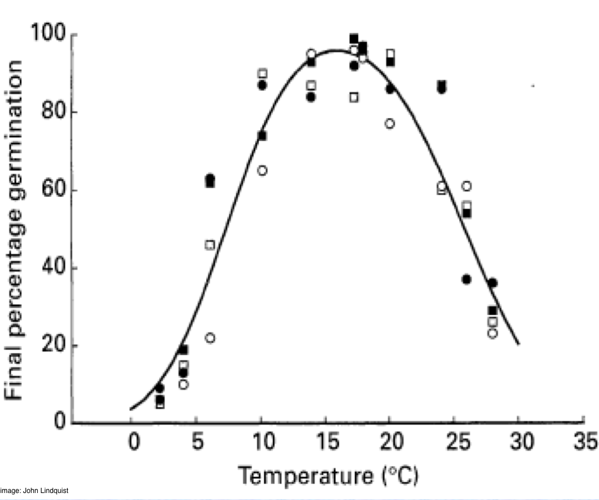
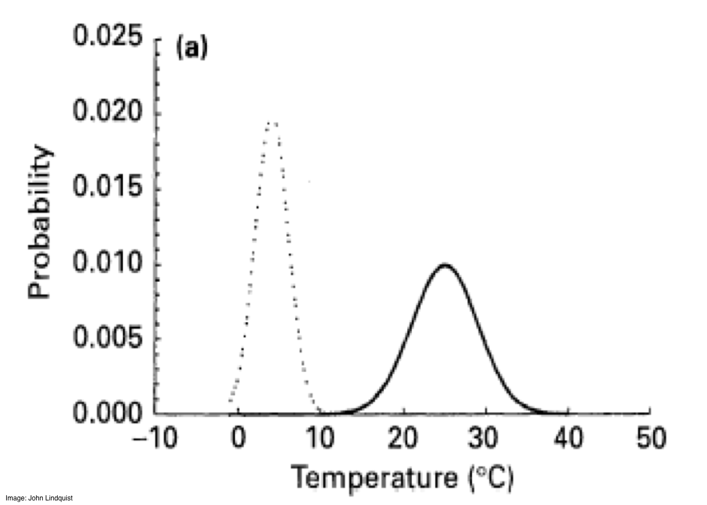
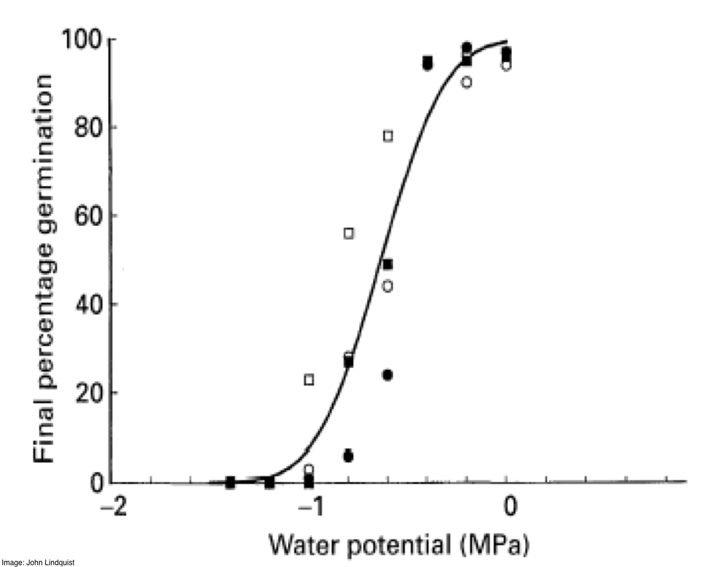
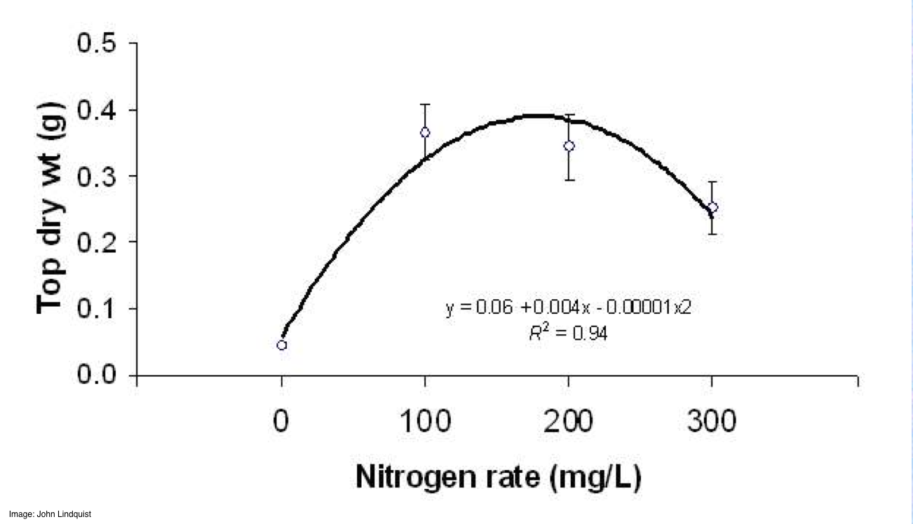
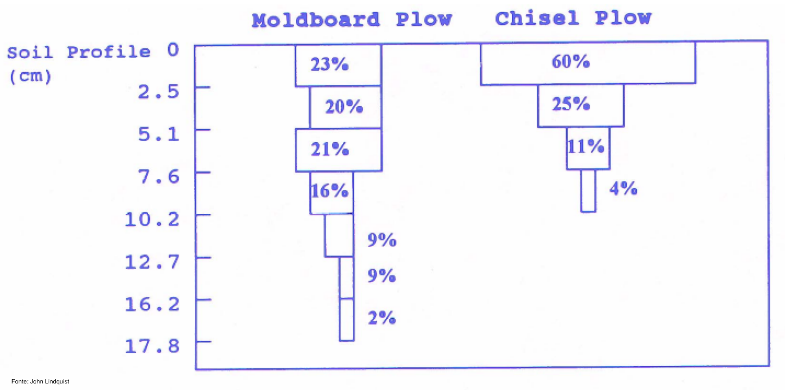
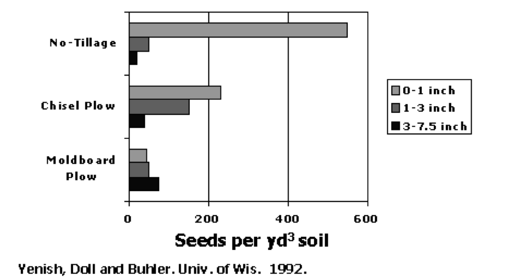
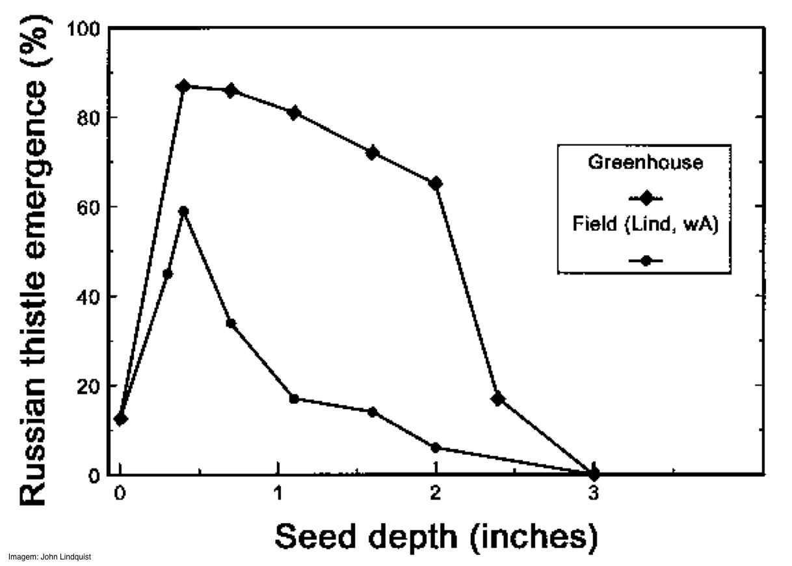
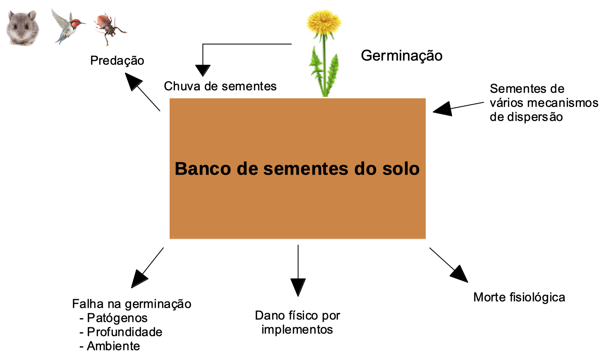
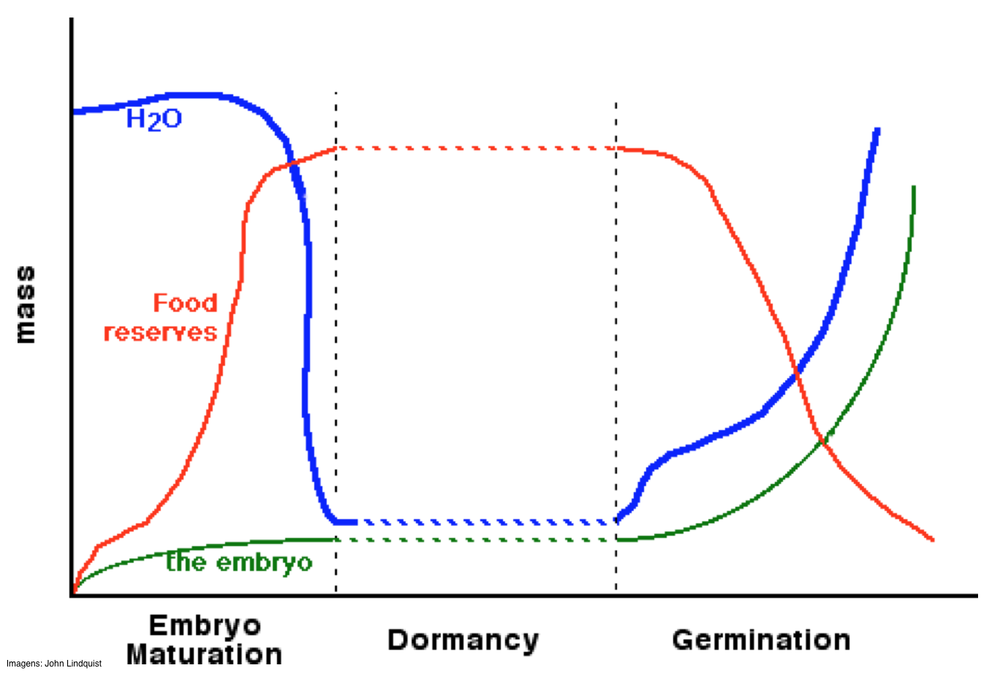

# Objetivos

- Estimar, qualitativa e quantitativamente, o ciclo de vida de plantas invasoras

- Explicar os processos que controlam o destino das sementes no banco de sementes

- Quantifique o recrutamento (emergência, maturação e imigração) 

- Discutir os fatores que afetam a sobrevivência e a produção de sementes

- Descrever maneiras pelas quais as plantas se dispersam


---

# O banco de sementes de plantas daninhas


```{r echo=FALSE, out.width=700, fig.align='center'}
knitr::include_graphics("images/seedbank.png")
``` 


---

# O banco de sementes de plantas daninhas

## Depósitos, retiradas e armazenamento em bancos de sementes:

- Os depósitos incluem chuva de sementes da produção, dispersão e imigração de sementes
--


- As retiradas ocorrem por germinação, senescência, morte e predação
--


- O armazenamento resulta da distribuição vertical de sementes dormentes viáveis através do perfil do solo


---

# O banco de sementes de plantas daninhas

## Destino das sementes na superfície do solo:

- Morte (decadência ou predação)

- Germinação

- Entrada na camada de arável


---

# Fatores que contribuem para o sucesso da germinação


```{r echo=FALSE, out.width=600, fig.align='center'}

``` 


---

# Fatores que contribuem para o sucesso da germinação


```{r echo=FALSE, out.width=600, fig.align='center'}

``` 


---

# Fatores que contribuem para o sucesso da germinação


```{r echo=FALSE, out.width=600, fig.align='center'}

``` 


---

# Fatores que contribuem para o sucesso da germinação


```{r echo=FALSE, out.width=600, fig.align='center'}

``` 


---

# O banco de sementes de plantas daninhas


## Destino das sementes na superfície do solo:
--


- Morte (decadência ou predação)
--


- Germinação
--


- Entrada na camada de arado -
    - características especiais da espécie permitem que ela penetre na superfície do solo
    - rachaduras no solo, enterro por minhocas, insetos, roedores
    - qualquer forma de preparo do solo


---

# 


---


# O banco de sementes de plantas daninhas


## Sementes na camada arável:

- Efeitos do plantio direto no enterro de sementes

- Efeitos do plantio direto na germinação de sementes


---


# Sementes na camada arável:

## Efeitos do preparo do solo no enterro de sementes


```{r echo=FALSE, out.width=700, fig.align='center'}

``` 


---

# Sementes na camada arável

## Influência do preparo do solo na distribuição de sementes no perfil do sol


```{r echo=FALSE, out.width=700, fig.align='center'}

``` 


---

# Sementes na camada arável

## Efeitos do preparo do solo na germinação


```{r echo=FALSE, out.width=700, fig.align='center'}

``` 


---


# O banco de sementes de plantas daninhas

## Sementes na camada arável

Efeitos do plantio direto na germinação:

- Posicionamento de sementes perto da superfície do solo

- Solos suaves (macios) aquecem mais rapidamente

- Aumento do teor de oxigênio do solo superficial

- Efeitos de luz na germinação


---

# O banco de sementes de plantas daninhas

## Efeitos do plantio direto na germinação de sementes

solos suaves (macios) aquecem mais rapidamente


---

# Efeitos do preparo do solo na germinação

.pull-left[
- Posicionamento de sementes perto da superfície do solo

- Solos suaves (macios) aquecem mais rapidamente

- Aumento do teor de oxigênio do solo superficial

- Efeitos de luz na germinação
]


.pull-right[


]

---

# O banco de sementes de plantas daninhas, N<sub>t</sub>


```{r echo=FALSE, out.width=700, fig.align='center'}

``` 


---

# Predação


- Sistemas de plantio direto e sistemas de forragem / perenes

- Pouco distúrbio

- Maioria da chuva de sementes pode ser eliminada por predação

- A maioria das predações ocorrerá na superfície do solo


---

# Armazenamento do banco de sementes

- Permite a dispersão no tempo

- Muitas espécies (particularmente espécies de folha larga). Podem permanecer viáveis no banco de sementes por > 20 anos

- Foram descobertas sementes viáveis de cordeiros e espoletas de milho (*Spergula arvensis*; Caryophyllaceae), datadas de 1700 anos


---

# Armazenamento do banco de sementes


## A longevidade no solo pode ser substancial

- As condições profundas no solo são frescas e úmidas

- Quanto mais profundo o enterro, mais tempo a semente pode permanecer viável (sem perturbações e dormência)

- A dormência do banco de sementes garante a sobrevivência das espécies em sistemas com perturbações frequentes


---


# Medindo o banco de sementes no solo


Se um produtor contrata você para determinar quantas ervas daninhas de quais espécies existiam em uma lavoura, como você faria isso?


---

# Medindo o banco de sementes no solo


---

#


---

# 


---

# O banco de sementes de plantas daninhas, N<sub>t</sub>


```{r echo=FALSE, out.width=700, fig.align='center'}
knitr::include_graphics("images/seedbank.png")
``` 


---

# Dormência

**Dormência** - falha na germinação de sementes viáveis

- Mecanismo de sobrevivência

- Permite a dispersão no tempo

- Regulado por complexas interações ambientais, fisiológicas e bioquímicas

vários

---

# Mudanças na semente


```{r echo=FALSE, out.width=700, fig.align='center'}

``` 


---

# Causas da dormência


- Ambiente desfavorável

- Embrião imaturo

- É necessário estimular algum processo - após o amadurecimento

- Inibidor de germinação está presente

- Sementeira dura

- Falta de oxigênio


---

# Causas de dormência - ambiente desfavorável


---

# 
