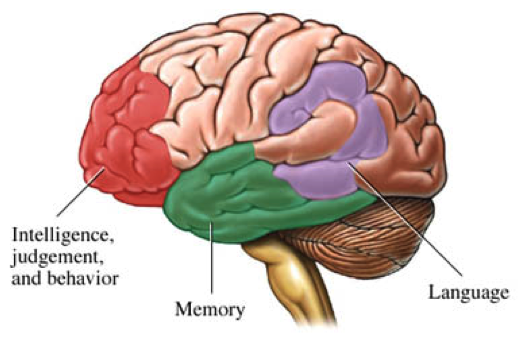
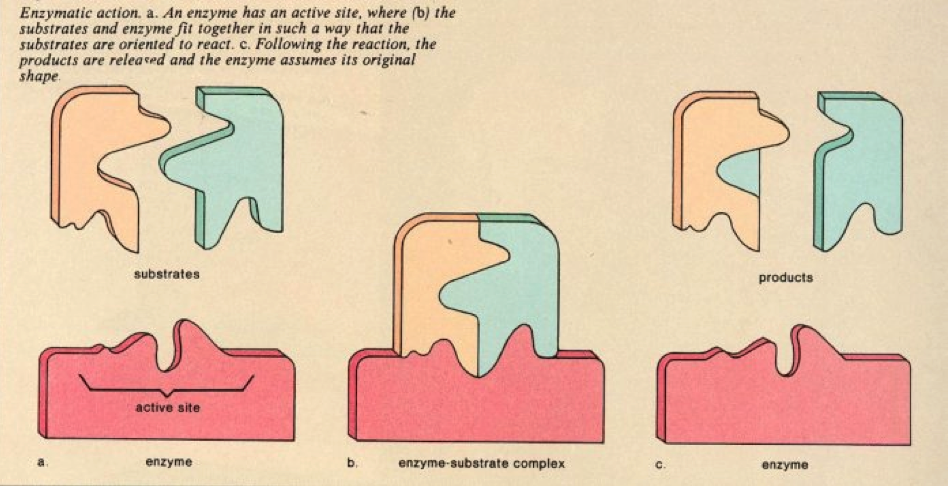
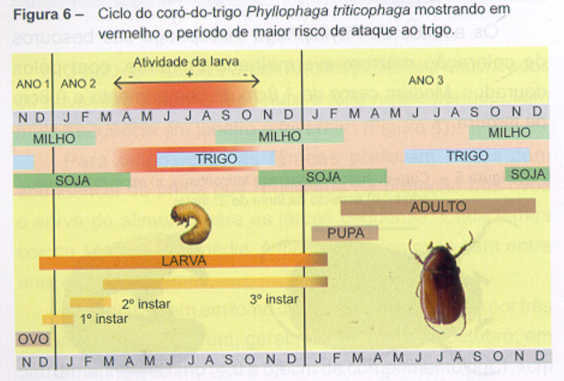
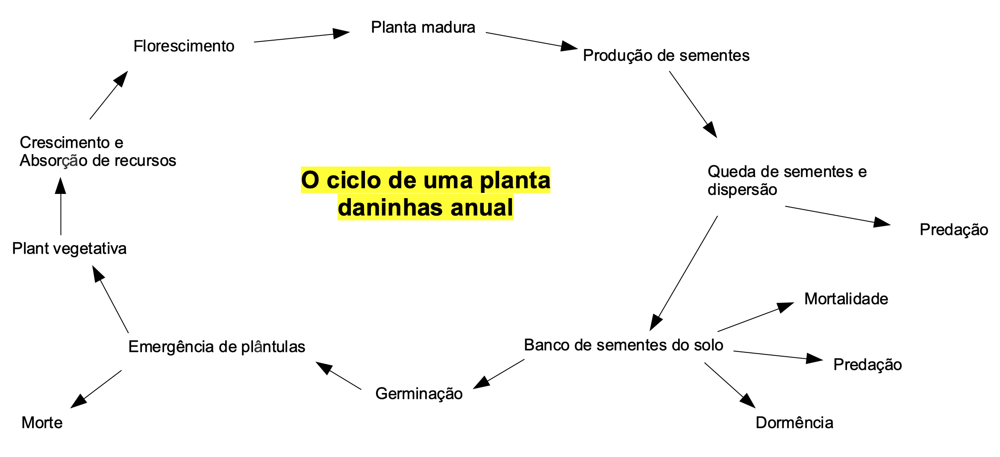
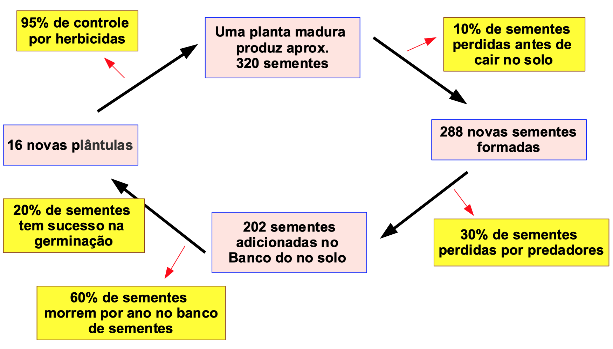
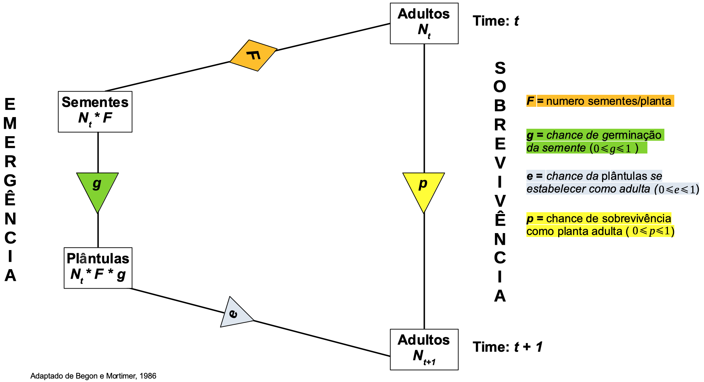
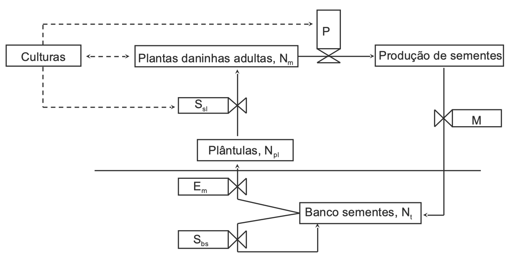

```{r setup, include=FALSE}
options(htmltools.dir.version = FALSE)

knitr::opts_chunk$set(
  echo = FALSE,
  fig.align = "center",
  message = FALSE,
  warning = FALSE,
  cache = TRUE
)
```

```{r}
library(pagedown)
```

# Um exemplo de ecologia populacional aplicada

- Suponha que um produtor acabou de arrendar mais 600 ha de terra irrigada na região de Assis, São Paulo. Ele planeja plantar essa área para uma rotação milho-soja transgênica (resistente ao glifosato). As plantas daninhas mais comuns nesses campos são capim amargoso, buva e botão-de-ouro. Em 5 anos, quais são os 3 resultados possíveis desse manejo? Liste os resultados e os motivos.


```{r echo=FALSE, out.width=800, fig.align='center'}
knitr::include_graphics("https://images.unsplash.com/photo-1593637607350-146aae52207d?ixlib=rb-1.2.1&ixid=eyJhcHBfaWQiOjEyMDd9&auto=format&fit=crop&w=2709&q=80")
```

- O que mais você gostaria de saber sobre o desse produtor rural?


---

# Modelos


Para descrever o crescimento de uma população de plantas daninhas que leva em consideração todos esses resultados possíveis, precisamos de um modelo
--

.pull-left[
Três tipos de modelos:


- Modelos de pensamento


- Modelos esquemáticos


- Modelo matemático
]
--


.pull-right[
```{r echo=FALSE, out.width=350, fig.align='center'}
knitr::include_graphics("https://media.giphy.com/media/APqEbxBsVlkWSuFpth/giphy.gif")
```
]

---


# Modelos de pensamento

Modelos que carregamos em nossas cabeças. Fornece a estrutura para a maneira como pensamos sobre o mundo ao nosso redor.

```{r echo=FALSE, out.width=350, fig.align='center'}

```

```{r echo=FALSE, out.width=350, fig.align='center'}
knitr::include_graphics("https://media.giphy.com/media/RGXtTi4SLHva7nrQGO/giphy.gif")
```

---

# Modelos de pensamento

.pull-left[
- Filosofia

- Economia

- Social

- Desenvolvimento

- Outros
]


.pull-left[
```{r echo=FALSE, out.width=400, fig.align='center'}
knitr::include_graphics("https://media.giphy.com/media/11LmeD33ETXN1C/giphy.gif")
```
]

---

# Modelos de pensamento


## Prós
- Eles são inerentes


- Eles estão sendo constantemente formulados e reformulados
--


## Contras

- Raramente somos capazes de articulá-los


- Eles estão mudando constantemente - torna a previsão difícil, inconsistente


- Eles estão em nossas cabeças, ninguém mais tem acesso a eles


---

# Modelos esquemáticos

Uma imagem que nos permite imaginar os componentes de um sistema - de uma maneira que faça sentido.


```{r echo=FALSE, out.width=350, fig.align='center'}

```

```{r echo=FALSE, out.width=350, fig.align='center'}
knitr::include_graphics("https://media.giphy.com/media/xT5LMDZgrau4WRdkJy/giphy.gif")
```

---

# Modelos esquemáticos

- Alguns modelos esquemáticos são projetados apenas para ajudar a visualizar os componentes do sistema.


- Desenhe um modelo esquemático do ciclo de vida de um organismo.


```{r echo=FALSE, out.width=600, fig.align='center'}

```


---

# Modelos esquemáticos

Alguns modelos esquemáticos são projetados apenas para ajudar a visualizar os componentes do sistema

```{r echo=FALSE, out.width=700, fig.align='center'}

```

---

# Modelos esquemáticos

Outro modelo esquemático do ciclo de vida de uma planta anual.

```{r echo=FALSE, out.width=700, fig.align='center'}
knitr::include_graphics("images/lifecycle_2.png")
```


---


# Modelos esquemáticos 

# Quantitativos

Outros modelos são projetados para visualizar os componentes e começar a pensar nos relacionamentos de uma maneira mais quantitativa


```{r echo=FALSE, out.width=700, fig.align='center'}

```

---

# Modelos esquemáticos

Outros modelos nos ajudam a pensar sobre o sistema de uma maneira mais quantitativa

```{r echo=FALSE, out.width=700, fig.align='center'}

```

---

# Modelos esquemáticos

- Variáveis de estado são mensuráveis


- As variáveis de taxa representam relacionamentos entre variáveis de estado e podem ser representadas usando equações.


```{r echo=FALSE, out.width=700, fig.align='center'}

```


---

# Modelos matemáticos

Fornece uma estrutura quantitativa que permita uma maior compreensão do funcionamento de um sistema.

## Modelos fenomenológicos 

- São baseados no empirismo e comumente construídos com equações diferenciais (a integração pode ser realizada analiticamente).

##Modelos mecanísticos 

- São baseados no entendimento básico dos relacionamentos entre muitas variáveis de estado. Esse entendimento pode ser teórico ou empírico. Esses modelos nunca são verdadeiramente mecanicistas. Eles são comumente construídos usando equações de diferença (a integração é realizada iterativamente).

---

# Crescimento populacional

## Um modelo fenomenológico

Vamos supor no momento que o número de sementes produzidas por planta (R) seja constante e que todas essas sementes produzirão plantas no próximo ano.

Se isso for verdade, o número de plantas no próximo ano (N<sub>t + 1</sub>) é o quê?


```{r echo=FALSE, out.width=400, fig.align='center'}
knitr::include_graphics("https://media.giphy.com/media/xT1Ra5h24Eliux3UVq/giphy.gif")
```


---

# Crescimento populacional


## Assumindo que: 

- N<sub>0</sub> = tamanho inicial da população = 1 planta m<sup>-2</sup>

- R = produção constante de sementes = planta de 100 sementes<sup>-1</sup>

- Todas as sementes produzem plantas.

.center[

N<sub>1</sub> = R * N<sub>0</sub> = ?? unidade? 

]

---

# Crescimento populacional

## Assumindo que: 

- N<sub>t</sub> = tamanho da população no tempo t

- Produção constante de sementes (R) 

- Todas as sementes produzem plantas

.center[
N<sub>t+1</sub> = RN<sub>t</sub> ou N<sub>1</sub> = RN<sub>0</sub>

N<sub>2</sub> = RN<sub>1</sub> = R(RN<sub>0</sub>) = R<sup>2</sup> N<sub>0</sub>

N<sub>3</sub> = RN<sub>2</sub> = R(R<sup>2</sup>No) = R<sup>3</sup>N<sub>0</sub>
]


**Então:**


.center[
<mark>N<sub>t</sub> = R<sup>t</sup> N<sub>0</sub></mark>
]


---

# Crescimento populacional

## Assumindo que: 

- N<sub>t</sub> = tamanho da população no tempo t

- Produção constante de sementes (R)

- Todas as sementes produzem plantas

.center[
<mark>N<sub>t</sub> = R<sup>t</sup> N<sub>0</sub></mark>
]

Portanto, se tivermos oito plantas este ano (N<sub>0</sub> = 8 plantas m<sup>-2</sup>) e cada uma produzir 10 sementes (R = 10 sementes planta<sup>-1</sup>), quantas plantas haverá em 9 anos?


---

# Crescimento populacional


```{r echo=TRUE}
N9 = 10 ^ 9 * 8 #<<
format(N9, scientific=F) # usado para eliminar o número exponencial
```

.center[
<mark>N<sub>t</sub> = 8,000,000,000 plantas m<sup>-2</sup>
]

```{r echo=FALSE, out.width=500, fig.align='center'}
knitr::include_graphics("https://media.giphy.com/media/tdN4TpyM3dzYA/giphy.gif")
```

---

# Suposições ou premissas são erradas


- O número de sementes produzidas por planta (R) **NÃO** é constante
--


- Nem todas as sementes permanecem na área e sobrevivem
--


- Nem todas as sementes que sobrevivem produzem plântulas no próximo ano
--


- Nem todas as plantas que emergem sobrevivem


```{r echo=FALSE, out.width=500, fig.align='center'}
knitr::include_graphics("https://media.giphy.com/media/4How4vb1GsLTi/giphy.gif")
```


---

# Suposições ou premissas são erradas

Como podemos modificar <mark>N<sub>t</sub> = R<sup>t</sup> N<sub>0</sub></mark>  para corrigir essas suposições erradas?

```{r echo=FALSE, out.width=500, fig.align='center'}
knitr::include_graphics("https://media.giphy.com/media/26gR0YFZxWbnUPtMA/giphy.gif")
```


---


# O banco de sementes de plantas daninhas


```{r echo=FALSE, out.width=700, fig.align='center'}

```


---

# Dúvidas?


```{r echo=FALSE, out.width=400, fig.align='center', fig.pos= "middle"}
knitr::include_graphics("https://media.giphy.com/media/13qctMBrrgbwJi/giphy.gif")
```

.center[
```
MAXWEL COURA OLIVEIRA - maxweloliveira@unoeste.br
```
]


```{r eval=FALSE}
#remotes::install_github('rstudio/pagedown')
pagedown::chrome_print("pop_biology_1.html")
```