```{r setup, include=FALSE}
options(htmltools.dir.version = FALSE)

knitr::opts_chunk$set(
  echo = FALSE,
  fig.align = "center",
  message = FALSE,
  warning = FALSE,
  cache = TRUE
)
```

```{r}
library(pagedown)
```

# Objetivos

- Estimar, qualitativa e quantitativamente, o ciclo de vida de plantas invasoras

- Explicar os processos que controlam o destino das sementes no banco de sementes

- Quantificar o recrutamento (emergência, maturação e imigração) 

- Discutir os fatores que afetam a sobrevivência e a produção de sementes

- Descrever maneiras pelas quais as plantas se dispersam

---

# Causas de dormência


- Embrião imaturo

- Necessário pós-amadurecimento

- Estimulação de algum processo

- Inibidor de germinação está presente

- Sementeira dura


```{r echo=FALSE, out.width=500, fig.align='center'}
knitr::include_graphics("https://image.slidesharecdn.com/florfrutosemente-170804154642/95/angiospermas-flor-fruto-e-semente-14-638.jpg?cb=1501861732")
``` 


---


# Papel da luz na dormência

- Sementes de ~ metade de todas as espécies de plantas daninhas têm necessidade de luz

- Ausência de luz pode induzir dormência

- Os requisitos de luz são mediados pelo fitocromo

- *Bidens pilosa* 


.pull-left[
```{r echo=FALSE, out.width=500, fig.align='center'}
knitr::include_graphics("https://www.scielo.br/img/revistas/babt/v41n1/a02fig2.jpg")
``` 

```{r echo=FALSE, out.width=250, fig.align='center'}
knitr::include_graphics("https://www.greenlife.co.ke/wp-content/uploads/bidens_pilosa.jpg")
``` 
]


.pull-right[
```{r echo=FALSE, out.width=400, fig.align='center'}
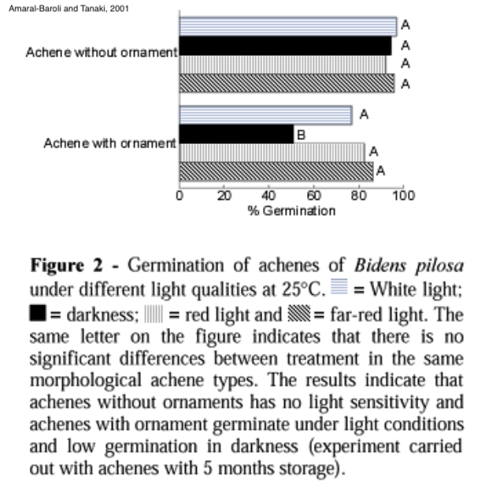
``` 
]


---

# Fitocromo

```{r echo=FALSE, out.width=500, fig.align='center'}
knitr::include_graphics("https://www.mdpi.com/ijms/ijms-20-06165/article_deploy/html/images/ijms-20-06165-g001.png")
``` 


.pull-left[
```{r echo=FALSE, out.width=300, fig.align='center'}
knitr::include_graphics("https://www.researchgate.net/profile/Haiyang_Wang6/publication/221803969/figure/fig1/AS:305413120643076@1449827570633/Absorption-spectra-of-phytochromes-EVRUSWLRQ-VSHFWUD-RI-WKH-WZR-IRUPV-3U-DQG-3IU-RI.png")
``` 
]


.pull-right[


- Luz vermelha produz Pfr e promove a germinação

- Luz vermelha distante produz Pr e inibe a germinação

]

---

# Fitocromo

.pull-left[
```{r echo=FALSE, out.width=700, fig.align='center'}
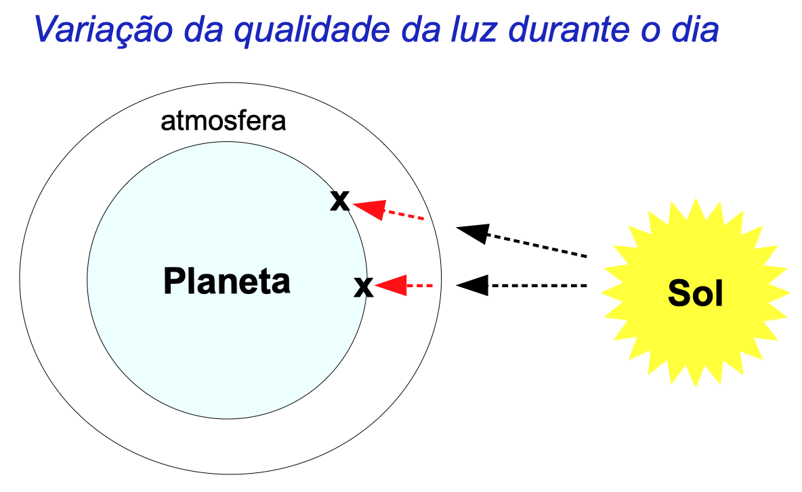
``` 

```{r echo=FALSE, out.width=700, fig.align='center'}
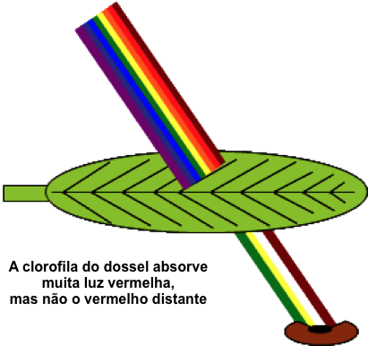
``` 

]


.pull-right[


```{r echo=FALSE, out.width=230, fig.align='center'}
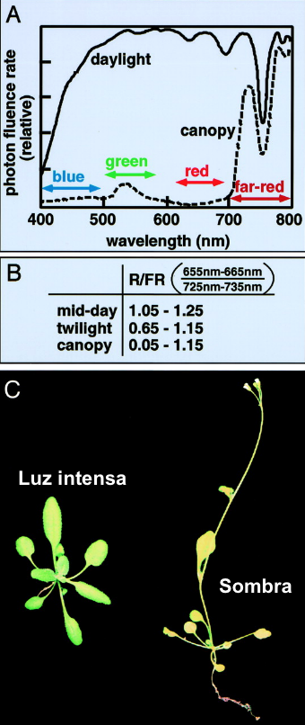
``` 

]


---

# Categorias de dormência


- **Físico** - A restrição física de acesso à água ou gás
    - Semeadura dura
    - Más condições ambientais
--


- Desenvolvimento incompleto do embrião
--


- **Fisiológico** - inerente à semente madura. Impede a germinação em um ambiente hostil e preserva as sementes para entrada no banco de sementes:
    - Controlado por gatilho bioquímico
    - Remoção de um inibidor
    

---

# Recrutamento

**Recrutamento** é o estabelecimento de uma planta adulta a partir de uma semente ou por imigração


---

# O ciclo de vida de uma erva daninha anual


```{r echo=FALSE, out.width=800, fig.align='center'}
knitr::include_graphics("images/seedbank.png")
```


---

# Recrutamento


- A **germinação** é o processo de desenvolvimento das plantas a partir do embrião quantificado pela emergência do radical do revestimento da semente

- A emergência ocorre quando a plântula rompe a superfície do solo


- Sobrevivência de plântula


```{r echo=FALSE, out.width=500, fig.align='center'}
knitr::include_graphics("https://media.giphy.com/media/mDBBU8K7Np2UQs9Dqy/giphy.gif")
``` 

---

# Germinação e Emergência


.pull-left[


]


.pull-right[


```{r echo=FALSE, out.width=700, fig.align='center'}
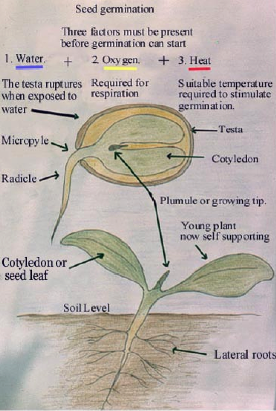
``` 

]


---


```{r echo=FALSE, out.width=700, fig.align='center'}
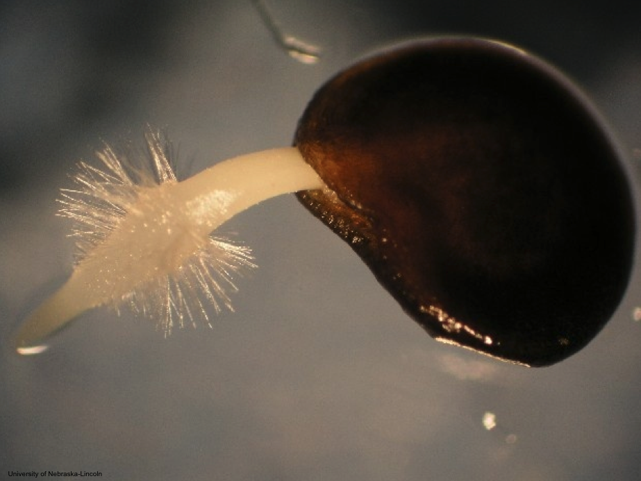
``` 


---

# Emergência

## A emergência é determinada em parte por
--


.pull-left[

- Temperatura e água

- Fatores genéticos
    
- Profundidade da semente
    
- Quantidade de recursos disponíveis para a muda (endosperma)
    
- Fatores que contribuem para a mortalidade.
]


.pull-right[

```{r echo=FALSE, out.width=700, fig.align='center'}
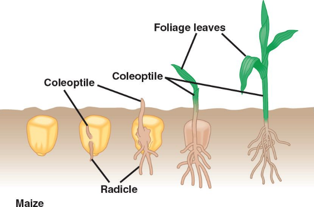
``` 

```{r echo=FALSE, out.width=700, fig.align='center'}
knitr::include_graphics("https://image.freepik.com/free-vector/diagram-plant-growth-stages_1308-22389.jpg")
``` 
]

---

# Emergência


## A emergência é determinada em parte por
--

- Temperatura

- Fatores genéticos

.pull-left[
```{r echo=FALSE, out.width=700, fig.align='center'}
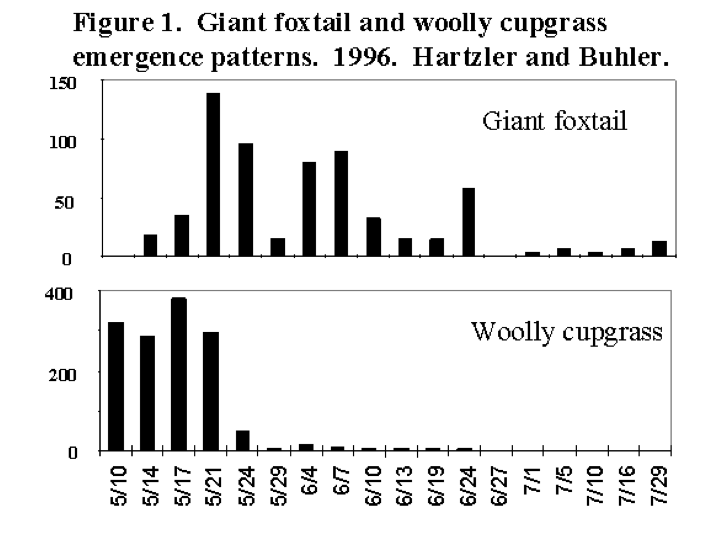
``` 
]


.pull-right[
```{r echo=FALSE, out.width=700, fig.align='center'}
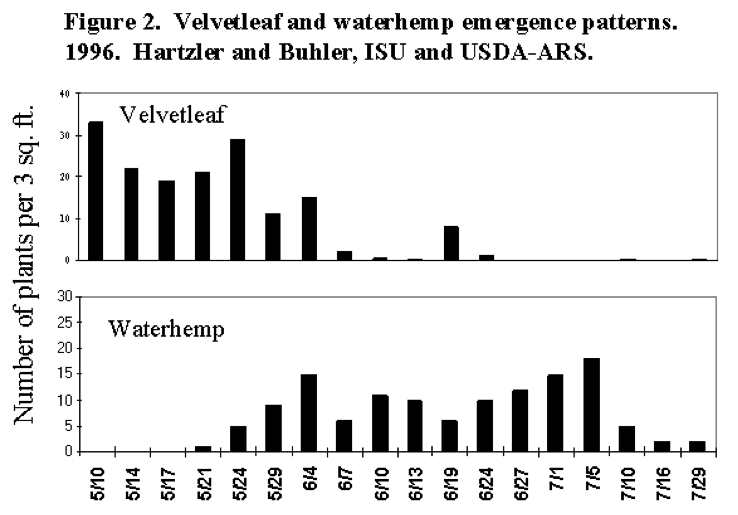
``` 
]


---

# Emergência


## A emergência é determinada em parte por
--


.pull-left[

- Temperatura

]


.pull-right[
```{r echo=FALSE, out.width=700, fig.align='center'}
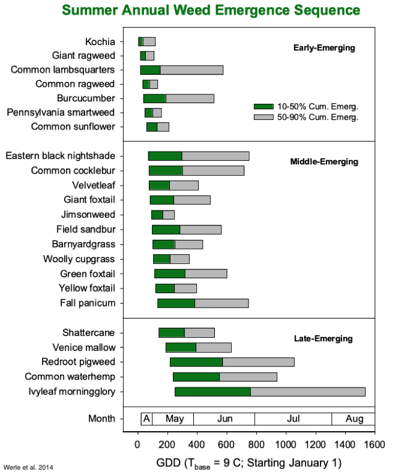
``` 
]


---

# Emergência


```{r echo=FALSE, out.width=500, fig.align='center'}
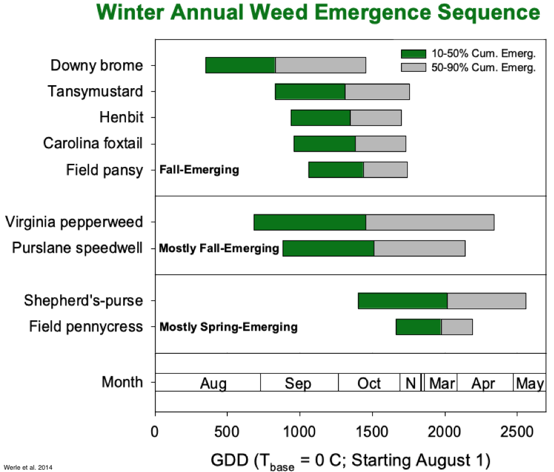
``` 


---

# Emergência

## A emergência é determinada em parte por
--

.pull-left[

- Profundidade da semente

]


.pull-right[
```{r echo=FALSE, out.width=700, fig.align='center'}
knitr::include_graphics("images/deep_burial.png")
``` 
]


---

# Emergência

## A emergência é determinada em parte por
--


- Água no solo


```{r echo=FALSE, out.width=500, fig.align='center'}
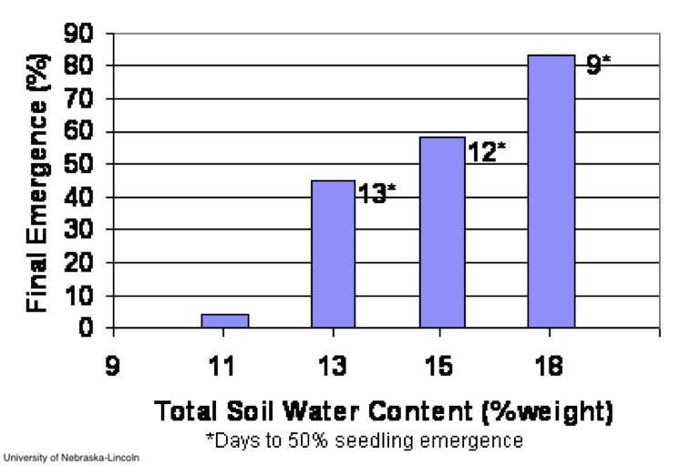
``` 


---

# Emergência

## A emergência é determinada em parte por
--


- Tamanho de sementes


```{r echo=FALSE, out.width=500, fig.align='center'}
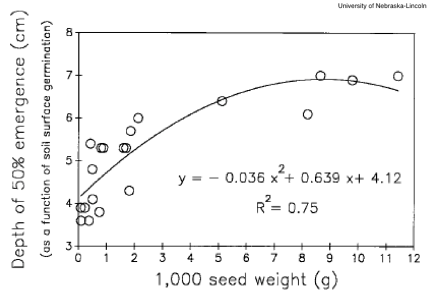
``` 

    
---

# Emergência


## A emergência é determinada em parte por:


- Mortalidade
    
    
.pull-left[
```{r echo=FALSE, out.width=330, fig.align='center'}
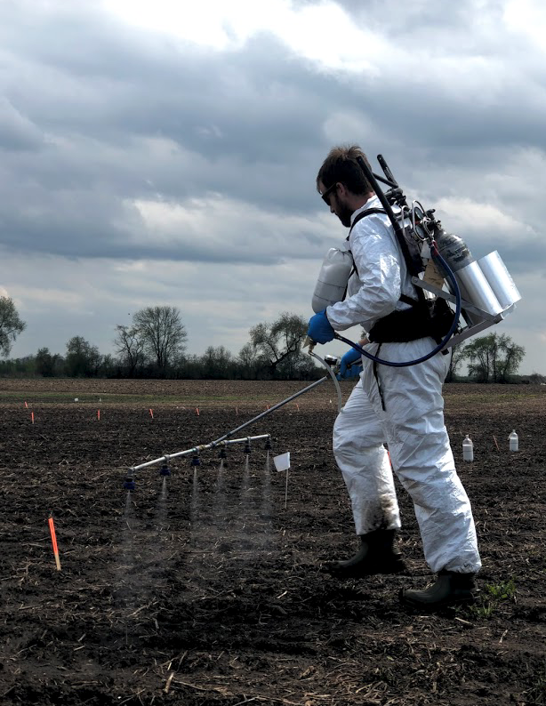
``` 
]


.pull-right[
```{r echo=FALSE, out.width=700, fig.align='center'}
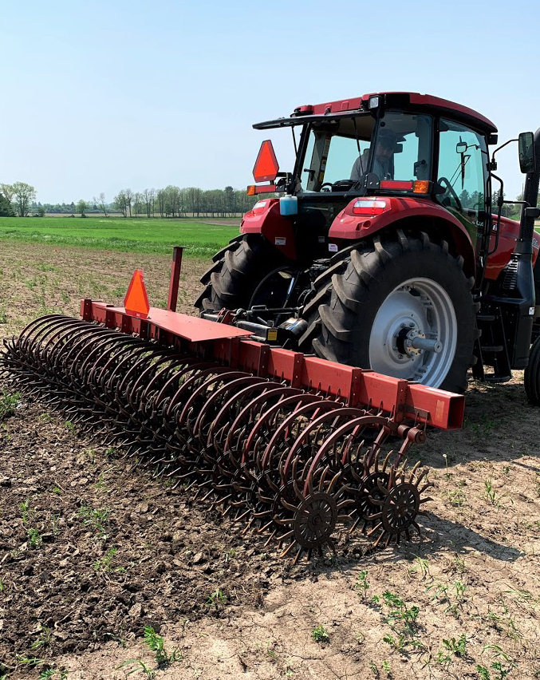
``` 
]

    

---

# O ciclo de vida de uma planta daninha anual


```{r echo=FALSE, out.width=800, fig.align='center'}
knitr::include_graphics("images/seedbank.png")
```

---

# Como quantificamos emergência?

```{r echo=FALSE, out.width=800, fig.align='center'}
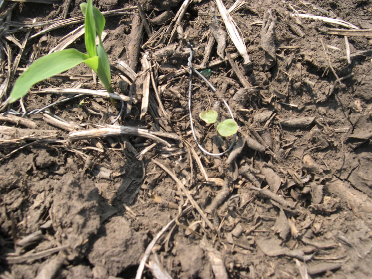
```


---

# O ciclo de vida de uma planta daninha anual


```{r echo=FALSE, out.width=800, fig.align='center'}
knitr::include_graphics("images/seedbank.png")
```


---

# Sobrevivência de plântulas

- Quais fatores ambientais influenciam a sobrevivência de plântulas?


- Quais fatores de manejo influenciam a sobrevivência de plântulas?


---

# Sobrevivência de plântulas


```{r echo=FALSE, out.width=500, fig.align='center'}
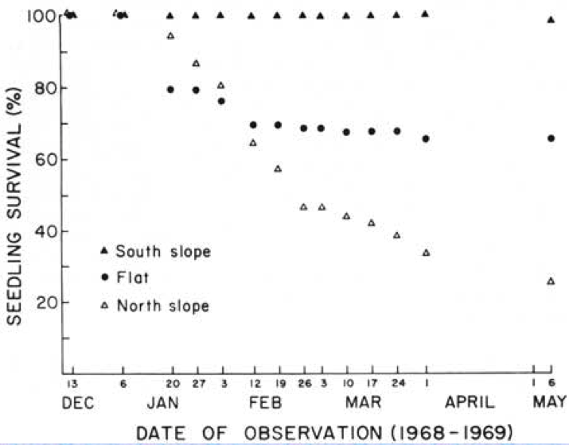
```


---

# Sobrevivência de plântulas

## Como quantificamos a emergência?


.pull-left[
```{r echo=FALSE, out.width=600, fig.align='center'}

``` 
]


.pull-right[
```{r echo=FALSE, out.width=300, fig.align='center'}
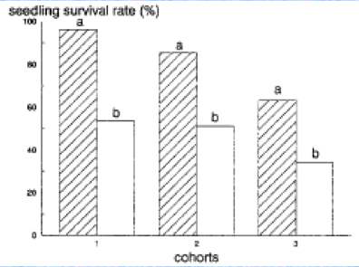
``` 
]


---

# O ciclo de vida de uma planta daninha anual


```{r echo=FALSE, out.width=800, fig.align='center'}
knitr::include_graphics("images/seedbank.png")
```


---

# Produção de Sementes


- Sementes plant<sup>-1</sup>


- Sementes m<sup>-2</sup> = (Sementes plant<sup>-1</sup>) * (Plantas<sup>-1</sup>)


---

# Produção de Sementes


.pull-left[

- Sementes plant<sup>-1</sup>

- Quais fatores de manejo e do ambiente influenciam a produção de sementes?

```{r echo=FALSE, out.width=400, fig.align='center'}
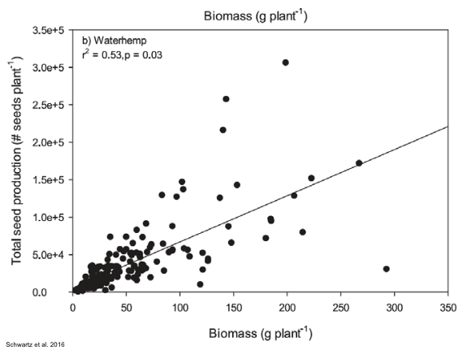
```

]


.pull-right[
```{r echo=FALSE, out.width=300, fig.align='center'}
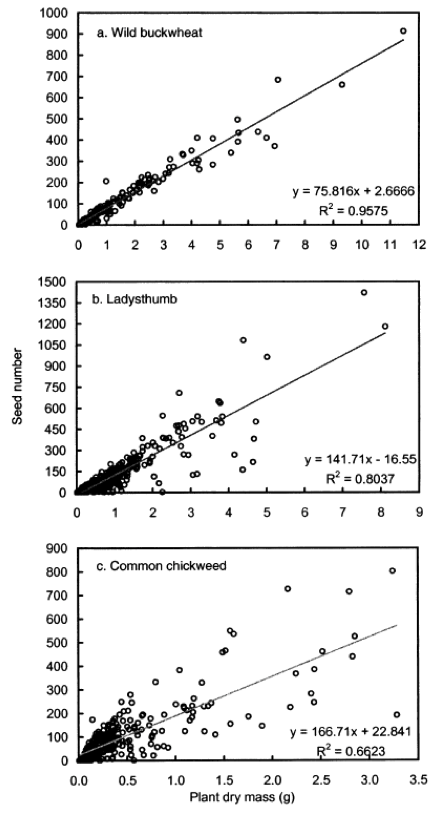
```
]

---

# Produção de Sementes


.pull-left[

```{r echo=FALSE, out.width=600, fig.align='center'}
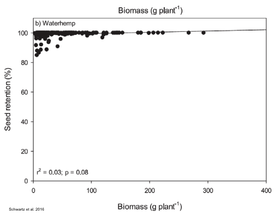
```

]


.pull-right[
```{r echo=FALSE, out.width=600, fig.align='center'}
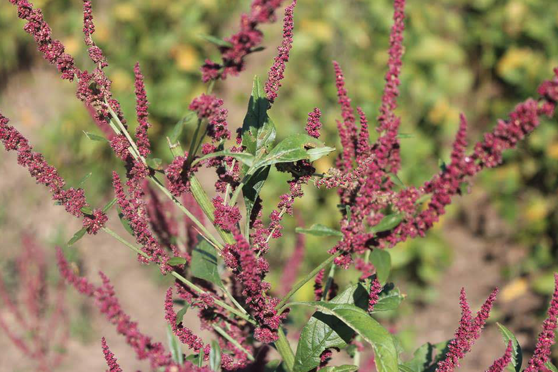
```

```{r echo=FALSE, out.width=600, fig.align='center'}
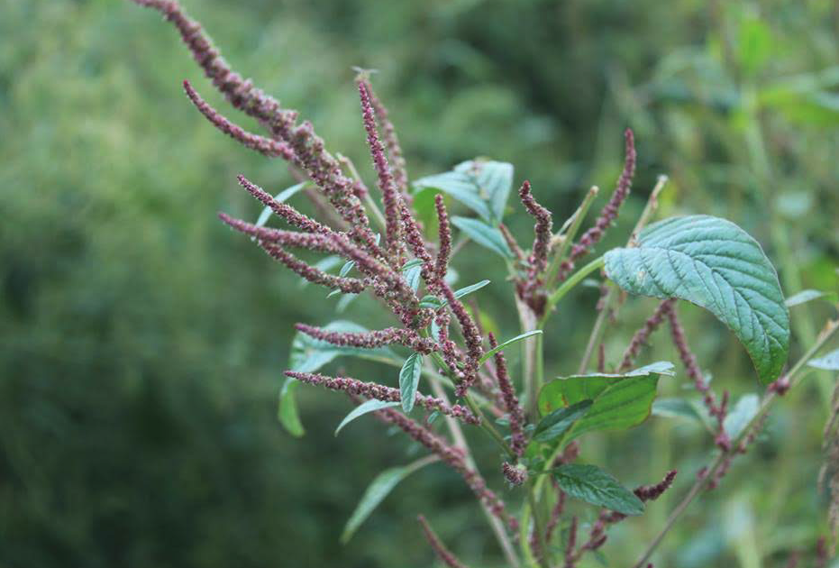
```

]

---

# O ciclo de vida de uma planta daninha anual


```{r echo=FALSE, out.width=800, fig.align='center'}
knitr::include_graphics("images/seedbank.png")
```


---

# O ciclo de vida de uma planta daninha anual


```{r echo=FALSE, out.width=800, fig.align='center'}
knitr::include_graphics("images/seedbank.png")
```


---

# Dispersão


- As plantas anuais são dispersas por sementes

- As plantas perenes podem ser dispersas por sementes ou por tecidos reprodutivos assexuais (propágulos)

    - Estolões

    - Rizomas

    - Tubérculos

    - Bulbos
    
    - Turião 


---

# Tecidos vegetativos


- Crescem e desenvolve longe da planta mãe

- Move fisicamente


---

# Agentes de dispersão natural de sementes


- Vento

- Água

- Animais

- Deiscência violenta

- Sementes contaminadas


---


```{r echo=FALSE, out.width=600, fig.align='center'}
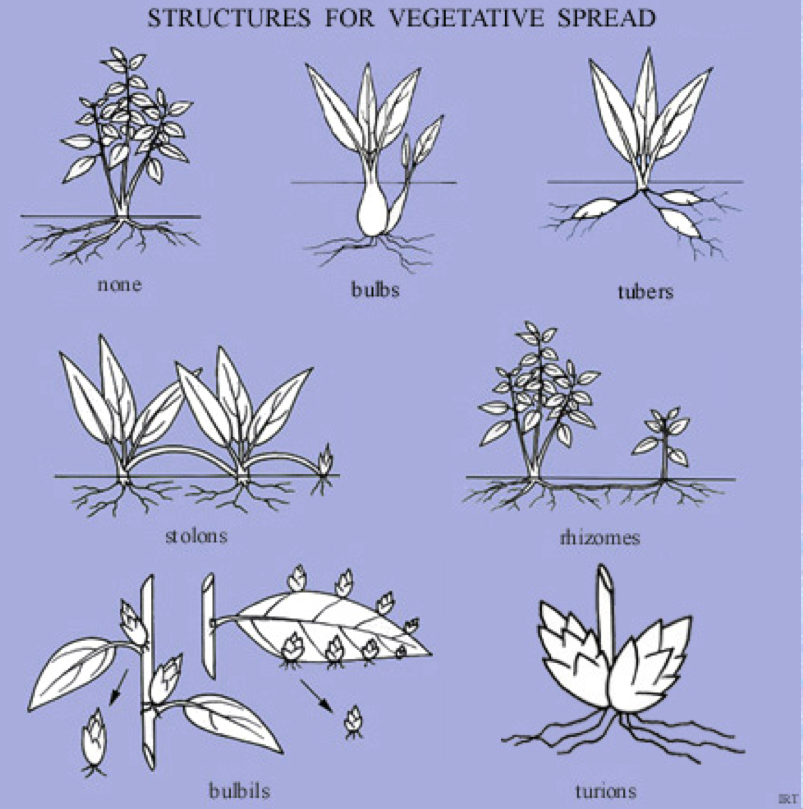
```


---

# Rizomas


.pull-left[
```{r echo=FALSE, out.width=500, fig.align='center'}
knitr::include_graphics("https://lh3.googleusercontent.com/proxy/uVsq6aUBVJuljuw61BtszGp7ejqO-Jo-ZfvL-_ONVMNrcL2ZOsazR0m2bk3PASpeMMIQtoaNLsTkaBIAwqOtKHhp5vD-hm21do0sd18g1t1Z4c-g9ylw9KB0c1SDmrhrQZ4ySvI")
```
```{r echo=FALSE, out.width=500, fig.align='center'}
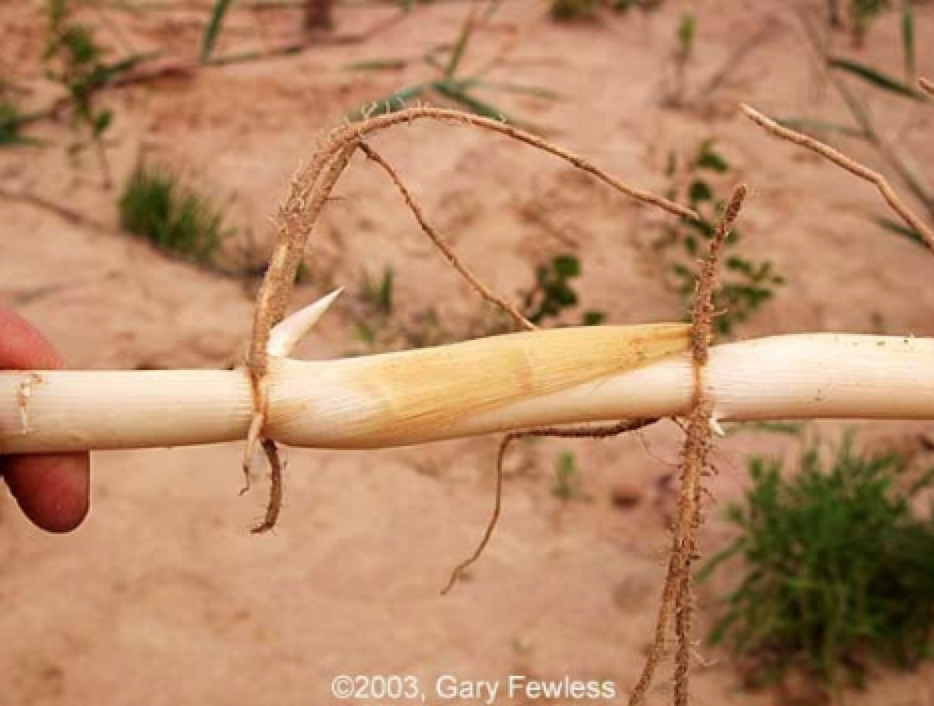
```
]


.pull-right[
```{r echo=FALSE, out.width=500, fig.align='center'}
knitr::include_graphics("https://encrypted-tbn0.gstatic.com/images?q=tbn%3AANd9GcRlH6G3Hir9yipJ_9pHmOuk037hIAbvUTgsTg&usqp=CAU")
```


```{r echo=FALSE, out.width=500, fig.align='center'}
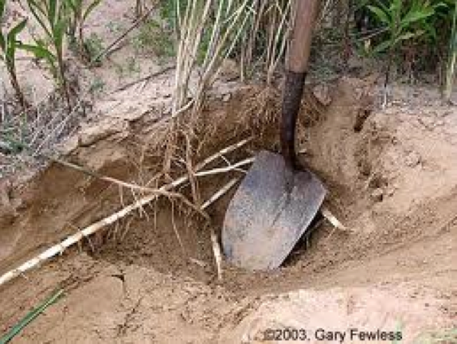
```

]


---

# Capim amargoso - rizoma


.pull-left[
```{r echo=FALSE, out.width=400, fig.align='center'}
knitr::include_graphics("https://blog.aegro.com.br/wp-content/uploads/2019/05/4-capim-amargoso.jpg")
```


```{r echo=FALSE, out.width=250, fig.align='center'}
knitr::include_graphics("https://lh3.googleusercontent.com/proxy/tfOG-KYqRCZCh0GuSfAngIZT1yF-PP5tr-RHWOEAl2IZhaWNbFQwNlP8gp2-VOX51hfGOHN7PCqZbSUuPjaDWWCHL3pbYxoQaMDGW3mnt8_fiVpuLR42EnFcWXVAH1WbJACPrqrzgknrpRwpQAf5bpGQ")
```

]


.pull-right[
```{r echo=FALSE, out.width=400, fig.align='center'}
knitr::include_graphics("https://encrypted-tbn0.gstatic.com/images?q=tbn%3AANd9GcRlH6G3Hir9yipJ_9pHmOuk037hIAbvUTgsTg&usqp=CAU")
```

```{r echo=FALSE, out.width=400, fig.align='center'}
knitr::include_graphics("https://www.grupocultivar.com.br/ativemanager/uploads/galeria/ace93-capim-amargoso-3.jpg")
```
]


---

# Rizomas e estolão

```{r echo=FALSE, out.width=600, fig.align='center'}
knitr::include_graphics("https://media.buzzle.com/media/images-en/illustrations/botany/plants/1200-610802-stolons-and-rhizomes.jpg")
```


---


# Tiririca - tubérculos


```{r echo=FALSE, out.width=700, fig.align='center'}
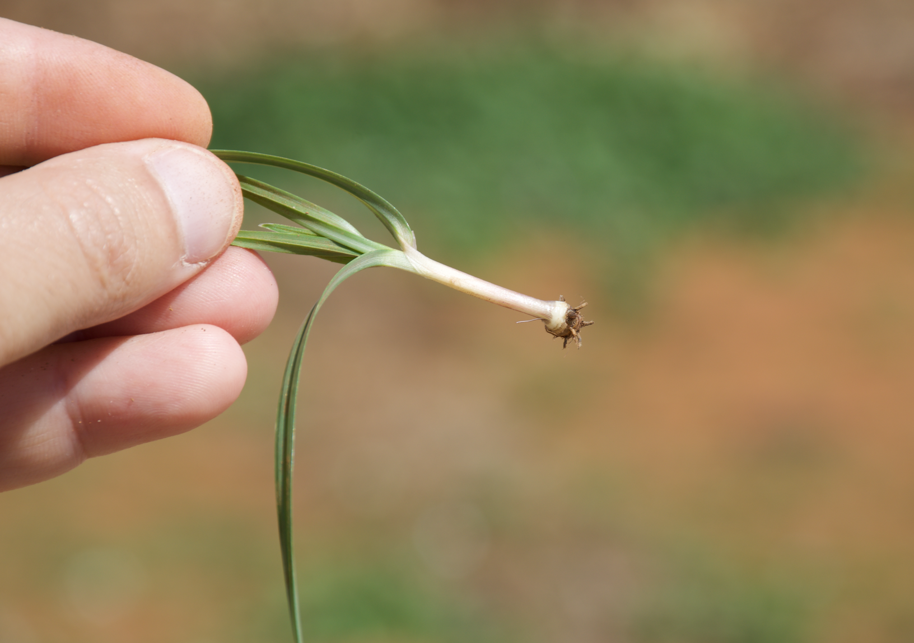
```


---

# Estolões

- Morango

```{r echo=FALSE, out.width=600, fig.align='center'}
knitr::include_graphics("https://image.shutterstock.com/image-photo/stolons-strawberry-on-black-background-260nw-1493815742.jpg")
```


---

# Turião 


.pull-left[

- Aspargos 

```{r echo=FALSE, out.width=400, fig.align='center'}
knitr::include_graphics("https://cdn.ecvol.com/s/www.gardenmania.com.br/produtos/sementes-de-aspargo-mary-washington-asparagus-officinalis/z/0.jpg?v=")
```
]


.pull-right[

- *Utricularia macrorhiza*

```{r echo=FALSE, out.width=400, fig.align='center'}
knitr::include_graphics("https://lh3.googleusercontent.com/proxy/II-6Af2kEeJgzoUAZikRsLi6NF2Na8Ppg62tOXfRT7JDzSJpCzYAPpiBPVafs9V4xev08MHLKwSRozy88LVmkUn3GL2fO9ZBWZIMSfVIeAIA1RGOyV2jiWOMvE5L-A")
```
]


---

Lembre-se de que derivamos a equação de crescimento exponencial:

N<sub>t</sub> = R<sup>t</sup> N<sub>0</sub>, 

que, se N<sub>0</sub> = 2 e R = 5, obtemos:


```{r echo=FALSE, out.width=600, fig.align='center'}
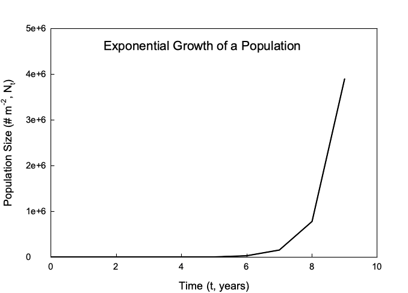
```


---

# O ciclo de vida de uma planta daninha anual


```{r echo=FALSE, out.width=800, fig.align='center'}
knitr::include_graphics("images/seedbank.png")
```


---

# A equação fundamental da biologia populacional


> N<sub>t+1</sub> = N<sub>t</sub> + Nascimentos - Mortes + Imigrantes - Emigrantes

N<sub>t</sub> = Armazenamento


Nascimentos + imigrantes = depósitos


Mortes (e outras perdas) + Emigrantes = retiradas

- N<sub>t+1</sub> = tamanho da população do banco de sementes (número de sementes) no tempo t + 1


- N<sub>t</sub> = tamanho da população do banco de sementes (número de sementes) no momento t


---

# A equação fundamental da biologia populacional


> N<sub>t+1</sub> = N<sub>t</sub> + Nascimentos - Mortes + Imigrantes - Emigrantes


- **Nascimentos** = acréscimos à população - que surgiram da população original (N<sub>t</sub>)

- **Imigração** = acréscimos à população - que surgiram de outra população

- **Óbitos** = perdas da população devido a óbito ou predação

- **Emigração** = perdas da população resultantes da mobilidade


