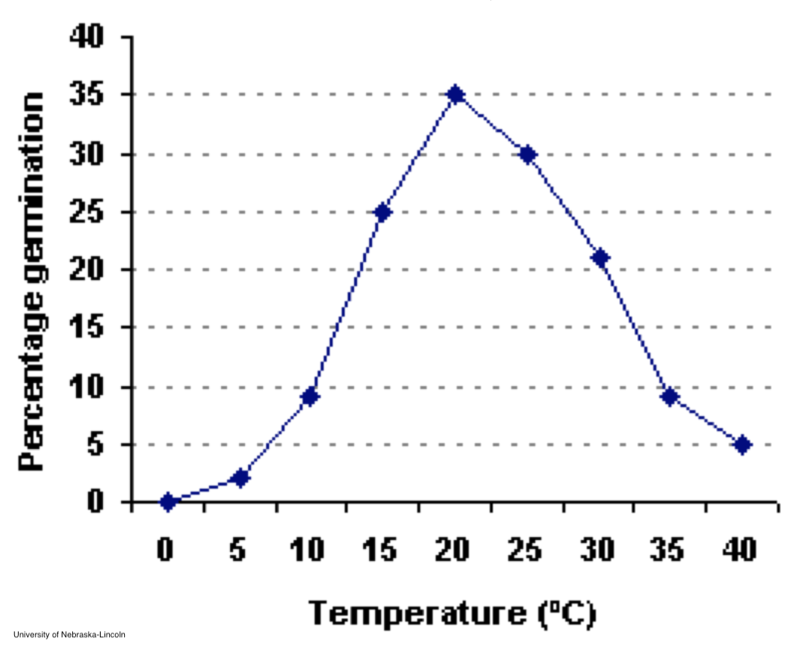

```{r setup, include=FALSE}
options(htmltools.dir.version = FALSE)

knitr::opts_chunk$set(
  echo = FALSE,
  fig.align = "center",
  message = FALSE,
  warning = FALSE,
  cache = TRUE
)
```

```{r}
library(pagedown)
```

# Objetivos

- Estimar, qualitativa e quantitativamente, o ciclo de vida de plantas daninhas

- Explicar os processos que controlam o destino das sementes no banco de sementes

- Quantifique o recrutamento (emergência, maturação e imigração) 

- Discutir os fatores que afetam a sobrevivência e a produção de sementes

- Descrever maneiras pelas quais as plantas se dispersam


---

# O banco de sementes de plantas daninhas


```{r echo=FALSE, out.width=700, fig.align='center'}
knitr::include_graphics("images/seedbank.png")
``` 


---

# O banco de sementes de plantas daninhas

## Depósitos, retiradas e armazenamento em bancos de sementes:

- Os **depósitos** incluem chuva de sementes da produção, dispersão e imigração de sementes
--


- As **retiradas** ocorrem por germinação, senescência, morte e predação
--


- O **armazenamento** resulta da distribuição vertical de sementes dormentes viáveis através do perfil do solo


---

# O banco de sementes de plantas daninhas

## Destino das sementes na superfície do solo

- Morte (declínio ou predação)

- Germinação

- Entrada na camada de arável

```{r echo=FALSE, out.width=300, fig.align='center'}
knitr::include_graphics("https://media.giphy.com/media/d83U1vYHFiczd83cjZ/giphy.gif")
``` 


---

# Fatores que contribuem para o sucesso da germinação


```{r echo=FALSE, out.width=600, fig.align='center'}
knitr::include_graphics("images/temperature.png")
``` 


---

# Fatores que contribuem para o sucesso da germinação


```{r echo=FALSE, out.width=600, fig.align='center'}
knitr::include_graphics("images/temperature_2.png")
``` 


---

# Fatores que contribuem para o sucesso da germinação


```{r echo=FALSE, out.width=600, fig.align='center'}

``` 


---

# Fatores que contribuem para o sucesso da germinação


```{r echo=FALSE, out.width=600, fig.align='center'}
knitr::include_graphics("images/nitrogen.png")
``` 


---

# O banco de sementes de plantas daninhas


## Destino das sementes na superfície do solo:
--


- Morte (declínio ou predação)
--


- Germinação
--


- Entrada na camada de arável -
    - características especiais da espécie permitem que ela penetre na superfície do solo
    - rachaduras no solo, canais de minhocas, insetos, roedores
    - qualquer forma de preparo do solo

---

# Qual semente de planta é essa?

```{r echo=FALSE, out.width=700, fig.align='center'}
knitr::include_graphics("https://bugwoodcloud.org/images/768x512/1459393.jpg")
``` 


---

# Aveia-doida (*Avena fatua*)

.pull-left[
```{r echo=FALSE, out.width=700, fig.align='center'}
knitr::include_graphics("https://pbs.twimg.com/media/Cn1Jo_pUkAEf56T?format=jpg&name=medium")
``` 
]

.pull-right[

- Observe a aparência distorcida da arista, logo abaixo de onde ele se dobra? 

- Quando molhado, a arista se torce, fazendo com que a parte dobrada gire. Ele age como um trado para garantir bom contato da semente com o solo

- A semente de aveia selvagem basicamente se cava no solo para garantir um estabelecimento bem-sucedido.

]


---

class: inverse

# O banco de sementes de plantas daninhas


## Sementes na camada arável:

- Efeitos do preparo do solo na profundidade de sementes

- Efeitos do preparo do solo na na germinação de sementes


```{r echo=FALSE, out.width=400, fig.align='center'}
knitr::include_graphics("https://media.giphy.com/media/3ohjUXuBzExvw0jIUo/giphy.gif")
``` 


---

# Sementes na camada arável

## Efeitos do preparo do solo na profundidade de sementes

```{r echo=FALSE, out.width=400, fig.align='center'}

``` 


---


# Sementes na camada arável:

## Efeitos do preparo do solo na profundidade de sementes


```{r echo=FALSE, out.width=700, fig.align='center'}

``` 
moldboard = arado de aiveca

chisel = escarificador


---

# Sementes na camada arável

## Influência do preparo na distribuição de sementes no perfil do solo


```{r echo=FALSE, out.width=700, fig.align='center'}

``` 

---

## Influência do preparo na distribuição de sementes no perfil do solo

- **Exemplo clássico:** buva em sistema de plantio direto

```{r echo=FALSE, out.width=700, fig.align='center'}
knitr::include_graphics("https://growiwm.org/wp-content/uploads/2020/03/horseweed-plants.png")
``` 

---

# Sementes na camada arável

## Efeitos do preparo do solo na germinação


```{r echo=FALSE, out.width=700, fig.align='center'}
knitr::include_graphics("images/russian.png")
``` 


---


# O banco de sementes de plantas daninhas

## Sementes na camada arável

Efeitos do preparo do solo na germinação:

- Posicionamento de sementes perto da superfície do solo

- Solos suaves (macios) aquecem mais rapidamente

- Aumento do teor de oxigênio do solo superficial

- Efeitos de luz na germinação


---

# O banco de sementes de plantas daninhas

## Efeitos do preparo do solo na germinação de sementes

- Solos suaves (macios) aquecem mais rapidamente


```{r echo=FALSE, out.width=700, fig.align='center'}

``` 


---

# Efeitos do preparo do solo na germinação

.pull-left[
- Posicionamento de sementes perto da superfície do solo

- Solos suaves (macios) aquecem mais rapidamente

- Aumento do teor de oxigênio do solo superficial

- Efeitos de luz na germinação
]


.pull-right[
```{r echo=FALSE, out.width=500, fig.align='center'}

``` 
]

---

# O banco de sementes de plantas daninhas, N<sub>t</sub>


```{r echo=FALSE, out.width=700, fig.align='center'}
knitr::include_graphics("images/seedbank_2.png")
``` 


---

# Predação


- Sistemas de plantio direto e sistemas de forragem / perenes

- Pouco distúrbio

- Maioria da chuva de sementes pode ser eliminada por predação

- A maioria das predações ocorrerá na superfície do solo


.pull-left[
```{r echo=FALSE, out.width=400, fig.align='center'}
knitr::include_graphics("https://news.psu.edu/sites/default/files/styles/gss_thumbnail/public/Harvester%20ant%20nest.jpg?itok=-zeM9J3L")
``` 
]


.pull-right[
```{r echo=FALSE, out.width=400, fig.align='center'}
knitr::include_graphics("https://besjournals.onlinelibrary.wiley.com/cms/asset/fdabdb75-9822-43f0-a4cf-cc7c19f88405/fec12143-toc-0001-m.jpg")
``` 
]


---

# Armazenamento do banco de sementes

- Permite a dispersão no tempo

- Muitas espécies (particularmente espécies de folha larga). Podem permanecer viáveis no banco de sementes por > 20 anos

- Foram descobertas sementes viáveis de ançarinha-branca (*Chenopodium album*) e esperguta (*Spergula arvensis*; Caryophyllaceae), datadas de 1700 anos


.pull-left[
```{r echo=FALSE, out.width=400, fig.align='center'}
knitr::include_graphics("https://upload.wikimedia.org/wikipedia/commons/thumb/6/6c/Gewone_spurrie_plant_Spergula_arvensis.jpg/440px-Gewone_spurrie_plant_Spergula_arvensis.jpg")
``` 
]


.pull-right[
```{r echo=FALSE, out.width=400, fig.align='center'}
knitr::include_graphics("https://plants.usda.gov/gallery/standard/spar_002_shp.jpg")
``` 
]


---

# Armazenamento do banco de sementes


## A longevidade no solo pode ser substancial

- As condições profundas no solo são frescas e úmidas

- Quanto mais a profundidade, mais tempo a semente pode permanecer viável (sem perturbações e dormência)

- A dormência do banco de sementes garante a sobrevivência das espécies em sistemas com perturbações frequentes


---


# Medindo o banco de sementes no solo


Se um produtor contrata você para determinar quantas plantas daninhas de quais espécies existiam em uma lavoura, como você faria isso?

```{r echo=FALSE, out.width=500, fig.align='center'}
knitr::include_graphics("https://media.giphy.com/media/3o7TKTDn976rzVgky4/giphy.gif")
```


---

# Medindo o banco de sementes no solo

.pull-left[
```{r echo=FALSE, out.width=400, fig.align='center'}

```
]

.pull-right[
```{r echo=FALSE, out.width=400, fig.align='center'}

```
]

---

# Medindo o banco de sementes no solo

.pull-left[
```{r echo=FALSE, out.width=700, fig.align='center'}

```
]

.pull-right[
```{r echo=FALSE, out.width=700, fig.align='center'}

```
]

---

# Limpeza


```{r echo=FALSE, out.width=400, fig.align='center'}

```


```{r echo=FALSE, out.width=400, fig.align='center'}
knitr::include_graphics("images/clean_2.png")
```


---

# Estufa


```{r echo=FALSE, out.width=400, fig.align='center'}

```


```{r echo=FALSE, out.width=400, fig.align='center'}

```


---

# O banco de sementes de plantas daninhas, N<sub>t</sub>


```{r echo=FALSE, out.width=700, fig.align='center'}
knitr::include_graphics("images/seedbank.png")
``` 


---

# Dormência

**Dormência** - falha na germinação de sementes viáveis

- Mecanismo de sobrevivência

- Permite a dispersão no tempo

- Regulado por complexas interações ambientais, fisiológicas e bioquímicas


---

# Mudanças na semente


```{r echo=FALSE, out.width=700, fig.align='center'}
knitr::include_graphics("images/dormencia.png")
``` 


---

# Causas da dormência


- Ambiente desfavorável

- Embrião imaturo

- É necessário estimular algum processo - após o amadurecimento

- Inibidor de germinação está presente

- Sementeira dura

- Falta de oxigênio

```{r echo=FALSE, out.width=300, fig.align='center'}

``` 

---

# Causas de dormência - ambiente desfavorável


```{r echo=FALSE, out.width=700, fig.align='center'}

``` 


---

# Dúvidas?


.center[


```
MAXWEL COURA OLIVEIRA - maxweloliveira@unoeste.br
```
]


```{r eval=FALSE}
#remotes::install_github('rstudio/pagedown')
pagedown::chrome_print("pop_biology_2.html")
```

