```{r setup, include=FALSE}
options(htmltools.dir.version = FALSE)

knitr::opts_chunk$set(
  echo = FALSE,
  fig.align = "center",
  message = FALSE,
  warning = FALSE,
  cache = TRUE
)
```

```{r}
library(pagedown)
```


## Lembre-se de que derivamos a equação de crescimento exponencial

N<sub>t</sub> = R<sup>t</sup> N<sub>o</sub>, 

que, se N<sub>o</sub> = 2 e R = 5, obtemos:


```{r echo=FALSE, out.width=600, fig.align='center'}
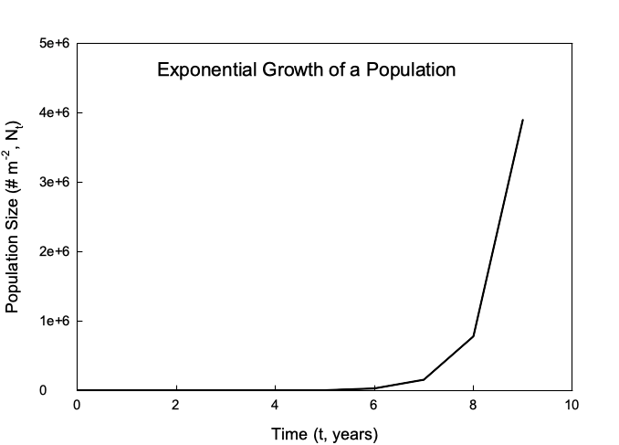
```


---

class: inverse

# O ciclo de vida de uma planta daninha anual


```{r echo=FALSE, out.width=800, fig.align='center'}
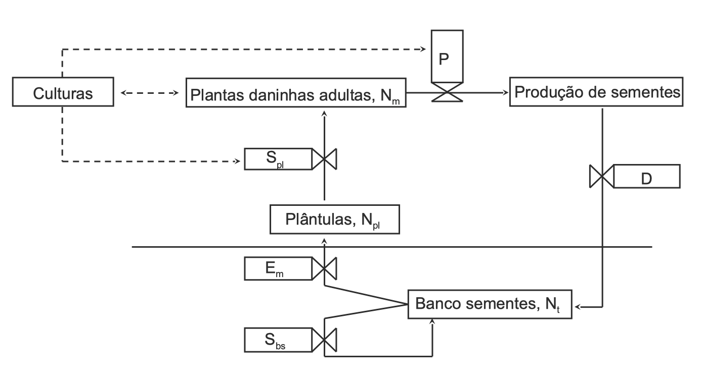
```


---

# A equação fundamental da biologia populacional


> N<sub>t+1</sub> = N<sub>t</sub> + Emergências - Mortes + Imigrantes - Emigrantes


- N<sub>t+1</sub> = tamanho da população do banco de sementes (número de sementes) no tempo t + 1

- N<sub>t</sub> = tamanho da população do banco de sementes (número de sementes) no momento t


N<sub>t</sub> = **Armazenamento**


Emergências + Imigrantes = **Depósitos**


Mortes (e outras perdas) + Emigrantes = **Retiradas**


---

# A equação fundamental da biologia populacional


> **N<sub>t+1</sub> = N<sub>t</sub> + Emergências - Mortes + Imigrantes - Emigrantes**


- **Emergências** = acréscimos à população - que surgiram da população original (N<sub>t</sub>)

- **Imigração** = acréscimos à população - que surgiram de outra população

- **Mortes** = perdas da população devido a morte, predação our geminação

- **Emigração** = perdas da população resultantes da mobilidade


---

class: inverse

# O ciclo de vida de uma planta daninha anual


```{r echo=FALSE, out.width=800, fig.align='center'}

```


---

# A equação do banco de sementes


N<sub>t</sub> = tamanho da população do banco de sementes no momento t

> **Emergências** = [(<font color='red'>N<sub>t</sub> \* E<sub>m</sub></font> \* S<sub>pl</sub>) \* P \* (1-E<sub>f</sub>)] \* D

<font color='red'>N<sub>pl</sub> = N<sub>t</sub> * E<sub>m</sub></font>

N<sub>m</sub> = <font color='red'>N<sub>pl</sub></font> \* S<sub>pl</sub> = <font color='red'>N<sub>t</sub> \* E<sub>m</sub></font> \* S<sub>pl</sub>

> **Sementes m<sup>-2</sup>** = plantas m<sup>-2</sup> \* sementes planta<sup>-1</sup> = <font color='blue'>N<sub>m</sub> \* P \* (1-E<sub>f</sub>)</font>

<br>

> **Depósitos** = <font color='blue'>N<sub>m</sub> \* P \* (1-E<sub>f</sub>)</font> \* D = <font color='purple'>N<sub>t</sub> \* E<sub>m</sub> \* S<sub>pl</sub> \* P \* (1-E<sub>f</sub>) \* D</font>

<br>

.footnote[
[1] N<sub>pl</sub> = número de plântulas

[2] N<sub>m</sub> = número de plantas maduras

[3] E<sub>f</sub> = eficiência de controle
]


---

class: inverse

# O ciclo de vida de uma planta daninha anual


```{r echo=FALSE, out.width=800, fig.align='center'}

```


---

# A equação do banco de sementes 


> **Mortes/Perdas** = [(<font color='red'>N<sub>t</sub> \* E<sub>m</sub></font>) + ((<font color='blue'>N<sub>t</sub>-N<sub>t</sub> \* E<sub>m</sub></font>) \* (<font color='green'>1-S<sub>bs</sub></font>))]

<font color='red'>N<sub>t</sub> \* E<sub>m</sub></font> = germinação e emergência

<font color='blue'>N<sub>t</sub>-N<sub>t</sub> \* E<sub>m</sub></font> = sementes que permanecem no banco de sementes após a emergência

<font color='blue'>N<sub>t</sub>-N<sub>t</sub> \* E<sub>m</sub></font> \* (<font color='green'>1-S<sub>bs</sub></font>) = sementes perdidas por predação, decomposição, etc. de um ano para o próximo


---

class: inverse

# O ciclo de vida de uma planta daninha anual


```{r echo=FALSE, out.width=800, fig.align='center'}

```


---

# A equação do banco de sementes 


N<sub>t</sub> = tamanho da população do banco de sementes no momento t

**Emergências** = <font color='green'>[(N<sub>t</sub> \* E<sub>m</sub> \* S<sub>pl</sub>) \* P \* (1-E<sub>f</sub>)] \* D</font>

**Mortes/perdas** = <font color='red'>[(N<sub>t</sub> \* E<sub>m</sub>) + ((N<sub>t</sub>-N<sub>t</sub> \* E<sub>m</sub>) \* (1-S<sub>bs</sub>))]</font>
 
**N<sub>t+1</sub>**  = N<sub>t</sub> + <font color='green'>[(N<sub>t</sub> \* E<sub>m</sub> \* S<sub>pl</sub>) \* P \* (1-E<sub>f</sub>)] \* D</font> - <font color='red'>[(N<sub>t</sub> \* E<sub>m</sub>) + ((N<sub>t</sub>-N<sub>t</sub> \* E<sub>m</sub>) \* (1-S<sub>bs</sub>))]</font> + I-E

<br>

> N<sub>t+1</sub> = N<sub>t</sub> + Emergências - Mortes + Imigrantes - Emigrantes


---

# Taxa variáveis

**N<sub>t+1</sub>**  = N<sub>t</sub> + [(N<sub>t</sub> \* <font color='green'>E<sub>m</sub></font> \* <font color='blue'>S<sub>pl</sub></font>) \* <font color='purple'>P \* (1-E<sub>f</sub>)</font>] \* <font color='orange'>D</font> - [(N<sub>t</sub> \* <font color='green'>E<sub>m</sub></font>) + ((N<sub>t</sub>-N<sub>t</sub> \* <font color='green'>E<sub>m</sub></font>) \* (1-<font color='red'>S<sub>bs</sub></font>))] + I-E


Onde (variáveis):


- <font color='green'>E<sub>m</sub></font> = fração de N<sub>t</sub> que germina e emerge


- <font color='blue'>S<sub>pl</sub></font> = fração de plântulas que sobrevivem até a maturidade


- <font color='purple'>P \* (1-E<sub>f</sub>)</font> = número de sementes produzidas por planta


- <font color='orange'>D</font> = fração de sementes dispersas na área de interesse


- <font color='red'>S<sub>bs</sub></font> = fração de sementes que permanecem no banco de sementes que sobrevivem à predação e à decomposição


---

# Quantificando a emergência


```{r echo=FALSE, out.width=800, fig.align='center'}
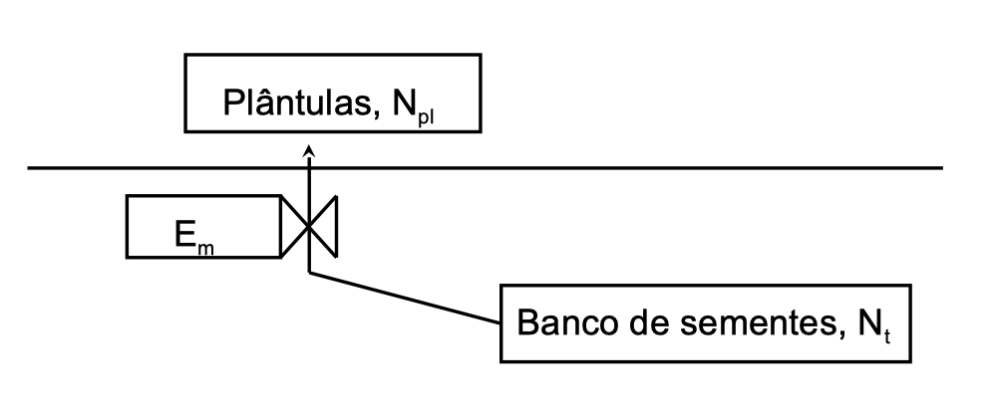
```


---

# E<sub>m</sub> 

## A fração de N<sub>t</sub> que emerge

.pull-left[
```{r echo=FALSE, out.width=600, fig.align='center'}
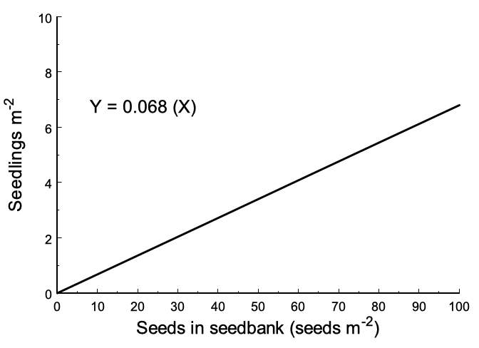
```
]


.pull-right[
```{r echo=FALSE, out.width=600, fig.align='center'}
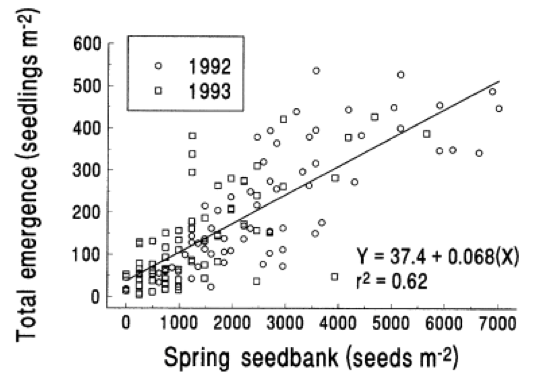
```
]

---

# E<sub>m</sub> 

## A fração de N<sub>t</sub> que germina e emerge

```{r echo=FALSE, out.width=600, fig.align='center'}
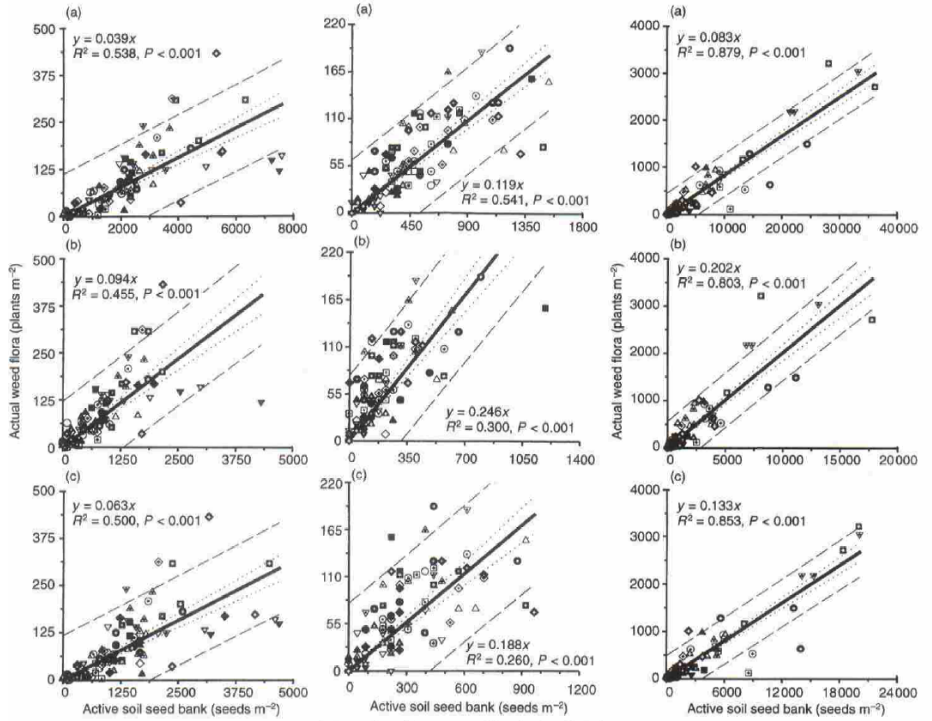
```


---

# Quantificando a sobrevivência de plântulas

```{r echo=FALSE, out.width=500, fig.align='center'}
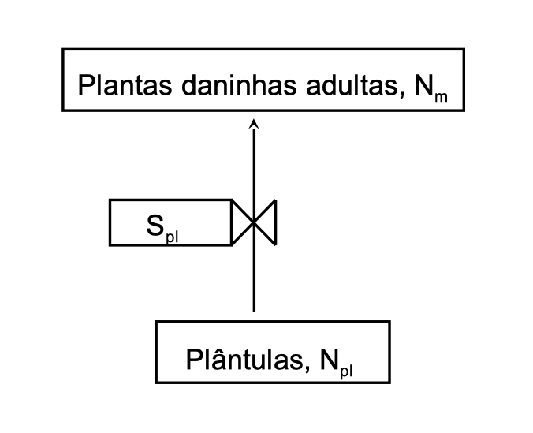
```


---

# S<sub>pl</sub> 

## A fração de plântulas que sobrevivem até a maturidade


```{r echo=FALSE, out.width=600, fig.align='center'}
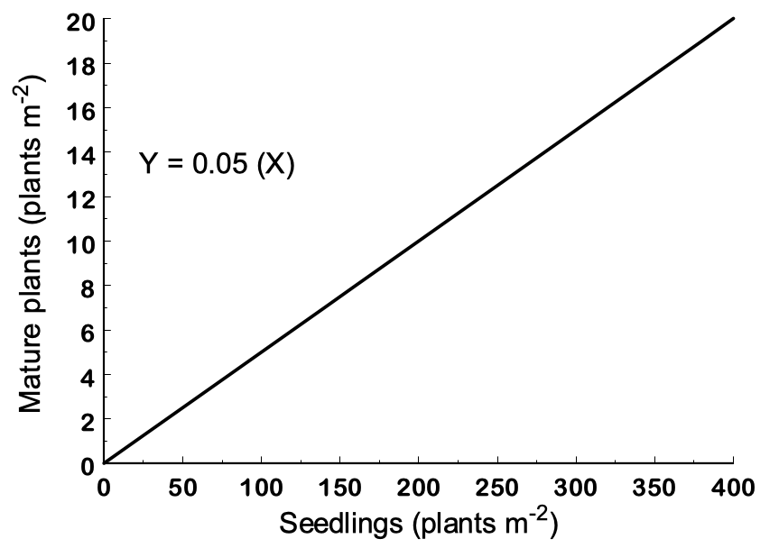
```


---


```{r echo=FALSE, out.width=500, fig.align='center'}
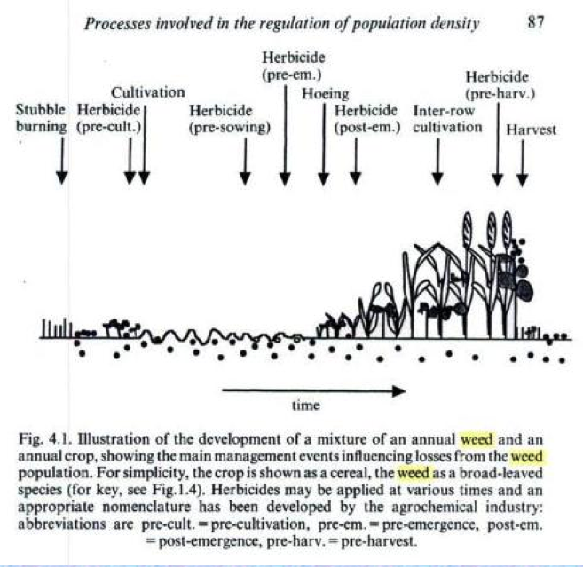
```


---

# S<sub>pl</sub> 

## A fração de plântulas que sobrevivem até a maturidade


```{r echo=FALSE, out.width=350, fig.align='center'}
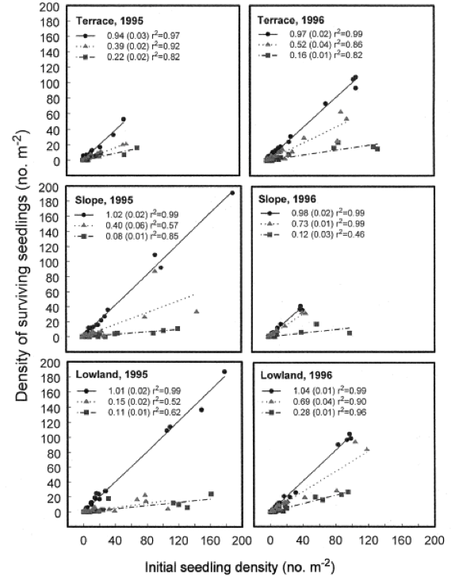
```


---


```{r echo=FALSE, out.width=700, fig.align='center'}
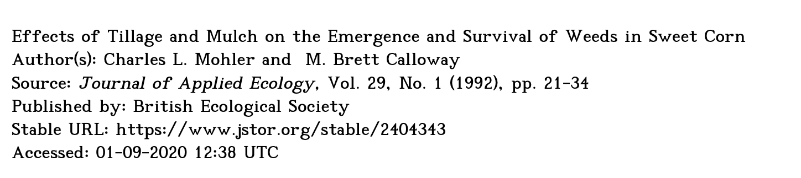
```

```{r echo=FALSE, out.width=700, fig.align='center'}
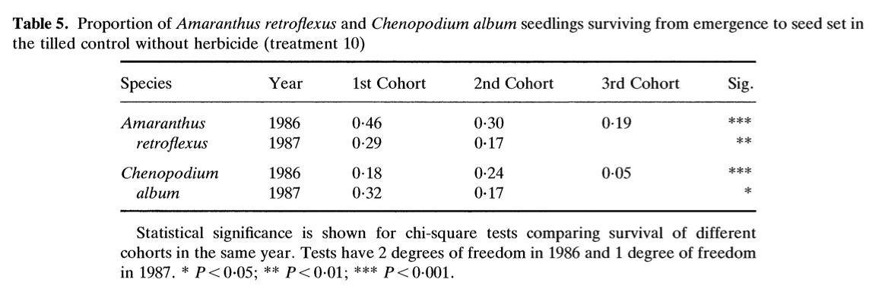
```

---


```{r echo=FALSE, out.width=600, fig.align='center'}
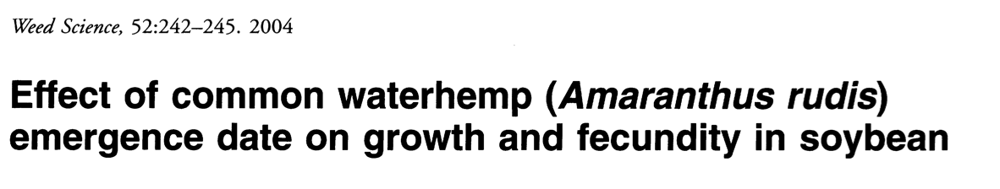
```

```{r echo=FALSE, out.width=600, fig.align='center'}
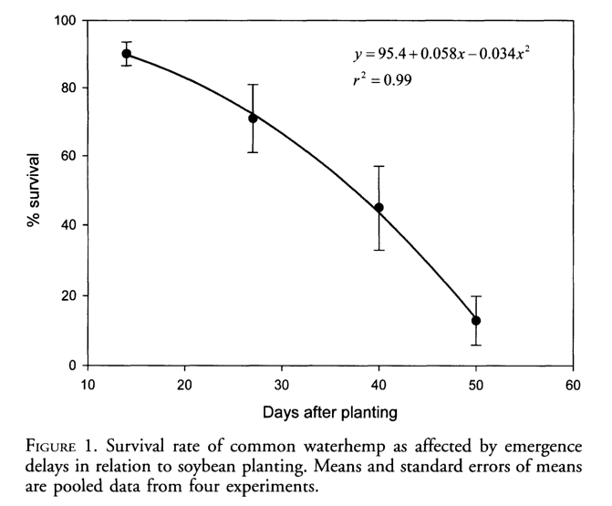
```

---

# Dependência de densidade


```{r echo=FALSE, out.width=700, fig.align='center'}
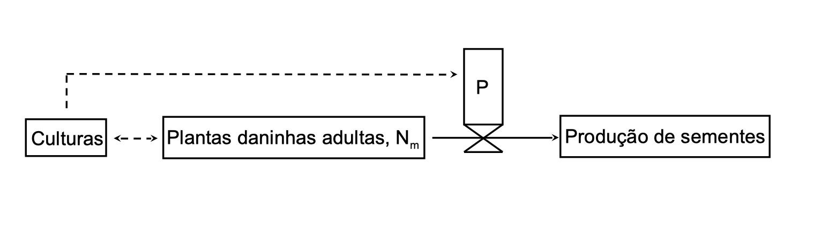
```


---

# N<sub>t</sub> = R<sup>t</sup>N<sub>o</sub>

```{r echo=FALSE, out.width=600, fig.align='center'}
knitr::include_graphics("https://kivu.com/wp-content/uploads/2015/05/human-pop-growth.jpg")
```


---

# Equação logistica

```{r echo=FALSE, out.width=700, fig.align='center'}
knitr::include_graphics("https://upload.wikimedia.org/wikipedia/commons/f/ff/Logistic_Carrying_Capacity.svg")
```


---

# Dependência da densidade


- Quando aumentamos a população de plantio de milho, o que acontece com o tamanho da espiga em cada planta?

- O que acontece com a produtividade?


```{r echo=FALSE, out.width=300, fig.align='center'}
knitr::include_graphics("https://media.giphy.com/media/wrW1xNeCns7S0/giphy.gif")
```


---

# P = número de sementes produzidas por planta


```{r echo=FALSE, out.width=600, fig.align='center'}
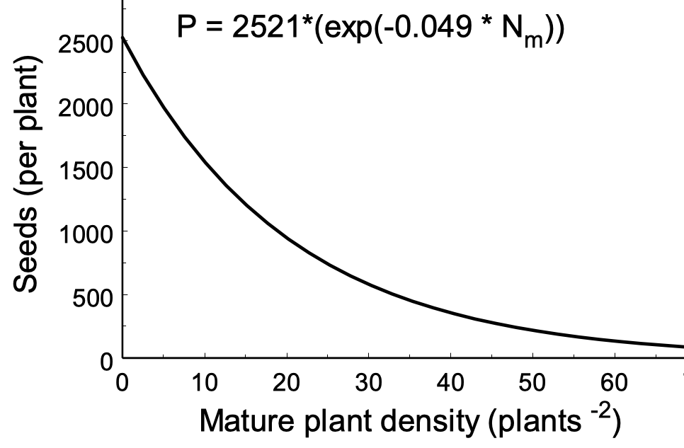
```

---

# Número total de sementes produzidas

## P \* N<sub>m</sub>

```{r echo=FALSE, out.width=600, fig.align='center'}
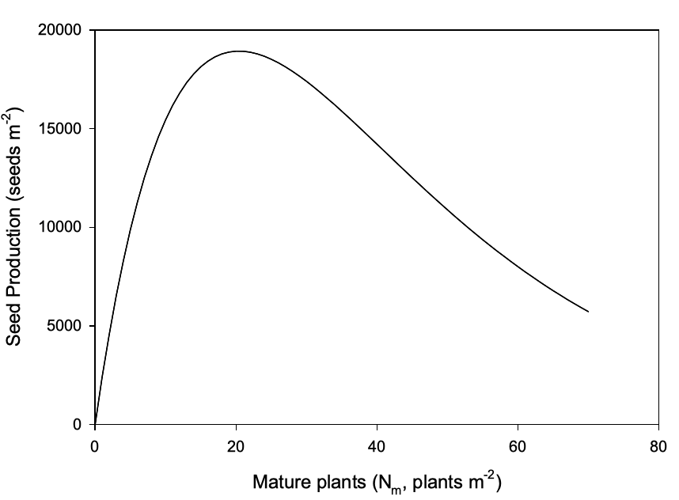
```

---


# O ciclo de vida de uma planta daninha anual


```{r echo=FALSE, out.width=600, fig.align='center'}
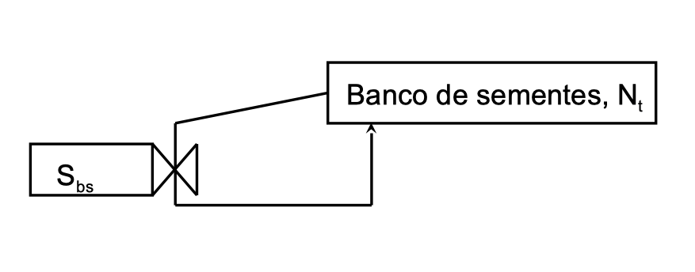
```


---

# S<sub>pl</sub>

## Fração de sementes que permanecem no banco de sementes que sobrevivem à predação e à decomposição


.pull-left[
```{r echo=FALSE, out.width=600, fig.align='center'}
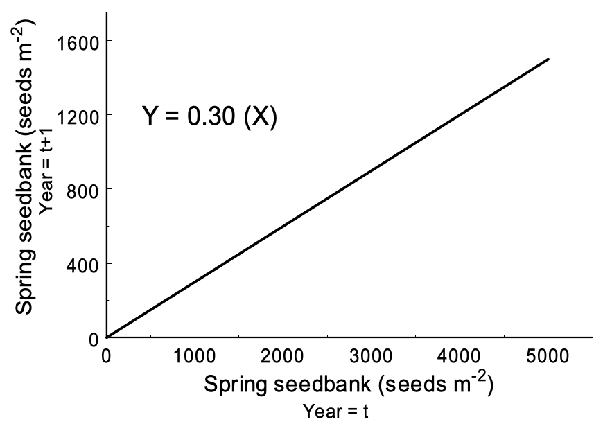
```
]


.pull-right[
```{r echo=FALSE, out.width=600, fig.align='center'}
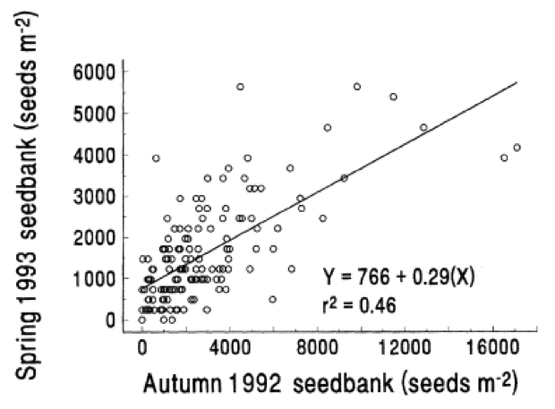
```
]


---

# Taxa variáveis

**N<sub>t+1</sub>**  = N<sub>t</sub> + [(N<sub>t</sub> \* <font color='red'>E<sub>m</sub></font> \* <font color='blue'>S<sub>pl</sub></font>) \* <font color='brown'>P</sub></font> \* (1-<font color='green'>E<sub>f</sub></font>)] \* <font color='orange'>D</sub></font> - [(N<sub>t</sub> \* <font color='red'>E<sub>m</sub></font>) + ((N<sub>t</sub>-N<sub>t</sub> \* <font color='red'>E<sub>m</sub></font>) \* (1-<font color='purple'>S<sub>bs</sub></font>))] + I-E


Onde (variáveis):


- <font color='red'>E<sub>m</sub></font> = fração de Nt que germina e emerge


- <font color='blue'>S<sub>pl</sub></font> = fração de plântulas que sobrevivem até a maturidade


- <font color='brown'>P</sub></font> = número de sementes produzidas por planta

- <font color='green'>E<sub>f</sub></font> = eficácia (proporção de plantas mortas pelo manejo)


- <font color='orange'>D</sub></font> = fração de sementes dispersas na área de interesse


- <font color='purple'>S<sub>bs</sub></font> = fração de sementes que permanecem no banco de sementes que sobrevivem à predação e à decomposição


---
class: inverse

# O ciclo de vida de uma planta daninha anual

```{r echo=FALSE, out.width=700, fig.align='center'}

```

---


# Dependência de densidade


```{r echo=FALSE, out.width=700, fig.align='center'}

```

---

# N<sub>t</sub> = R<sup>t</sup> N<sub>o</sub>


```{r echo=FALSE, out.width=600, fig.align='center'}

```

---


```{r echo=FALSE, out.width=700, fig.align='center'}
knitr::include_graphics("https://upload.wikimedia.org/wikipedia/commons/f/ff/Logistic_Carrying_Capacity.svg")
```

---


# Dependência de densidade


- Quando aumentamos a população de plantio de milho, o que acontece com o tamanho da orelha em cada planta?

- O que acontece com o rendimento?


---

# P = número de sementes produzidas por planta


```{r echo=FALSE, out.width=600, fig.align='center'}

```


---

# Número total de sementes produzidas

## P \* N<sub>m</sub>

```{r echo=FALSE, out.width=600, fig.align='center'}

```


---


# O ciclo de vida de uma planta daninha anual


```{r echo=FALSE, out.width=600, fig.align='center'}

```


---

# S<sub>pl</sub>

## Fração de sementes que permanecem no banco de sementes que sobrevivem à predação e à decomposição


.pull-left[
```{r echo=FALSE, out.width=600, fig.align='center'}

```
]


.pull-right[
```{r echo=FALSE, out.width=600, fig.align='center'}

```
]


---

# Taxa variáveis

**N<sub>t+1</sub>**  = N<sub>t</sub> + [(N<sub>t</sub> \* <font color='green'>E<sub>m</sub></font> \* <font color='blue'>S<sub>pl</sub></font>) \* <font color='purple'>P \* (1-E<sub>f</sub>)</font>] \* <font color='orange'>D</font> - [(N<sub>t</sub> \* <font color='green'>E<sub>m</sub></font>) + ((N<sub>t</sub>-N<sub>t</sub> \* <font color='green'>E<sub>m</sub></font>) \* (1-<font color='red'>S<sub>bs</sub></font>))] + I-E


Onde (variáveis):


- <font color='green'>E<sub>m</sub></font> = fração de N<sub>t</sub> que germina e emerge


- <font color='blue'>S<sub>pl</sub></font> = fração de plântulas que sobrevivem até a maturidade


- <font color='purple'>P \* (1-E<sub>f</sub>)</font> = número de sementes produzidas por planta


- <font color='orange'>D</font> = fração de sementes dispersas na área de interesse


- <font color='red'>S<sub>bs</sub></font> = fração de sementes que permanecem no banco de sementes que sobrevivem à predação e à decomposição


---

# Revisão

Qual é o valor de um modelo de dinâmica populacional de plantas daninhas?

- Ajuda-nos a entender as plantas daninhas

- Nos fornece uma estrutura na qual basear as decisões

- Diz-nos o que não sabemos, para que possamos aprender mais


---

# Dúvidas?


.center[


```
MAXWEL COURA OLIVEIRA - maxweloliveira@unoeste.br
```
]


```{r eval=FALSE}
#remotes::install_github('rstudio/pagedown')
pagedown::chrome_print("pop_biology_4.html")
```

