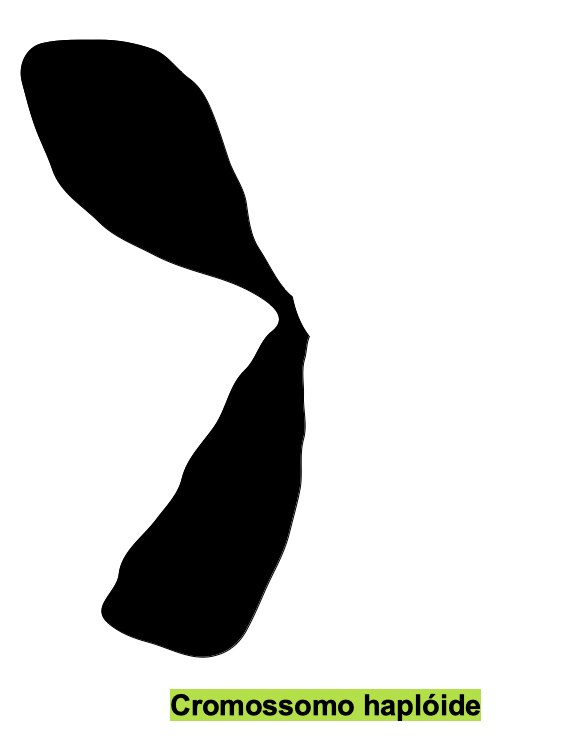
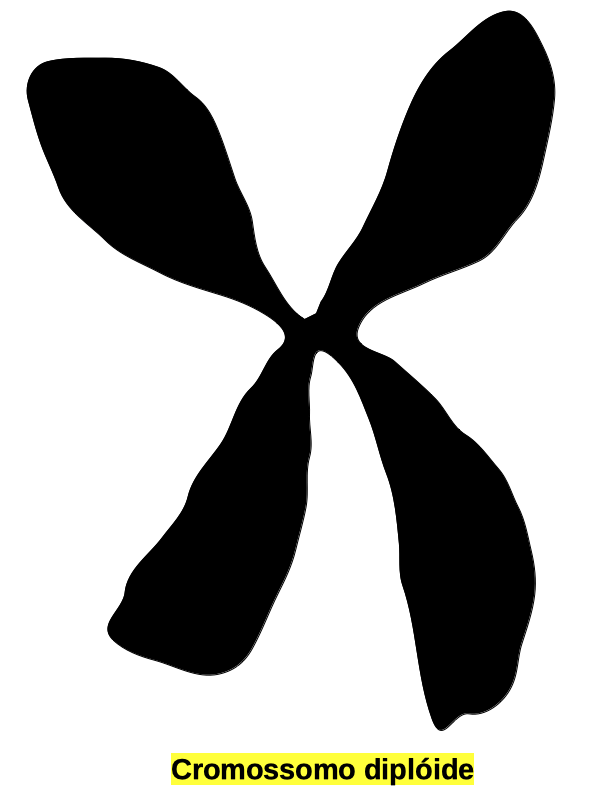
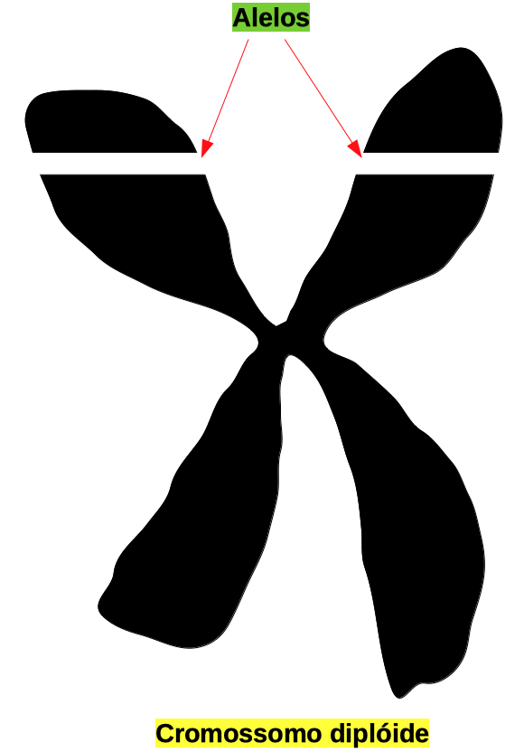
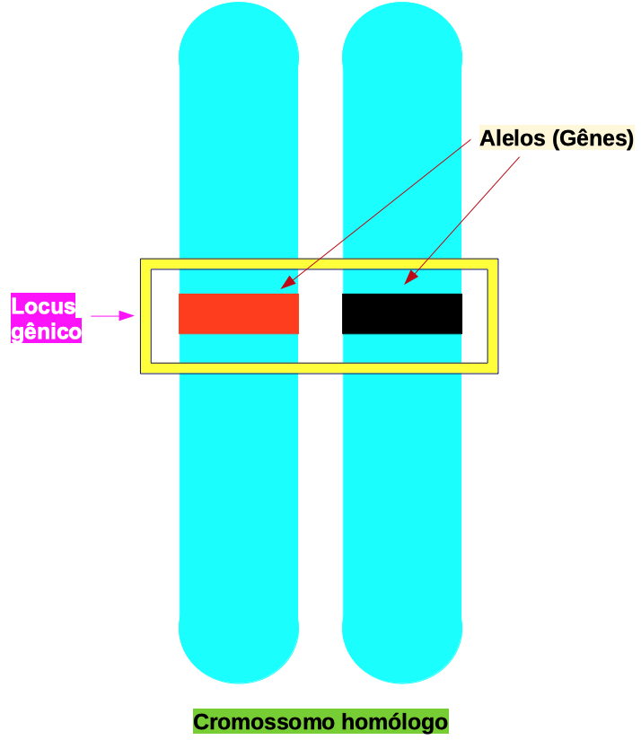
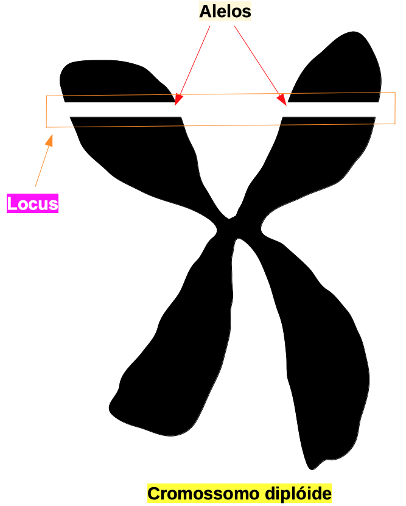
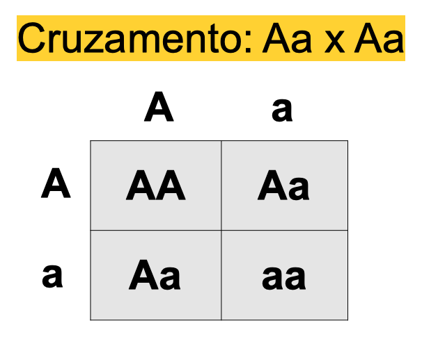
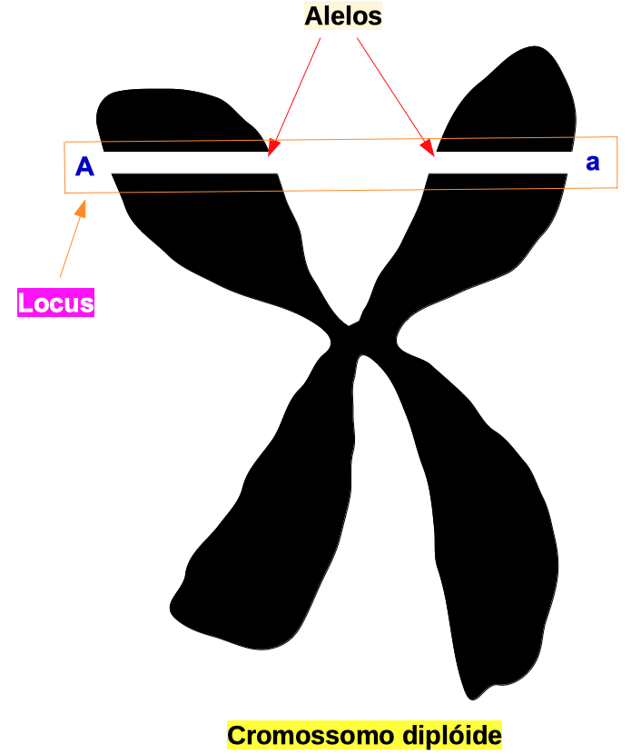
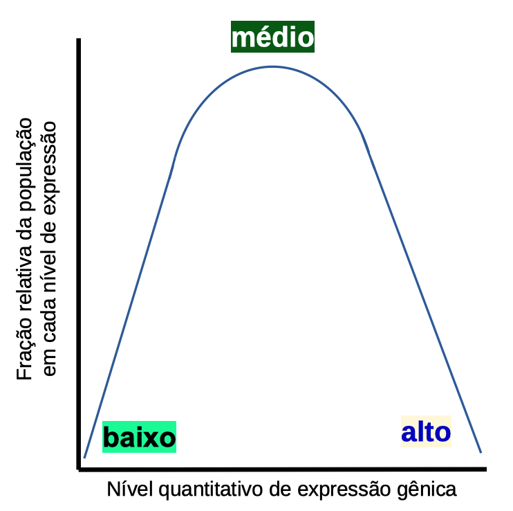

# Genética

## Existem duas amplas direções 

- Genética - celular, organela, molecular

- Genética de populações, genética evolutiva, genética quantitativa


---

# Genética - celular a molecular

## Perguntas que esse tipo de geneticista faz incluem


- O que é um gene?

- Onde estão localizados os genes?

- Qual é a função de um gene?

- Como a função do gene é traduzida em função fisiológica?

- Quantos genes determinam uma característica?

- Como podemos manipular o genoma?

```{r echo=FALSE, out.width=300, fig.align='center'}
knitr::include_graphics("https://media.giphy.com/media/ZBQJXF4aS8u2owCAuC/giphy.gif")
```

---

# População, genética evolutiva e quantitativa

## As perguntas deste tipo de geneticista incluem:

- Quais fatores contribuem para a seleção?

- Por que indivíduos geneticamente únicos (variação genética, polimorfismo) são mantidos em uma população?

- Quanta variação genética existe na população?

- Quais traços são selecionados e por quê?

- Como o genótipo interage com o ambiente (genótipo por interação com o ambiente)?

- Como os genes fluem dentro de uma população?


---

# Algumas definições importantes

- **Polimorfismo** - dois ou mais tipos diferentes em uma única população (por exemplo, sexo, cor dos olhos).

- **Genótipo** - descreve a composição genética de um indivíduo

- **Fenótipo** - qualquer qualidade observada de um organismo resultante da interação genótipo x ambiente


---

# Algumas definições importantes

## Seleção 
- Reprodução ou sobrevivência diferencial de diferentes genótipos

- Indivíduos com características vantajosas tendem a ter mais sucesso reprodutivo

- Dependente do ambiente

- Só ocorre se a característica vantajosa for herdável


---

# Terminologia


## Diploide

- As células possuem duas cópias homólogas de cada cromossomo

.pull-left[
```{r echo=FALSE, out.width=275, fig.align='center'}

```
]

.pull-left[
```{r echo=FALSE, out.width=275, fig.align='center'}

```
]


---

# Terminologia

## Alelo

- Versões diferentes de um gene


```{r echo=FALSE, out.width=275, fig.align='center'}

```

---

# Terminologia

## Locus

- Localização específica de um gene em um cromossomo

.pull-left[
```{r echo=FALSE, out.width=300, fig.align='center'}

```
]

.pull-left[
```{r echo=FALSE, out.width=300, fig.align='center'}

```
]

---

# Terminologia

- Um organismo diplóide terá dois alelos (A e a) em um único locus e existem apenas três genótipos possíveis: AA, Aa, aa


.pull-left[
```{r echo=FALSE, out.width=325, fig.align='center'}

```
]

.pull-left[
```{r echo=FALSE, out.width=325, fig.align='center'}

```
]


---


# Terminologia

- Alelos dominantes escondem a presença de um alelo recessivo. AA e Aa exibem a característica de 'A.'

- O controle genético de uma determinada característica é chamado de **herança**

```{r echo=FALSE, out.width=500, fig.align='center'}

```

---

# Terminologia

- As características quantitativas são controladas por mais de um gene, isto é, múltiplos genes. Cada gene segrega de acordo com as leis de Mendel

    - Produtividade da cultura
    
    - Ganho de peso em animais
    
    - QI humano
    
    - Pressão arterial


```{r echo=FALSE, out.width=300, fig.align='center'}

```

---

# Conceitos

## Variação genética

- Necessário para que exista pressão de seleção

- Alcançado através de vários mecanismos que direcionam o fluxo gênico

- Imigração de genes externos para uma população

- Sistemas de criação e deriva genética (alterações aleatórias na frequência alélica)

- A presença de um banco de sementes inativo que retarda a perda de genes de uma população


---


# Sistemas de reprodução

## Auto fertilização

- Da mesma planta

- Pode ser de diferentes flores na mesma planta


---

# Sistemas de reprodução

## Alogamia

- Fertilização cruzada

- De uma planta para outra

## Agamospermy

- Formação de sementes assexuadas

- Pode incluir apomixia (reprodução assexuada)


---

# Sistemas de reprodução

## Dióico

- Plantas masculinas e femininas separadas

- Ex. Palmer amaranth

## Monoecious

- Flores masculinas e femininas na mesma planta em partes diferentes

- Ex. milho

---

# Lei de Baker

- Uma característica notável da maioria das plantas daninhas é sua capacidade de plantar sementes sem a necessidade de visitas a polinizadores, ou seja, via apomixia

- Baker propôs em 1955 que espécies autocompatíveis tinham maior probabilidade de se estabelecer em ilhas oceânicas

- Muitos autores documentaram a alta frequência de plantas autofertilizantes nas ilhas


---

# Plasticidade fenotípica


- As plantas daninhas exibem naturalmente plasticidade em resposta à mudança de ambientes

> Mudando ambientes = Alterando pressões de seleção

- A estrutura e a formação da planta evoluem como resultado das mudanças nas pressões de seleção

- As forças ambientais em mudança podem incluir:

    - Disponibilidade de recursos, ou seja, água, nutrientes

    - Fatores bióticos, isto é, insetos

    - Perturbação humana / manejo, ou seja, cultivo


