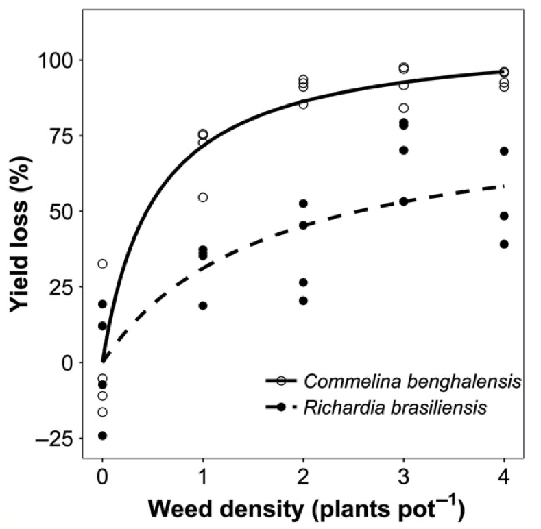
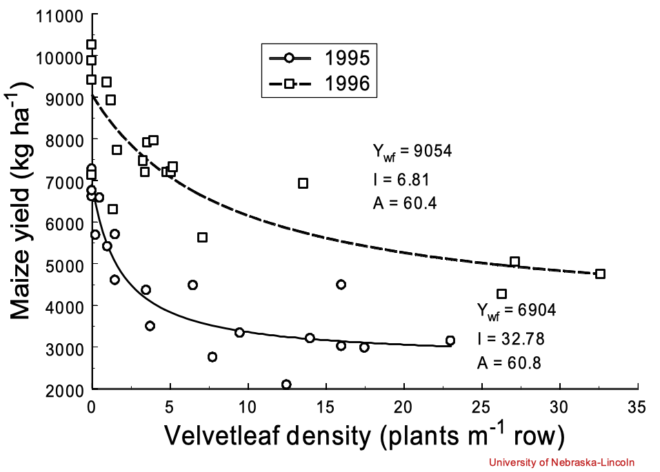
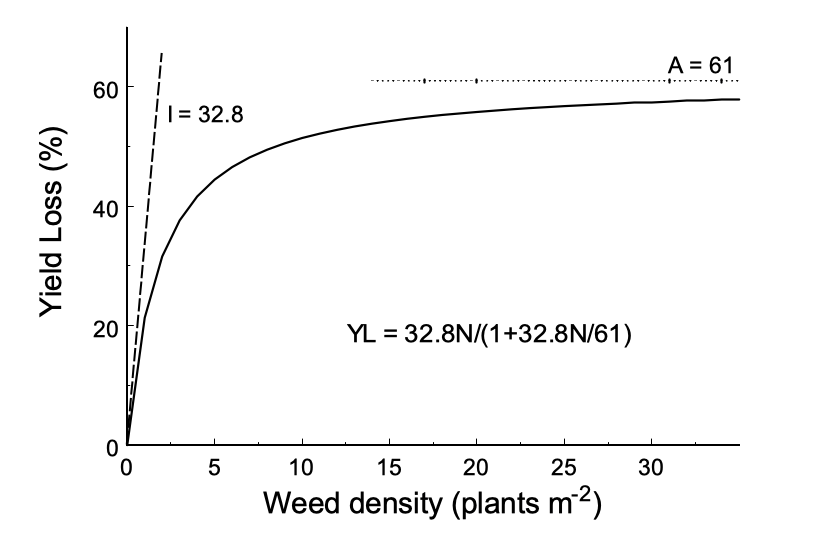
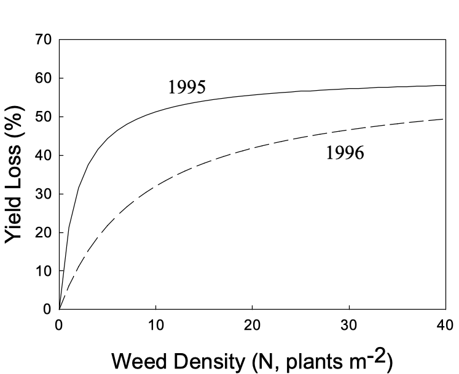
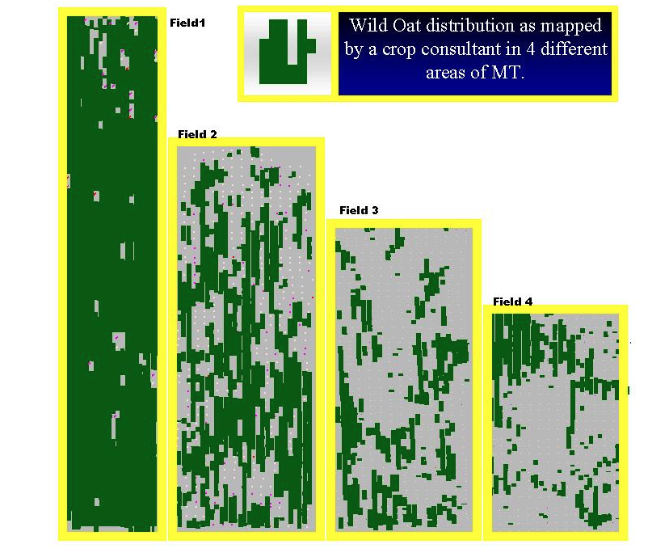
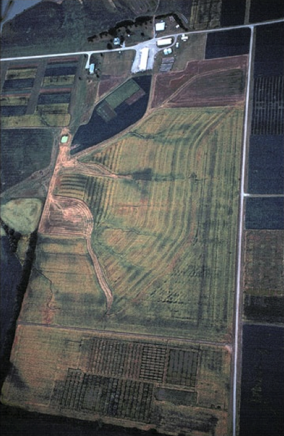
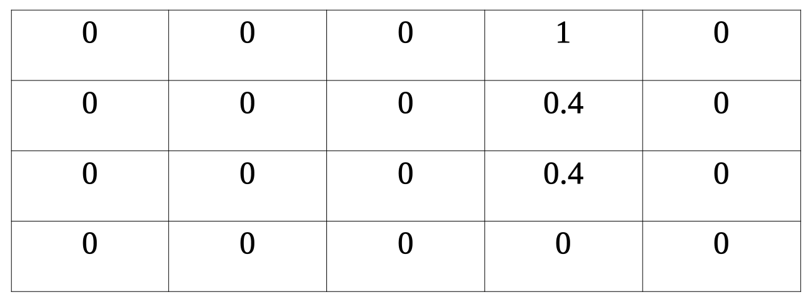

# Objetivos

- Entender relação entre rendimento, perda de rendimento e densidade de plantas daninhas

- Usar a relação perda de produtividade - densidade de plantas daninhas para calcular um limite de dano  econômico de densidade de plantas daninhas

- Calcular o retorno líquido sob várias estratégias de controle de plantas daninhas


---

# Interferência de plantas daninhas


```{r echo=FALSE, out.width=500, fig.align='center'}

```

---

class: center, middle

```{r echo=FALSE, out.width=600, fig.align='center'}

```

---

# Perda de produtividade

A perda de produtividade (Y<sub>L</sub>) é determinada a partir da produtividade relativo na mistura (Y<sub>mix</sub>) e na produtividade sem plantas daninhas (Y<sub>s</sub>)

- Y<sub>L</sub> = (Y<sub>s</sub>-Y<sub>mix</sub>) / Y<sub>s</sub> = 1-Y<sub>mix</sub> / Y<sub>s</sub>

Ou:

- Y<sub>L</sub> (%) = (1-Y<sub>mix</sub> / Y<sub>s</sub>) * 100


---


# Perda de produtividade

## Relação de densidade de plantas

- Quando não há plantas daninhas presentes, não pode haver redução de rendimento

- Os efeitos da planta daninha são aditivos em baixas densidades de planta daninha (N):

.center[Y<sub>L</sub> = I\*N]

- A perda de produtividade nunca pode exceder 100%, mas se aproxima de algum limite assintótico, tipicamente abaixo de 100%


---

# Perda de produtividade

## Relação de densidade de plantas

```{r echo=FALSE, out.width=600, fig.align='center'}

```


---

# A função da perda de produtividade


$${Y_L}=\frac{IN}{1 + \frac{IN}{A}}$$


onde: 

- YL = perda de produtividade

I = perda proporcional de produtividade à medida que a densidade de plantas daninhas se aproxima de zero

A = perda máxima proporcional de produtividade (a assíntota superior)

N = densidade de plantas daninhas


---

# Interferência de plantas daninhas


```{r echo=FALSE, out.width=500, fig.align='center'}

```


---

# Perda de produtividade

## Relação de densidade de plantas


```{r echo=FALSE, out.width=500, fig.align='center'}

```


---

# Nível de dano econômico

- Nível de dano econômico (De) é a densidade de plantas daninhas na qual o <font color='blue'>custo de uma medida de controle é igual à perda de valor resultante da interferência</font> de plantas daninhas

$${D_e}=\frac{C}{Y_s P I E_f}$$


Onde:

- C = custo do herbicida e sua aplicação (R$ / ha)

- Y<sub>s</sub> = produtividade de culturas sem plantas daninhas (sacas / ha) ou a meta de produtividade

- P = preço da safra (R$ / sacas)

- I = perda de produtividade à medida que a densidade de plantas daninhas se aproxima de zero (da equação de perda de produtividade)

- E<sub>f</sub> = eficácia do herbicida (proporção de mudas mortas)


---

class: center, middle

> Quando a densidade das plantas daninhas está **acima** do limite de dano econômico, o controle de plantas daninhas resultará em retornos líquidos mais elevados

**Densidade de plantas daninhas m<sup>-2</sup> > D<sub>e</sub> = controle = <font color='green'>ganho</font>**

<br>
<br>

> Quando a densidade das plantas daninhas está **abaixo** do limite de dano econômico, o controle de plantas daninhas resultará em retornos líquidos mais baixos

**D<sub>e</sub> > Densidade de plantas daninhas m<sup>-2</sup> controle = <font color='red'>perdas</font>**

---

# Retorno econômico líquido

Retorno Líquido = Retorno Bruto - Custos de Produção


$${RL}= (Y * P) - (C + M) $$

Onde:

- RL = retorno líquido (R$ / ha)

- Y = produtividade da cultura (sacas / ha)

- P = preço recebido pela safra (R$ / sacas)

- C = custo do manejo de plantas daninhas (R$ / ha)

- M = todos os outros custos de manejo (R$ / ha)


---


# Decisões de manejo de plantas daninhas

- Como você sabe quantas plantas daninhas existem em uma lavoura?
--
```{r echo=FALSE, out.width=500, fig.align='center'}
knitr::include_graphics("https://media.giphy.com/media/IfsxP5r7WmhP5P6seN/giphy.gif")
```
--


- Como você usa essas informações para fazer uma recomendação?
--


- As plantas daninhas são distribuídas uniformemente nas lavouras?


---


```{r echo=FALSE, out.width=700, fig.align='center'}

```


---


```{r echo=FALSE, out.width=400, fig.align='center'}

```


---


Suponha que as células da tabela a seguir listem a densidade média de capim pé-de-galinha (plantas m<sup>-2</sup>) para uma área de 5 ha (ou seja, 20 células cada representando 5 ha significa que o campo tem tamanho total de 100 ha)


```{r echo=FALSE, out.width=600, fig.align='center'}

```


- A densidade média de pé-de-galinha em todo este campo é de 1,8 / 20 = 0,09 plantas m<sup>-2</sup>


---


Agora, suponha que tenhamos identificado os seguintes valores:


- C = R$ 250 / ha (isso varia dependendo do seu programa de manejo)

- Y = 60 sacas / ha (depende do clima, ambiente do solo e manejo)

- P = 120,0 R$ / sacas (depende de muitas coisas, bastante variável)

- I = perda de rendimento de 30% (varia de acordo com o clima, o ambiente do solo e o manejo - tudo que pode influenciar o desempenho e a competição entre plantas)

- E<sub>f</sub> = 95% (depende das condições ambientais, idade das plantas daninhas, etc. no momento em que o manejo é aplicado)

- A = 60% (também variável)

- $${D_e}=\frac{C}{Y_s P I E_f}$$

```{r include=FALSE}
250 / (60 * 120 * 0.3 * 0.95)
```


---

# Controle de plantas daninhas localizado

- Se usássemos toda a densidade de capim pé-de-galinha da lavoura e esse nível de dano econômico da densidade de capim pé-de-galinha para decidir se devemos controlar a planta daninha, o que faríamos?

- Devemos pulverizar todo o campo? ou apenas os blocos que possuem densidades que excedem o limite?

- O D<sub>e</sub> mudaria se o preço obtido da cultura para a safra diminuísse?


```{r echo=FALSE, out.width=500, fig.align='center'}
knitr::include_graphics("https://media.giphy.com/media/igtdauKhbfyHpf6N1W/giphy.gif")
```

